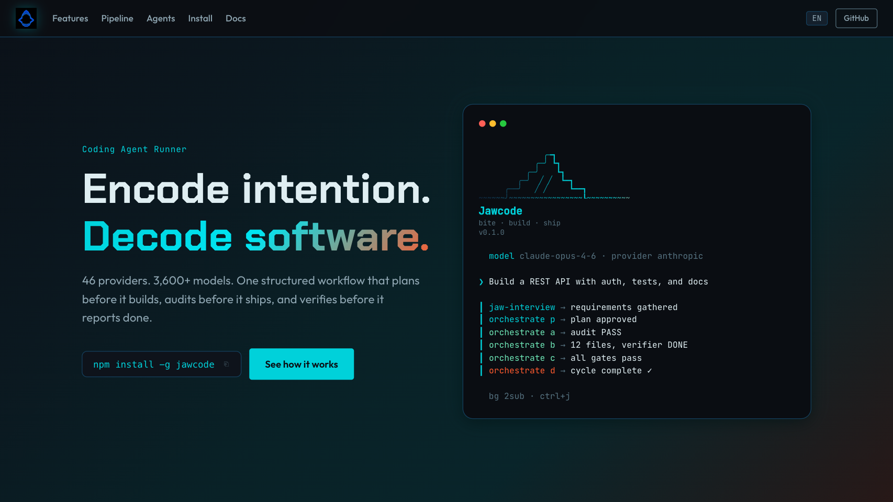
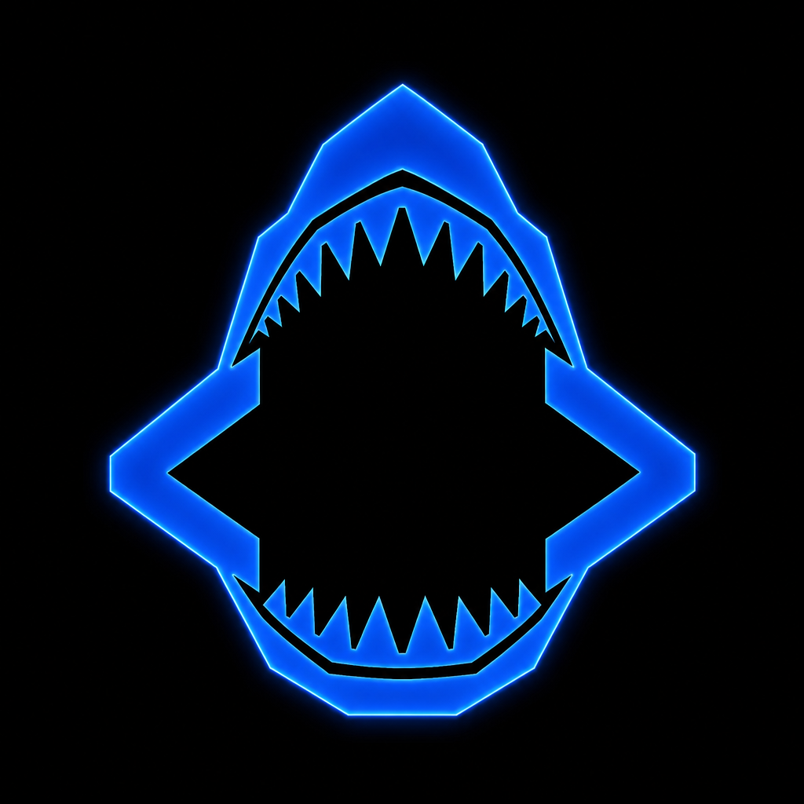
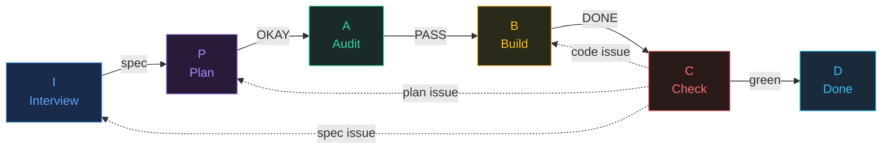
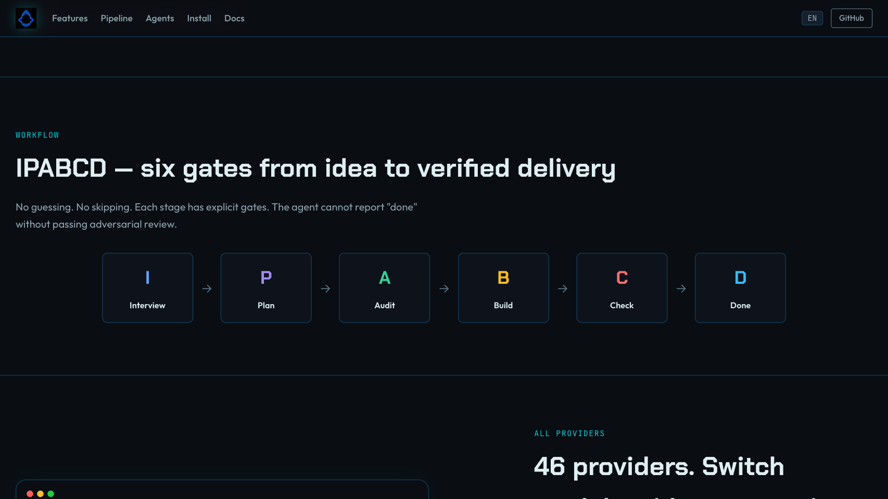
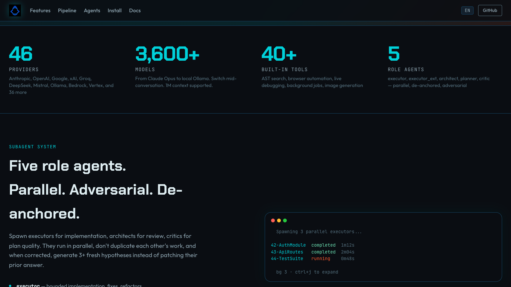
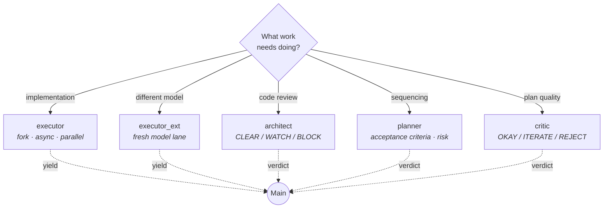

<p align="center">
  
</p>

<h1 align="center">Jawcode</h1>

<p align="center">
  <strong>Encode intention. Decode software.</strong><br />
  46 providers &middot; 3,600+ models &middot; IPABCD workflow &middot; 40+ tools &middot; 5 role agents<br />
  <sub>Bun-native. Plans before it builds. Audits before it ships. Verifies before it reports done.</sub>
</p>

<p align="center">
  <a href="https://lidge-jun.github.io/jawcode"></a>
  <a href="https://www.npmjs.com/package/jawcode"></a>
  <a href="LICENSE"></a>
</p>

<p align="center">
  
</p>

> Jawcode (`jwc`) is an experimental, beta-stage project. Expect rough edges and verify outputs before relying on it for important work.

## What is Jawcode?

Jawcode (`jwc`) is a standalone coding-agent harness. 46 providers, 3,600+ models, Bun-native. It runs from any repository or worktree and gives the agent a structured workflow — plan before build, audit before ship, verify before done.

## Install

```sh
bun install -g jawcode
jwc --version
```

<details>
<summary>npm (alternative)</summary>

```sh
npm install -g jawcode
jwc --version
```

</details>

<details>
<summary>Don't have bun or npm? Install bun first</summary>

**macOS / Linux**
```sh
curl -fsSL https://bun.sh/install | bash
```

**Windows (PowerShell)**
```powershell
irm bun.sh/install.ps1 | iex
```

**Windows (WSL recommended for full support)**
```sh
# 1. Install WSL if you haven't (run in PowerShell as admin)
wsl --install

# 2. Inside WSL (Ubuntu), install prerequisites + bun
sudo apt update && sudo apt install -y unzip curl
curl -fsSL https://bun.sh/install | bash
```

After installing bun, restart your terminal and run:
```sh
bun install -g jawcode
jwc --version
```

> **Note:** On Windows without WSL, `jwc` runs but the agent's shell tool targets bash.
> For the full experience (bash, tmux, fd, ripgrep), use WSL.

</details>

<details>
<summary>From source (for contributors or latest dev)</summary>

```sh
git clone https://github.com/lidge-jun/jawcode.git
cd jawcode
bun run setup    # installs deps, bootstraps ~/.cli-jaw/, sets up defaults
jwc --version
```

To update a source build later:

```sh
git pull && bun run setup
```

</details>



<p align="center">
  
</p>

It is intentionally not a hidden plugin for Codex CLI, Claude Code, OpenCode, or Claw Code. Start `jwc` beside those tools when you want structured planning, persistent evidence, tmux-backed workers, or an isolated worktree.

## Human control model

Plain `jwc orchestrate` is **HITL by default**: the agent plans, audits, and builds in PABCD stages, but the important handoffs still expect a human to look and approve. Think of it as a careful checklist mode.

`jwc goal` can wrap that same PABCD loop as **HOTL**: the goal gives the agent permission to keep moving with evidence checkpoints, while the human watches progress and steps in only to steer, pause, or cancel. In short: PABCD alone asks first; PABCD inside a goal keeps going unless you intervene.

## Quick start

```sh
# Start a session in your repo
cd your-project
jwc

# Or with tmux (recommended for long tasks)
jwc --tmux
```

Inside a session, just talk to the agent. For structured work:

```sh
# Clarify vague requirements first
/skill:jaw-interview

# Plan, audit, build, check, done — the full IPABCD cycle
jwc orchestrate p

# Or let the agent drive autonomously with checkpoints
jwc goal set "implement the feature with evidence"
```

See the [full documentation](https://lidge-jun.github.io/jawcode/docs/getting-started/quickstart.html) for walkthroughs.

## Core capabilities

- **46 providers, 3,600+ models**: Anthropic, OpenAI, Google, xAI, Groq, DeepSeek, Mistral, Amazon Bedrock, Google Vertex, OpenRouter, Ollama, and 35 more. Switch models mid-conversation. 1M context supported.
- **Bun-native speed**: built on Bun from the ground up. Prompt caching, streaming tool output, auto-compaction, Rust-backed native bindings. No webpack, no cold-start lag.
- **Five role agents**: `executor` (fork subagent, default for all parallel work), `executor_ext` (external/fresh model lane), `architect` (read-only code review), `planner` (sequencing), `critic` (plan quality). They run in parallel, don't duplicate work, and when corrected, generate 3+ fresh hypotheses instead of patching their prior answer (correction de-anchoring).
- **IPABCD workflow**: six stages from vague idea to verified delivery — Interview, Plan, Audit, Build, Check, Done. Each has explicit gates. The agent cannot report "done" without passing adversarial review.
- **40+ built-in tools**: AST-aware code search, browser automation, live debugging, background job management, image generation, inter-agent messaging, and more.
- **Human control**: HITL (user approves each stage) or HOTL (goal wraps PABCD, agent advances autonomously with evidence checkpoints).
- **External and reviewable**: run from any repo or worktree without patching another agent runtime.

<p align="center">
  
</p>

## Workflow surface

Jawcode exposes four bundled workflow definitions. Public names are the aliases agents and users should see; source paths may retain legacy engine names until the internal cleanup slice lands.

| Public workflow | What it does |
| --- | --- |
| `jaw-interview` | Clarifies ambiguous requirements before planning or code changes. |
| `plan` / `jwc orchestrate` | Runs native IPABCD/PABCD planning and phase gates. |
| `goal` / `jwc goal` | Tracks durable execution goals, checkpoints, verification, and completion evidence. |
| `team` | Coordinates tmux-backed workers when parallel execution is worth it. |

Five callable task role agents:



All subagents run **async** — the main agent keeps chatting while they work. They share **correction de-anchoring**: on resume with a correction, they discard prior analysis and generate 3+ fresh hypotheses from different angles. They verify the parent's claims with their own tool calls (authority-bias prevention) and never duplicate each other's work.

This fork/spawn/resume architecture is **prompt-cache-aware by design**: subagent system prompts are split at a static/dynamic boundary so the cacheable prefix is shared across spawns, and resumed agents reuse the cached session context instead of rebuilding from scratch. The result is lower latency and fewer redundant input tokens on every spawn and resume cycle.

## Tool inventory

Jawcode ships 40+ built-in tools. Essential tools load by default; discoverable tools activate on demand.

<details>
<summary><strong>Search</strong> — <code>read</code> <code>find</code> <code>search</code> <code>ast_grep</code> <code>web_search</code></summary>

| Tool | Description |
| --- | --- |
| `read` | Files, directories, archives, URLs, PDFs, SQLite, images. |
| `find` | Fast file-name/glob lookup. |
| `search` | Regex content search. |
| `ast_grep` | Structural AST pattern matching. |
| `web_search` | Web search beyond training cutoff. |
</details>

<details>
<summary><strong>Edit</strong> — <code>edit</code> <code>write</code> <code>ast_edit</code></summary>

| Tool | Description |
| --- | --- |
| `edit` | Surgical line-anchored edits with content-hash anchors. |
| `write` | Create/overwrite files, archive entries, SQLite rows. |
| `ast_edit` | Structural AST-aware rewrites. |
</details>

<details>
<summary><strong>Execute</strong> — <code>bash</code> <code>eval</code> <code>browser</code> <code>computer_use</code> <code>debug</code></summary>

| Tool | Description |
| --- | --- |
| `bash` | Shell commands. |
| `eval` | Python or JavaScript in-process. |
| `browser` | Chromium tab control. |
| `computer_use` | Desktop app control (CUA). |
| `debug` | DAP debugger. |
</details>

<details>
<summary><strong>Orchestrate</strong> — <code>task</code> <code>subagent</code> <code>skill</code> <code>goal</code> <code>background</code> <code>monitor</code></summary>

| Tool | Description |
| --- | --- |
| `task` | Launch parallel subagents. |
| `subagent` | List, inspect, await, pause, resume, steer, cancel subagents. |
| `skill` | Chain into workflow skills. |
| `goal` | Goal mode — set, update, complete, pause. |
| `background` | Background row management. |
| `monitor` | Persistent background process. |
</details>

<details>
<summary><strong>Observe</strong> — <code>lsp</code> <code>github</code> <code>inspect_image</code> + 12 more</summary>

| Tool | Description |
| --- | --- |
| `lsp` | Language server queries. |
| `github` | GitHub API. |
| `inspect_image` | Visual image analysis. |
| `generate_image` | Image generation. |
| `irc` | Inter-agent messaging. |
| `ask` | Structured user prompts. |
| `todo_write` | Multi-step todo tracking. |
| `checkpoint` / `rewind` | Working tree snapshots. |
| `resolve` | Apply/discard pending actions. |
| `ssh` | Remote shells. |
| `calc` | Calculator. |
| `recipe` | Shell command presets. |
| `CronCreate/List/Delete` | Cron scheduling. |
| `render_mermaid` | Mermaid → image. |
</details>
## Works beside your existing agent

| Tool        | Recommended JWC command                        | Boundary                                               |
| ----------- | ---------------------------------------------- | ------------------------------------------------------ |
| Codex CLI   | `jwc --tmux --worktree <path>` or `jwc`        | External runner; run both from the same repo/worktree. |
| Claude Code | `jwc --tmux` or `jwc --tmux --worktree <path>` | JWC does not become a Claude Code extension.           |
| OpenCode    | `jwc` or `jwc --tmux`                          | External-runner workflow only today.                   |
| Claw Code   | `jwc --tmux --worktree <path>`                 | JWC does not install into or replace Claw Code.        |

For remote-control protocol details, see [`docs/bridge.md`](docs/bridge.md). For cli-jaw embedding strategy, start with [`devlog/_plan/260614_cli_jaw_jwc_distribution_strategy/000_moc_distribution_strategy.md`](devlog/_plan/260614_cli_jaw_jwc_distribution_strategy/000_moc_distribution_strategy.md).

## Configuration

Provider retry budgets live in `~/.jwc/config.yml`:

```yaml
retry:
  requestMaxRetries: 4
  streamMaxRetries: 100
  maxRetries: 3
  maxDelayMs: 300000
```

`requestMaxRetries` applies before a stream is established. `streamMaxRetries` applies only to replay-safe transient stream failures. Invalid auth, unsupported models/providers, malformed requests, context overflow, user aborts, and permanent quota failures remain fail-fast.

## TUI identity

The default dark TUI identity is the JWC abyss-bite theme (dark blue/cyan), while light-appearance terminals default to the bundled abyss-bite-light theme. Explicit user theme settings still win.

## Development
Agent-facing documentation canon rules and durable development-log notes live in [`AGENTS.md`](AGENTS.md).

Set up the development environment:

```sh
bun run setup
```

Run the CLI from source:

```sh
bun packages/jwc/bin/jwc.js --help
```

Default workflow definitions live in source, not committed `.jwc` copies:

```text
packages/coding-agent/src/defaults/jwc/skills/<name>/SKILL.md
packages/coding-agent/src/prompts/agents/<role>.md
```

For workflow-definition or rebrand-surface changes, run the project gates:

```sh
bun scripts/check-visible-definitions.ts
bun scripts/verify-g002-gates.ts
bun scripts/rebrand-inventory.ts --strict
bun test packages/coding-agent/test/default-jwc-definitions.test.ts
```

For a package-by-package map, see [`docs/codebase-overview.md`](docs/codebase-overview.md).

## Contributors

Jawcode currently starts as a single-maintainer project by [lidge-jun](https://github.com/lidge-jun). Contributions, bug reports, and release validation can start after the public package and release tracks are stable.

## Lineage

Jawcode is a fork of [`gajae-code`](https://github.com/Yeachan-Heo/gajae-code). The internal `@jawcode-dev/*` package namespace originates from that upstream repo.

- [`gajae-code`](https://github.com/Yeachan-Heo/gajae-code) — **direct upstream** fork source.
- [`oh-my-pi`](https://github.com/can1357/oh-my-pi) — upstream implementation DNA.
- [`oh-my-codex`](https://github.com/Yeachan-Heo/oh-my-codex) — Codex-focused orchestration experiments.
- [`oh-my-claudecode`](https://github.com/Yeachan-Heo/oh-my-claudecode) — Claude Code workflow exploration.
- **cli-jaw** — core IPABCD orchestration loop, HITL/HOTL workflow engine, and `jawcode/sdk` embedding surface originate from the cli-jaw harness.

Full attribution in [`NOTICE.md`](NOTICE.md).

## License

MIT. See [`LICENSE`](LICENSE).
