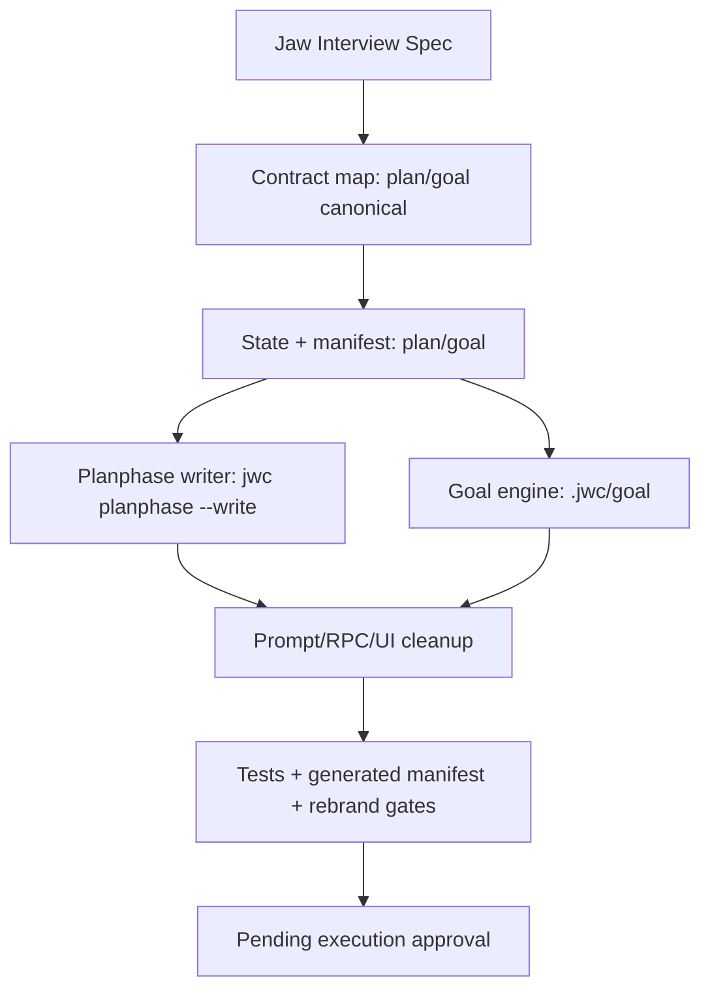

# PABCD P Plan — Legacy workflow name inversion

Date: 2026-06-14
Status: P-stage draft, pending Critic approval and user execution approval.
Spec: `.jwc/specs/jaw-interview-legacy-workflow-name-inversion.md`
Goal: flip `ralplan` to public `plan` / internal P-stage artifact contract `planphase`, and flip `ultragoal` to `goal` across TS contracts, state/storage, CLI/RPC, prompts, and tests.

## Current repository note

A direct implementation attempt began before this P-stage was activated. Current modified product files must be treated as **unreviewed pre-PABCD drift**. In B-stage, keep only changes that match this approved plan; rewrite or discard mismatched agent-owned edits without touching unrelated user work. The P-stage itself must not continue source edits.

Known current product drift from `git status --short` includes:

- `packages/coding-agent/src/commands/planphase.ts` (new)
- `packages/coding-agent/src/cli.ts`
- `packages/coding-agent/src/jwc-runtime/plan-writer.ts`
- `packages/coding-agent/src/jwc-runtime/state-runtime.ts`
- `packages/coding-agent/src/jwc-runtime/state-schema.ts`
- `packages/coding-agent/src/jwc-runtime/workflow-manifest.ts`
- `packages/coding-agent/src/prompts/agents/{planner,architect,critic}.md`
- `packages/coding-agent/src/skill-state/{active-state,workflow-hud}.ts`
- `packages/coding-agent/src/tools/bash-allowed-prefixes.ts`

## Decisions from the interview spec

- Public workflow name remains `plan`.
- Internal P-stage artifact/writer/storage contract is `planphase`.
- Canonical plan writer command is `jwc planphase --write`.
- Canonical plan artifact storage is `.jwc/plans/planphase/`.
- Canonical goal workflow/ledger name is `goal`.
- Canonical goal storage is `.jwc/goal/`.
- `ralplan` and `ultragoal` are fully deprecated. They may exist only as temporary internal/local compatibility aliases or explicit deprecation diagnostics.
- This is pre-release, so fresh-install canonical behavior is primary. No public migration command is required.

## Frozen compatibility policy

Executors must not make product-policy decisions in B-stage. Use this alias policy:

| Surface | Canonical behavior | Legacy handling |
|---|---|---|
| `jwc planphase --write` | Canonical plan artifact writer | n/a |
| `jwc ralplan --write` | Not advertised | Keep as hidden deprecated alias to the same writer until local compatibility tests are removed; it must emit or document deprecation guidance |
| non-write `jwc ralplan ...` | Not a normal user path | Keep only as a deprecated diagnostic command that points to `jwc orchestrate p` and `jwc planphase --write`; no normal examples |
| `jwc goal ...` | Canonical goal command | n/a |
| `jwc ultragoal ...` | Not advertised | Keep only as hidden/deprecated diagnostic alias to `jwc goal` during transition; no normal examples |
| `$goal` | Routes to `goal` | n/a |
| `$ultragoal` | Not canonical | If retained, route to `goal` with deprecation guidance; never route to `ultragoal` |
| `$plan` / `consensus plan` | Routes to `plan` / `jwc orchestrate p` | n/a |
| `$ralplan` | Not canonical | If retained, route to `plan` with deprecation guidance; never route to `ralplan` |
| RPC/gate output | Emits canonical `plan`, `planphase`, `goal` | Legacy inputs may normalize on read only when tests require local compatibility |

## Implementation phases

### Phase B1 — Contract map and canonical state surface

MODIFY `packages/coding-agent/src/jwc-runtime/state-schema.ts`

Before:

```ts
const CANONICAL_JWC_WORKFLOW_SKILLS = ["jaw-interview", "ralplan", "goal", "ultragoal", "team"] as const;
export const LEGACY_WORKFLOW_SKILL_ALIASES = { "deep-interview": "jaw-interview" };
```

After:

```ts
const CANONICAL_JWC_WORKFLOW_SKILLS = ["jaw-interview", "plan", "goal", "team"] as const;
export const LEGACY_WORKFLOW_SKILL_ALIASES = {
  "deep-interview": "jaw-interview",
  ralplan: "plan",
  ultragoal: "goal",
};
```

Acceptance:

- Read-side validation normalizes legacy `ralplan` / `ultragoal`.
- Write-side canonical skills preserve `jaw-interview` and `team`, while replacing only `ralplan` → `plan` and `ultragoal` → `goal`.

MODIFY `packages/coding-agent/src/skill-state/active-state.ts`

Before:

```ts
export const CANONICAL_JWC_WORKFLOW_SKILLS = ["jaw-interview", "ralplan", "goal", "ultragoal", "team"] as const;
const skill = safeString(record.skill).trim();
```

After:

```ts
export const CANONICAL_JWC_WORKFLOW_SKILLS = ["jaw-interview", "plan", "goal", "team"] as const;
const skill = normalizeWorkflowSkillSlug(safeString(record.skill).trim());
```

Acceptance:

- Active-state entries normalize old names to new names.
- HUD and stop hooks see canonical `plan` / `goal`.
- Receipt normalization must also call `normalizeWorkflowSkillSlug(...)` before validation so legacy `ralplan` / `ultragoal` receipts remain readable as `plan` / `goal`.

MODIFY `packages/coding-agent/src/jwc-runtime/workflow-manifest.ts`

Before:

- manifest key `ralplan` with `skill: "ralplan"`.
- manifest key `ultragoal` with `skill: "ultragoal"`.
- getter `goal() { return WORKFLOW_MANIFEST.ultragoal; }`.
- jaw-interview typed arg `handoff` enum only `ralplan`.

After:

- manifest key `plan` with `skill: "plan"`, graph label `Plan`.
- manifest key `goal` with `skill: "goal"`.
- no `ultragoal` getter shim as canonical contract.
- jaw-interview typed arg `handoff` enum uses `plan`.

Acceptance:

- `serializeManifestProjection()` emits `plan` / `goal` canonical manifest.
- Generated manifest is regenerated from source.

GENERATE `packages/coding-agent/src/jwc-runtime/workflow-manifest.generated.json`

Command in B-stage:

```sh
bun scripts/generate-jwc-workflow-manifest.ts --write
```

### Phase B2 — Planphase writer and storage

NEW `packages/coding-agent/src/commands/planphase.ts`

Content outline:

- Command class `Planphase`.
- Description: persist orchestrate plan-phase artifacts.
- Examples use `jwc planphase --write` only.
- Delegates to `runNativePlanWriterCommand(this.argv, process.cwd())`.

MODIFY `packages/coding-agent/src/cli.ts`

Before:

```ts
{ name: "ralplan", load: () => import("./commands/ralplan").then(m => m.default) },
```

After:

- Add `planphase` to the Jaw-brand command surface.
- Keep `ralplan` only as a deprecated diagnostic command during this pre-release transition; remove normal examples and root-help promotion.

Recommended B-stage patch:

```ts
{ name: "planphase", load: () => import("./commands/planphase").then(m => m.default) },
```

MODIFY `packages/coding-agent/src/jwc-runtime/plan-writer.ts`

Before:

- Type names and docs centered on `RalplanCommandResult` / `RalplanStage`.
- State path `.jwc/state/**/ralplan-state.json`.
- Artifact path `.jwc/plans/ralplan/<run-id>/`.
- Receipt/audit `skill: "ralplan"` and command strings `jwc ralplan ...`.
- HUD sync uses `skill: "ralplan"` and source `gjc-ralplan-native`.
- Non-write handoff says `/skill:ralplan`.

After:

- Type names `PlanphaseCommandResult` / `PlanphaseStage`.
- State path `.jwc/state/**/planphase-state.json`.
- Artifact path `.jwc/plans/planphase/<run-id>/`.
- Receipt/audit `skill: "plan"` and command strings `jwc planphase ...`.
- HUD sync uses `skill: "plan"` and source `jwc-planphase-native`.
- Non-write handoff says `/skill:plan`.
- Deprecated exported alias `runNativeRalplanCommand = runNativePlanWriterCommand` may remain only if existing imports require it.
- Existing pre-PABCD drift in `state-runtime.ts` and `workflow-hud.ts` must be reconciled here: keep only the `buildPlanphaseHudSummary` / canonical `plan` dispatch changes that match B1, and update state-runtime dispatch to canonical `plan` / `goal` with tested legacy normalization at the boundary.

Acceptance:

- `jwc planphase --write --stage planner --stage_n 1 --artifact "..." --json` writes under `.jwc/plans/planphase/<run-id>/`.
- Final stage writes `pending-approval.md` in the same planphase run directory.
- New state file is `planphase-state.json` and payload skill is `plan`.
- Deprecated `jwc ralplan --write` delegates to the same writer with deprecation diagnostics/tests; non-write `jwc ralplan` is a diagnostic-only compatibility command, not a normal planner entry.

MODIFY `packages/coding-agent/src/tools/bash-allowed-prefixes.ts`

Before:

```ts
if (words[1] === "ralplan") { ... }
```

After:

```ts
if (words[1] === "planphase" || words[1] === "ralplan") { ... }
```

Acceptance:

- Restricted role-agent bash accepts canonical `jwc planphase --write`.
- Legacy `jwc ralplan --write` is accepted only during transition.
- Non-write `jwc ralplan` and `jwc planphase` are rejected.

MODIFY role prompts:

- `packages/coding-agent/src/prompts/agents/planner.md`
- `packages/coding-agent/src/prompts/agents/architect.md`
- `packages/coding-agent/src/prompts/agents/critic.md`

Before:

```yaml
bashAllowedPrefixes:
  - jwc ralplan --write
```

After:

```yaml
bashAllowedPrefixes:
  - jwc planphase --write
  - jwc state
```

All prose and output contracts use `jwc planphase --write`.

### Phase B3 — Goal storage and workflow identity

MODIFY `packages/coding-agent/src/jwc-runtime/goal-engine.ts`

Before:

- `getGoalPaths()` returns `.jwc/ultragoal`.
- User-facing help/errors say `jwc ultragoal ...`.
- Reconciliation writes payload `skill: "ultragoal"` and mode `"ultragoal"`.

After:

- `getGoalPaths()` returns `.jwc/goal`.
- Help/errors prefer `jwc goal ...`.
- Reconciliation writes payload `skill: "goal"` and mode `"goal"`.
- Any legacy `.jwc/ultragoal` read support is explicitly local/pre-release compatibility and should not be advertised.
- Treat `getGoalPaths`, goal-mode request constants/source, `goal-engine.ts` imports/callsites, reconciliation payload/mode, and `goal-cli.ts` activation path as one atomic patch to avoid mixed `.jwc/ultragoal` / `.jwc/goal` state.

MODIFY `packages/coding-agent/src/jwc-runtime/goal-cli.ts`

Before:

- Comments describe `ultragoal engine`.
- Activation passes `.jwc/ultragoal/goals.json`.
- Status says `Mode: goal ledger (.jwc/ultragoal/)`.

After:

- Comments describe `goal ledger engine`.
- Activation passes `.jwc/goal/goals.json`.
- Status says `Mode: goal ledger (.jwc/goal/)`.

MODIFY `packages/coding-agent/src/jwc-runtime/goal-mode-request.ts`

Before:

- `DEFAULT_ULTRAGOAL_OBJECTIVE`.
- `source: "ultragoal"`.
- helper `ultragoalGoalsPath()` returns `.jwc/ultragoal/goals.json`.

After:

- `DEFAULT_GOAL_OBJECTIVE`.
- `source: "goal"`.
- helper `goalLedgerPath()` or `goalGoalsPath()` returns `.jwc/goal/goals.json`.
- Update all `goal-engine.ts` imports/callsites from `DEFAULT_ULTRAGOAL_OBJECTIVE` to `DEFAULT_GOAL_OBJECTIVE` (or an intentionally retained deprecated alias), and cover this with goal-mode-request and goal-runtime tests.
- Read compatibility accepts old pending requests with `source: "ultragoal"` if needed for local state.

MODIFY `packages/coding-agent/src/jwc-runtime/goal-guard.ts`

Before:

- Accepts objectives containing `.jwc/ultragoal/...`.
- Error guidance says `jwc ultragoal checkpoint`.

After:

- Accepts `.jwc/goal/...` as canonical and optionally `.jwc/ultragoal/...` as legacy read-compat.
- Error guidance says `jwc goal ...` or the canonical goal tool/command surface.

MODIFY `packages/coding-agent/src/jwc-runtime/state-renderer.ts`

Before:

- Markdown title `# ultragoal status`.
- Missing-plan guidance says `jwc ultragoal create-goals`.

After:

- Markdown title `# goal status`.
- Missing-plan guidance says `jwc goal ...`.

### Phase B4 — Skill prompts, keyword routing, command refs, and UI/RPC

### Phase B4a — CLI command help and public examples

MODIFY command surfaces that currently advertise legacy names:

- `packages/coding-agent/src/commands/goal.ts`
  - Ensure examples and descriptions are the canonical durable goal surface.
  - Any goal-ledger help must prefer `.jwc/goal/` and `jwc goal`.
- `packages/coding-agent/src/commands/ultragoal.ts`
  - Keep only as a hidden/deprecated diagnostic alias to `jwc goal` during this transition; remove normal examples and root-help promotion.
  - Full removal is reserved for a later cleanup after compatibility tests are retired.
- `packages/coding-agent/src/commands/ralplan.ts`
  - Keep only as a hidden/deprecated diagnostic alias that points to `jwc orchestrate p` and `jwc planphase --write`; remove normal examples and root-help promotion.
  - Full removal is reserved for a later cleanup after compatibility tests are retired.
- `packages/coding-agent/src/commands/interview.ts`
  - Change handoff flag descriptions from `ralplan` to `plan` / `orchestrate p`.
  - Do not describe deliberate mode as ralplan handoff.
- `packages/coding-agent/src/commands/skills.ts`
  - Examples should read `goal` and `plan`, not `ultragoal` or `ralplan`.
- `packages/coding-agent/src/commands/state.ts`
  - Examples should use `state plan` / `state goal` and handoff to `plan` / `goal`.
  - Legacy state-owner values may be mentioned only in deprecation or read-compat diagnostics.

Acceptance:

- `jwc --help`, `jwc skills --help`, `jwc state --help`, `jwc interview --help`, `jwc goal --help`, and `jwc planphase --help` do not present `ralplan` or `ultragoal` as normal recommended commands.
- Root/base command registration must not expose `ultragoal` as a first-class normal command. Canonical `goal` owns the public surface; `ultragoal` is hidden/deprecated alias only if retained.
- Any retained legacy command emits deprecation guidance.

MODIFY `packages/coding-agent/src/defaults/jwc/skills/jaw-interview/SKILL.md`

Before:

- Execution option says `Execute with ultragoal`.
- Action invokes `/skill:ultragoal`.
- Tool usage says bridge to `ultragoal`.

After:

- Execution option says `Execute with goal`.
- Action invokes `/skill:goal` or `jwc goal` according to the skill tool path.
- All normal guidance uses `goal`; legacy `ultragoal` only appears in explicit deprecated/internal notes if unavoidable.

MODIFY `packages/coding-agent/src/defaults/jwc/skills/ultragoal/SKILL.md`

Before:

- Title `# Ultragoal Workflow`.
- Prose and commands centered on `jwc ultragoal` and `.jwc/ultragoal`.

After:

- Title `# Goal Workflow`.
- Prose and commands centered on `jwc goal` and `.jwc/goal`.
- Frontmatter already `name: goal`; preserve that.

MODIFY `packages/coding-agent/src/defaults/jwc/skills/ultragoal/ai-slop-cleaner.md`

Before:

- Parent skill described as `ultragoal`.
- Report/taxonomy says Ultragoal.

After:

- Parent skill described as `goal`.
- Report/taxonomy says Goal.

MODIFY `packages/coding-agent/src/defaults/jwc/skills/team/SKILL.md`

Before:

- `Team + Ultragoal bridge`.
- `$ultragoal`, `/skill:ultragoal`, `.jwc/ultragoal`, `jwc ultragoal checkpoint`.

After:

- `Team + Goal bridge`.
- `$goal`, `/skill:goal`, `.jwc/goal`, canonical goal checkpoint/update wording.

MODIFY `packages/coding-agent/src/hooks/skill-keywords.ts`

Before:

```ts
{ keyword: "$ralplan", skill: "ralplan" }
{ keyword: "$ultragoal", skill: "ultragoal" }
{ keyword: "$goal", skill: "ultragoal" }
```

After:

```ts
{ keyword: "$plan", skill: "plan" }
{ keyword: "$goal", skill: "goal" }
```

Optional deprecated aliases should route to `plan` / `goal` with deprecation guidance, not canonical legacy skills.

MODIFY `packages/coding-agent/src/modes/shared/agent-wire/approval-gate.ts`

MODIFY hook/HUD surfaces that currently inject legacy names:

- `packages/coding-agent/src/hooks/skill-state.ts`
  - Sanitized skill config text says bundled workflows are `jaw-interview`, `plan`, `goal`, `team`.
  - Handoff-required logic uses `plan` instead of `ralplan`.
  - Active goal prompt context reads canonical `goal` state and recommends canonical goal steering/checkpoint language.
  - Stop-block messages do not recommend `jwc ultragoal`.
  - Generic next-step examples say `plan/team/goal`, not `ralplan/team/ultragoal`.
- `packages/coding-agent/src/skill-state/initial-phase.ts`
  - Initial phase lookup uses canonical `plan` / `goal`.
  - Legacy inputs normalize before lookup if retained.
- `packages/coding-agent/src/modes/components/skill-hud/render.ts`
  - Remove or invert display-name hacks once canonical active-state entries are `plan` / `goal`.
  - HUD should not depend on seeing `ralplan` / `ultragoal` for normal operation.
- `packages/coding-agent/src/modes/components/status-line/workflow-readers.ts`
  - Goal ledger reader uses `.jwc/goal/ledger.jsonl` as canonical.
  - Legacy `.jwc/ultragoal/ledger.jsonl` read support, if kept, is local compatibility and must be tested.

Acceptance:

- Prompt injection and stop-hook text never tells the agent to hand off to `ralplan` or run `jwc ultragoal`.
- HUD/status-line tests cover canonical plan/goal entries without legacy display-map dependence.

Before:

- approval stage `ralplan`.
- execution stage `ultragoal`.

After:

- approval stage `plan` or `planphase` according to contract context.
- execution stage `goal`.
- Field-level mapping is fixed: approval/workflow identity emits `plan`; P-stage artifact writer/storage fields emit `planphase`; execution identity emits `goal`.

MODIFY `packages/coding-agent/src/modes/rpc/rpc-types.ts`

Before:

```ts
export type RpcWorkflowStage = "jaw-interview" | "deep-interview" | "ralplan" | "ultragoal" | "goal";
```

After:

```ts
export type RpcWorkflowStage = "jaw-interview" | "deep-interview" | "plan" | "planphase" | "goal";
```

If local read-compat is needed, parse legacy values at boundaries and emit canonical values in new outputs. Field-level mapping is fixed: workflow/approval stages use `plan`; artifact writer/storage uses `planphase`; execution/goal ledger uses `goal`.

MODIFY `packages/coding-agent/src/modes/shared/agent-wire/workflow-gate-broker.ts`

Before:

- V1 stage list includes `ralplan` and `ultragoal`.

After:

- Canonical V1-or-current stage list emits `plan` / `planphase` and `goal`.
- If legacy inputs are still accepted, normalize `ralplan -> plan` and `ultragoal -> goal` at the broker boundary.
- Persisted gates should store canonical stage names for new writes.

Acceptance:

- Broker tests cover canonical emissions.
- Legacy gate inputs normalize only when explicitly retained for local compatibility.

### Phase B5 — Defaults and path structure

MODIFY `packages/coding-agent/src/defaults/jwc-defaults.ts`

Before:

- imports from `skills/ralplan` and `skills/ultragoal`.
- relative paths `skills/ralplan/SKILL.md`, `skills/ultragoal/SKILL.md`, fragment path `skill-fragments/ultragoal/...`.

After preferred final layout:

- source directories are renamed to `skills/plan/`, `skills/goal/`, and `skill-fragments/goal/`.
- imports and relative paths use the new directory names.
- public default names stay `jaw-interview`, `plan`, `team`, `goal`.

File operations in B-stage:

- MOVE `packages/coding-agent/src/defaults/jwc/skills/ralplan/` → `packages/coding-agent/src/defaults/jwc/skills/plan/`.
- MOVE `packages/coding-agent/src/defaults/jwc/skills/ultragoal/` → `packages/coding-agent/src/defaults/jwc/skills/goal/`.
- MOVE `packages/coding-agent/src/defaults/jwc/skill-fragments/ultragoal/` → `packages/coding-agent/src/defaults/jwc/skill-fragments/goal/` if the directory exists.

Acceptance:

- No public default source path references `ralplan` / `ultragoal` except in explicit deprecation docs/tests.

### Phase B6 — Tests

MODIFY/ADD focused tests:

- `packages/coding-agent/test/jwc-runtime/ralplan-runtime.test.ts`
  - Rename or update to planphase writer vocabulary.
  - Assert canonical writes go to `.jwc/plans/planphase/<run-id>/`.
  - Assert final stage creates `pending-approval.md` there.
  - Assert legacy `jwc ralplan --write` compatibility only if retained.

- `packages/coding-agent/test/jwc-runtime/ultragoal-runtime.test.ts`
  - Rename or update to goal engine vocabulary.
  - Assert canonical `.jwc/goal/` paths.
  - Assert fresh goal source is `goal`.
  - Keep old `.jwc/ultragoal/` read-compat only if local state support remains.

- `packages/coding-agent/test/jwc-runtime/goal-mode-request.test.ts`
  - Assert pending requests write `source: "goal"`.
  - Assert old `source: "ultragoal"` reads only if compatibility remains.

- `packages/coding-agent/test/jwc-runtime/state-schema.test.ts`
  - Assert canonical write-side skills exclude `ralplan` / `ultragoal`.
  - Assert read normalization maps legacy values.

- `packages/coding-agent/test/default-jwc-definitions.test.ts`
  - Assert default names remain exactly `jaw-interview`, `plan`, `team`, `goal`.
  - Assert role agents use `jwc planphase --write`.
  - Assert default skill source paths use `skills/plan` and `skills/goal` after directory moves.

- `packages/coding-agent/test/prompt-action-skill-autocomplete.test.ts` / routing tests
  - Assert `$goal` routes to `goal`.
  - Assert `$ralplan` / `$ultragoal` do not route to canonical legacy skills.

- `packages/coding-agent/test/workflow-gate-broker.test.ts`, `workflow-approval-gates.test.ts`, RPC tests
  - Assert new wire outputs use `plan`/`planphase` and `goal`.
  - Assert legacy inputs normalize if retained.

Additional verification coverage required by the Critic review:

- CLI/help smoke tests for public command examples and deprecation text:
  - `jwc interview --help`
  - `jwc skills --help`
  - `jwc state --help`
  - `jwc goal --help`
  - `jwc planphase --help`
- Hook/stop-output tests:
  - `packages/coding-agent/test/jwc-skill-state-hooks.test.ts`
  - `packages/coding-agent/test/skill-active-state.test.ts`
  - `packages/coding-agent/test/skill-hud-bar.test.ts`
  - `packages/coding-agent/test/status-line-workflow-readers.test.ts`
- Wire/broker tests:
  - `packages/coding-agent/test/workflow-gate-broker.test.ts`
  - `packages/coding-agent/test/rpc-client-workflow-gate.test.ts`
  - `packages/coding-agent/test/rpc-workflow-gate.test.ts`
- Public legacy inventory gate:
  - `bun scripts/check-public-legacy-zero.ts` or an equivalent strict inventory test must fail on normal user-facing `ralplan` / `ultragoal` remnants, with allowlisted deprecation/local-compat occurrences only.

## Verification plan

Run focused tests first:

```sh
bun test packages/coding-agent/test/jwc-runtime/ralplan-runtime.test.ts \
  packages/coding-agent/test/jwc-runtime/ultragoal-runtime.test.ts \
  packages/coding-agent/test/jwc-runtime/goal-mode-request.test.ts \
  packages/coding-agent/test/jwc-runtime/goal-runtime.test.ts \
  packages/coding-agent/test/jwc-runtime/state-schema.test.ts \
  packages/coding-agent/test/default-jwc-definitions.test.ts \
  packages/coding-agent/test/prompt-action-skill-autocomplete.test.ts \
  packages/coding-agent/test/jwc-skill-state-hooks.test.ts \
  packages/coding-agent/test/skill-active-state.test.ts \
  packages/coding-agent/test/skill-hud-bar.test.ts \
  packages/coding-agent/test/status-line-workflow-readers.test.ts \
  packages/coding-agent/test/workflow-gate-broker.test.ts \
  packages/coding-agent/test/workflow-approval-gates.test.ts \
  packages/coding-agent/test/rpc-client-workflow-gate.test.ts \
  packages/coding-agent/test/rpc-workflow-gate.test.ts
```

Run CLI/help smoke after command-surface changes:

```sh
jwc interview --help
jwc skills --help
jwc state --help
jwc goal --help
jwc planphase --help
```

Then run required workflow/default-surface gates:

```sh
bun scripts/generate-jwc-workflow-manifest.ts --check
bun scripts/check-public-legacy-zero.ts
bun scripts/check-visible-definitions.ts
bun scripts/verify-g002-gates.ts
bun scripts/rebrand-inventory.ts --strict
bun test packages/coding-agent/test/default-jwc-definitions.test.ts
```

Run package type/check only after focused tests are green:

```sh
bun check
```

## Rollback / conflict handling

- Do not revert unrelated user changes.
- Current pre-PABCD product edits are agent-owned and may be reshaped under this plan during B-stage.
- If old and new state/storage paths both exist during tests, prefer canonical fresh-install behavior and add explicit read-compat tests only for local legacy fixtures.

## Mermaid overview


