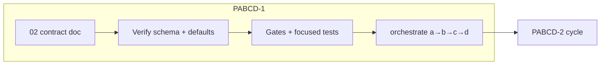

# PABCD cycle — PABCD-1 (contract map)

Date: 2026-06-15  
Phase doc: `02_pabcd_1_contract_map.md`  
Spec: `.jwc/specs/jaw-interview-legacy-workflow-name-inversion.md`  
Orchestrate session: `019ec6c2-3ce0-7000-814f-bc21cb4abac1`

## Scope (this cycle only)

Freeze and **verify** canonical/legacy vocabulary; no new feature work beyond gaps against `02` acceptance.

## Decisions (from interview + phase doc)

- Canonical workflow skills: `plan`, `goal` (plus `jaw-interview`, `team`).
- Legacy read aliases: `ralplan` → `plan`, `ultragoal` → `goal` (`state-schema.ts` `LEGACY_WORKFLOW_SKILL_ALIASES`).
- Public workflow: `/skill:plan`, `/skill:goal`; internal P-stage storage/writer: `planphase` (not a fifth public skill).
- Dual physical state paths on disk: **deferred to PABCD-6**; PABCD-1 only requires read-side slug normalization + fixture/schema tests.

## Work items

| ID | Action | Evidence |
|----|--------|----------|
| P1-1 | Confirm `CANONICAL_JWC_WORKFLOW_SKILLS` and aliases in `state-schema.ts`, `active-state.ts`, `workflow-state-contract.ts` | file read + `default-jwc-definitions.test.ts` |
| P1-2 | Confirm bundled defaults expose `plan`/`goal` not `ralplan`/`ultragoal` as preferred skills | `default-jwc-definitions.test.ts`, `check-visible-definitions.ts` |
| P1-3 | Confirm public prompts do not prefer `/skill:ralplan` or `/skill:ultragoal` | `workflow-surface-orchestrate.test.ts`, rebrand gates |
| P1-4 | Legacy fixture read-compat (in-memory normalize) | `normalizeLegacyState` in `state-migration-gate.test.ts` (migrate CLI on `ralplan-state.json` path is PABCD-6) |

## Acceptance (exit P→A)

- [ ] P1-1–P1-3 green on focused tests/gates listed above.
- [ ] Critic OKAY on this plan (pragmatic: doc nits fixed inline, no re-audit loop).
- [ ] `planphase --write --stage final` → pending-approval for this cycle.

## Verification commands (B/C)

```bash
bun test packages/coding-agent/test/default-jwc-definitions.test.ts
bun test packages/coding-agent/test/workflow-surface-orchestrate.test.ts
bun scripts/check-visible-definitions.ts
bun scripts/verify-g002-gates.ts
bun scripts/rebrand-inventory.ts --strict
```

## Out of scope

- PABCD-2..5 implementation slices (separate cycles).
- PABCD-6 dual-read / `ralplan-state.json` migrate path (cycle 6).

## Mermaid

