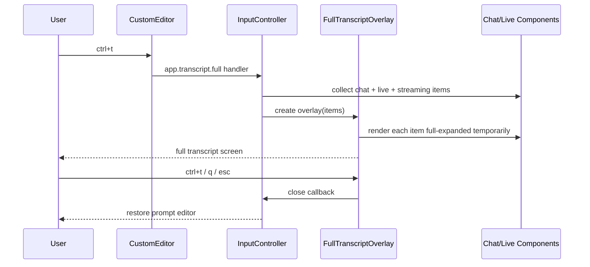

# 260614 — PABCD P plan: `ctrl+t` full conversation transcript overlay

> 상태: 🟡 P-stage plan draft
> 목표: `ctrl+t`를 Claude/Codex식 full conversation transcript overlay로 구현한다. 기존 `ctrl+o` live-only toggle과 `alt+t` tool-only transcript overlay는 보존한다.
> 범위: 이 파일은 P-stage 계획 산출물이다. Product/source 변경은 A-stage 통과 후 B-stage에서 수행한다.

## 1. 요구사항

사용자 요구:

- `ctrl+t`를 예전 thinking toggle로 쓰지 않는다.
- `ctrl+t`는 Claude Code처럼 전체 대화가 펼쳐진 transcript 화면/overlay를 연다.
- 전체 transcript에는 thinking과 tool output이 full-expanded로 보여야 한다.
- `ctrl+o`는 이전 phase에서 결정한 대로 현재 live/current-turn tool+thinking toggle로 유지한다.
- compaction 이후에도 과거 사용자 메시지/스크립트가 transcript overlay에서 보여야 한다.
- PABCD를 돌려 계획, 감사, 구현, 체크, 완료까지 진행한다.

## 2. 현재 코드 근거

### 2.1 현재 keybinding 상태

`packages/coding-agent/src/config/keybindings.ts`:

```ts
"app.thinking.toggle": {
	defaultKeys: [],
	description: "Toggle thinking block visibility",
},
"app.tools.expand": {
	defaultKeys: "ctrl+o",
	description: "Toggle current turn tool and thinking output",
},
"app.tools.transcript": {
	defaultKeys: "alt+t",
	description: "Open full tool transcript overlay",
},
```

현재 의미:

- `ctrl+o`: current live/current-turn tool+thinking toggle.
- `ctrl+t`: 비어 있음. 새 full transcript overlay로 배정 가능.
- `alt+t`: 기존 tool-only overlay 유지.

### 2.2 현재 overlay 구현

`packages/coding-agent/src/modes/components/tool-transcript-overlay.ts`:

- `ToolTranscriptOverlayComponent`가 이미 존재한다.
- `ToolExecutionComponent[]`를 받아 full-expanded로 렌더한다.
- `up/down/pageUp/pageDown/g/G`, `escape`, `q`를 처리한다.
- editor container를 overlay로 바꾸는 구조다.

`packages/coding-agent/src/modes/controllers/input-controller.ts`:

```ts
for (const key of this.ctx.keybindings.getKeys("app.tools.transcript")) {
	this.ctx.editor.setCustomKeyHandler(key, () => this.showToolTranscript());
}
```

`showToolTranscript()`는 `chatContainer.children`에서 `ToolExecutionComponent`만 모아 overlay를 연다.

### 2.3 compaction-visible transcript 기반

이전 phase에서 구현된 분리:

- `AgentSession.buildDisplaySessionContext()`는 visible transcript projection이다.
- `AgentSession.buildModelSessionContext()`는 compacted model projection이다.
- `SessionManager.buildVisibleTranscriptContext(...)`는 compaction 전 raw visible transcript를 보존한다.

따라서 `ctrl+t` full overlay는 model projection을 쓰면 안 되고 display/visible transcript source를 써야 한다.

## 3. 설계 결정

### 3.1 `ctrl+t`의 새 의미

새 action을 추가한다.

```ts
"app.transcript.full": {
	defaultKeys: "ctrl+t",
	description: "Open full conversation transcript overlay",
},
```

원칙:

- `app.thinking.toggle.defaultKeys`는 계속 `[]`다.
- `app.tools.transcript.defaultKeys`는 계속 `alt+t`다.
- `ctrl+t`는 prompt screen에서 thinking block을 직접 토글하지 않는다.

### 3.2 overlay source

1차 구현 source:

- `ctx.chatContainer.children`
- `ctx.liveToolContainer.children`
- `ctx.streamingComponent` if present

이유:

- 현재 prompt screen이 이미 `buildDisplaySessionContext()` 기반으로 rebuild된다.
- compaction 이후 visible transcript가 `chatContainer`에 복원되어야 한다.
- 기존 `ToolTranscriptOverlayComponent`의 UX 패턴만 참고한다: editorContainer swap, header/footer, scroll keys, close keys. `ToolTranscriptOverlayComponent`를 subclass/extend하거나 tool-only API를 재사용하지 않는다.

감사/검증 포인트:

- overlay가 `Container.render()`를 호출하면 committed child skip 규칙이 적용될 수 있으므로 금지한다.
- overlay는 `chatContainer.children`의 각 child를 직접 렌더해야 한다.
- committed child도 overlay에서는 렌더되어야 한다.

필수 source invariant:

- 1차 구현 source는 `chatContainer.children + liveToolContainer.children + streamingComponent`다.
- The compaction overlay render-output test is a hard gate: if rendered overlay text does not contain the pre-compaction user-script marker, the implementation must switch in the same phase to `session.buildDisplaySessionContext()` session source before shipping.
- No build can pass with only “source items contain marker”; the assertion must inspect `FullTranscriptOverlayComponent.render(width)` output.

Ordering/dedupe rule:

- Overlay order is chronological: historical `chatContainer.children` first, then active `liveToolContainer.children`, then `streamingComponent` tail.
- When appending `streamingComponent`, dedupe by object identity so the same assistant tail is not rendered twice if it is already present in `chatContainer.children`.
- `liveToolContainer` remains separate because live tools are not guaranteed to be in historical chat children until finalized.

### 3.3 full-expanded rendering

Overlay 안에서는 다음 protocol을 적용한다.

- Overlay calls `renderFullTranscript(width)` when present.
- Otherwise overlay calls plain `render(width)` only.
- Overlay never generic-forces private expansion state.
- `assistant-message.ts` must implement `renderFullTranscript(width)` in this phase so thinking full expansion has a single component-owned path.
- overlay에서는 `renderCommitted(width)`를 절대 사용하지 않는다. `renderCommitted`는 canonical collapsed scrollback commit용 protocol이므로 full transcript overlay에 쓰면 thinking/tool full expansion 요구를 깨뜨린다.

필수:

- 상태 복원은 `finally`에서 수행한다.
- prompt screen의 live/collapsed state를 영구 변경하지 않는다.
- `any`를 쓰지 않고 `unknown` + type guard를 쓴다.

## 4. 파일별 변경 계획

### 4.1 MODIFY `packages/coding-agent/src/config/keybindings.ts`

변경:

```ts
interface AppKeybindings {
	...
	"app.transcript.full": true;
	...
}
```

`KEYBINDINGS`에 추가:

```ts
"app.transcript.full": {
	defaultKeys: "ctrl+t",
	description: "Open full conversation transcript overlay",
},
```

Migration decision:

- Keep `KEYBINDING_NAME_MIGRATIONS.toggleThinking = "app.thinking.toggle"` for semantic compatibility with explicitly customized thinking toggles.
- Add a load-time conflict sanitizer near `migrateKeybindingNames(...)` / `loadKeybindingsConfig(...)`: if migrated or user config binds `ctrl+t` to `app.thinking.toggle`, remove that key from `app.thinking.toggle` unless the user also explicitly binds `app.transcript.full` away from `ctrl+t`.
- Add a regression test in `packages/coding-agent/test/keybindings-migration.test.ts` for an upgraded legacy `toggleThinking: "ctrl+t"` config: after load/writeback, default `ctrl+t` opens `app.transcript.full` and thinking toggle no longer consumes `ctrl+t`.
- 새 alias를 추가하는 경우 실제 repo symbol은 `KEYBINDING_NAME_MIGRATIONS`다. 존재하지 않는 `DEFAULT_KEYBINDINGS` / `DEFAULT_KEYBINDING_ALIASES` 이름을 만들지 않는다.

유지:

```ts
"app.thinking.toggle": { defaultKeys: [] }
"app.tools.transcript": { defaultKeys: "alt+t" }
```

### 4.2 MODIFY `packages/coding-agent/src/modes/components/custom-editor.ts`

Register full transcript as an editor action rather than a late custom handler so it wins before legacy/custom thinking toggle checks.

Changes:

- Add `"app.transcript.full"` to `ConfigurableEditorAction`.
- Add `DEFAULT_ACTION_KEYS["app.transcript.full"] = ["ctrl+t"]`.
- Add `onFullTranscript?: () => void`.
- In `handleInput(...)`, check `#matchesAction(data, "app.transcript.full") && this.onFullTranscript` **before** the existing `app.thinking.toggle` block at `custom-editor.ts:359`.
- Keep `app.thinking.toggle` wired for non-conflicting user remaps, but default `ctrl+t` must be consumed by full transcript first.

### 4.2.1 NO CHANGE `packages/coding-agent/src/extensibility/extensions/runner.ts`

`ExtensionRunner.#RESERVED_SHORTCUTS` already lists built-in shortcut strings including `ctrl+t`. Keep `ctrl+t` reserved after assigning it to `app.transcript.full`.

Acceptance detail:

- Extension-registered `ctrl+t` must continue to be rejected as a built-in conflict.
- The built-in `app.transcript.full` keybinding takes precedence over extension shortcuts via the existing reserved shortcut path.
- `ctrl+t` built-in precedence is enforced by the editor action order above, not by late extension custom handlers.

### 4.3 ADD `packages/coding-agent/src/modes/components/full-transcript-overlay.ts`

새 class:

```ts
type FullTranscriptSource =
	| { kind: "components"; items: Component[] }
	| { kind: "session"; sessionContext: SessionContext; liveItems: Component[] };

export class FullTranscriptOverlayComponent extends Container {
	#source: FullTranscriptSource;
	#close: () => void;
	#requestRender: () => void;
	#scroll = 0;
	#cache?: { width: number; lines: string[] };

	constructor(source: FullTranscriptSource, callbacks: { close: () => void; requestRender: () => void })
	getFocus(): FullTranscriptOverlayComponent
	handleInput(data: string): void
	override render(width: number): string[]
}
```

Render behavior:

- Build cached transcript lines per width.
- Remove leading blank separators like tool transcript overlay.
- Header shows item count and visible range.
- Footer documents navigation and close keys.
- `ctrl+t`, `escape`, `q` close.
- `up/down/pageUp/pageDown/g/G` scroll.

Helper/protocol types:

```ts
type FullTranscriptRenderable = {
	renderFullTranscript(width: number): string[];
};
```

Type guards must accept `unknown`.

Implementation rule:

- Overlay prefers `renderFullTranscript(width)` when a component provides it.
- Overlay iterates source items itself and never wraps them in a nested `Container` for rendering; nested container aggregation would skip committed children.
- Overlay never calls `renderCommitted(width)`.
- Overlay must use `renderFullTranscript(width)` for assistant thinking; `assistant-message.ts` is a required protocol file below.
- Overlay must not generic-force `setExpanded(true)` on components that do not expose readable current expansion state; that cannot be restored safely.
- Components that need private-state full rendering must implement `renderFullTranscript(width)` themselves.

Fallback source-backed renderer rule:

- Start with `{ kind: "components", items }`, but this path is valid only if the required compaction render-output marker test passes.
- The compaction regression test must assert rendered overlay lines contain a marker from a pre-compaction user script after display rebuild.
- If component-source render output does not contain the marker, `showFullTranscript()` must pass `{ kind: "session", sessionContext: this.ctx.session.buildDisplaySessionContext(), liveItems }` in the same implementation phase.
- The session renderer target remains `full-transcript-overlay.ts`; it must render `SessionContext.messages` into transcript lines without calling `buildModelSessionContext()` or `sessionManager.buildSessionContext()`.
- Session-source fallback is release-blocking until it reaches the parity matrix below. Plain role headers are acceptable only where the stored message has no richer component renderer.

Parity matrix for session-source fallback:

| Message/source kind | Required rendered proof |
|---|---|
| user text/script | marker text appears verbatim |
| assistant text | assistant content appears |
| assistant thinking | thinking text appears full-expanded when present in stored content |
| tool result/update | tool name and result text/details appear full-expanded when present |
| custom/skill message | full message body appears |
| branch summary | summary body appears |
| compaction summary | compaction summary body appears |
| live tail | live components appended once after historical/session lines |

Session renderer contract:

- If `{ kind: "session" }` is needed, do not hand-roll partial role headers as the final implementation.
- Extract or add a pure message-to-transcript-lines helper that mirrors `packages/coding-agent/src/modes/utils/ui-helpers.ts` display mapping without mutating `chatContainer` / `pendingTools` / history.
- The helper must live in `full-transcript-overlay.ts` or a colocated utility imported by it, and it must cover every parity matrix row.
- Tests must include one fixture/assertion per parity matrix row when session source is activated.
- Concrete helper contract: add `sessionMessagesToTranscriptLines(messages, width, options)` in `full-transcript-overlay.ts` or a colocated utility. It must mirror the role/custom/tool/compaction branches from `packages/coding-agent/src/modes/utils/ui-helpers.ts` `renderSessionContext(...)` / `addMessageToChat(...)`, but return strings and mutate no UI containers.
- Options typedef:
  ```ts
  type SessionTranscriptRenderOptions = {
  	fullExpanded: true;
  	renderToolResults: true;
  	renderReadGroups: true;
  	renderAssistantSegments: true;
  };
  ```
- Branch checklist for `sessionMessagesToTranscriptLines(...)`: mirror `ui-helpers.ts` `renderSessionContext(...)` / `addMessageToChat(...)` handling for assistant text/thinking segments, tool result/update pairing, read groups, bash/eval executions, custom/skill messages, branch summaries, and compaction summaries; no branch may write to `chatContainer`, `pendingTools`, or history arrays.
- Session source rendering is `sessionMessagesToTranscriptLines(sessionContext.messages, width, ...)` followed by the same live tail rendering used by component source for `liveToolContainer.children` and deduped `streamingComponent`.
- Tests for session source must assert live tail appears once after session-derived historical lines.

### 4.3.1 MODIFY expandable transcript component protocols

Add `renderFullTranscript(width: number): string[]` to expandable components whose expansion state is private and not safely readable by the overlay:

- `packages/coding-agent/src/modes/components/assistant-message.ts`
- `packages/coding-agent/src/modes/components/tool-execution.ts`
- `packages/coding-agent/src/modes/components/read-tool-group.ts`
- `packages/coding-agent/src/modes/components/bash-execution.ts`
- `packages/coding-agent/src/modes/components/eval-execution.ts`
- `packages/coding-agent/src/modes/components/custom-message.ts`
- `packages/coding-agent/src/modes/components/skill-message.ts`
- `packages/coding-agent/src/modes/components/branch-summary-message.ts`
- `packages/coding-agent/src/modes/components/compaction-summary-message.ts`
- `packages/coding-agent/src/modes/components/ttsr-notification.ts`
- No `hook-message.ts` product change is planned for this phase: hook display rows in `ui-helpers.ts` are rendered through `CustomMessageComponent`, so `custom-message.ts` protocol coverage is the real chatContainer path.

Implementation shape per component:

```ts
renderFullTranscript(width: number): string[] {
	const previous = this.#expanded;
	this.setExpanded(true);
	try {
		return this.render(width);
	} finally {
		this.setExpanded(previous);
	}
}
```

Required: add `renderFullTranscript(width)` to `assistant-message.ts` using `isThinkingExpanded()` / `setThinkingExpanded(true)` / `render(width)` / restore so thinking full expansion is owned by the component, not duplicated in overlay logic.

### 4.4 MODIFY `packages/coding-agent/src/modes/controllers/input-controller.ts`

Add import:

```ts
import { FullTranscriptOverlayComponent } from "../components/full-transcript-overlay";
```

Bind editor action near existing editor action setup:

```ts
this.ctx.editor.setActionKeys("app.transcript.full", this.ctx.keybindings.getKeys("app.transcript.full"));
this.ctx.editor.onFullTranscript = () => this.showFullTranscript();
```

Keep `app.tools.transcript` on the existing `setCustomKeyHandler(...)` path for `alt+t`.

Add method:

```ts
showFullTranscript(): void {
	this.#exitToolFocus();
	const liveItems = [...this.ctx.liveToolContainer.children];
	const componentItems = [...this.ctx.chatContainer.children, ...liveItems];
	if (this.ctx.streamingComponent && !componentItems.includes(this.ctx.streamingComponent)) {
		componentItems.push(this.ctx.streamingComponent);
		liveItems.push(this.ctx.streamingComponent);
	}
	if (componentItems.length === 0) {
		this.ctx.showStatus("No transcript to show");
		return;
	}
	const source =
		needsDisplaySessionTranscriptSource()
			? { kind: "session", sessionContext: this.ctx.session.buildDisplaySessionContext(), liveItems }
			: { kind: "components", items: componentItems };
	const close = () => {
		this.ctx.editorContainer.clear();
		this.ctx.editorContainer.addChild(this.ctx.editor);
		this.ctx.ui.setFocus(this.ctx.editor);
		this.ctx.ui.requestRender();
	};
	const overlay = new FullTranscriptOverlayComponent(source, { close, requestRender: () => this.ctx.ui.requestRender() });
	this.ctx.editorContainer.clear();
	this.ctx.editorContainer.addChild(overlay);
	this.ctx.ui.setFocus(overlay.getFocus());
	this.ctx.ui.requestRender();
}

`needsDisplaySessionTranscriptSource()` is a small local helper in `input-controller.ts` or an inline condition introduced only if the compaction overlay render-output test fails for component source. In the happy path it returns false or is elided and the code passes `{ kind: "components", items }` directly. The test must assert rendered overlay text, not just the items/source array.
```

### 4.5 MODIFY `packages/coding-agent/src/modes/utils/hotkeys-markdown.ts`

Add row:

```ts
`| \`${appKey(bindings, "app.transcript.full")}\` | Open full conversation transcript overlay |`,
```

Keep row:

```ts
`| \`${appKey(bindings, "app.tools.transcript")}\` | Open full tool transcript overlay |`,
```

### 4.6 ADD tests

Preferred new tests:

1. `packages/coding-agent/test/full-transcript-overlay.test.ts`
   - overlay renders committed child lines by directly rendering items.
   - overlay uses `renderFullTranscript(width)` for protocol components and restores previous state.
   - overlay closes on `escape`, `q`, and `ctrl+t`.

2. Extend `packages/coding-agent/test/input-controller-keybindings.test.ts` and/or `packages/coding-agent/test/keybindings-display.test.ts`
   - `app.transcript.full` default key is `ctrl+t`.
   - `app.thinking.toggle` default remains empty.
   - `app.tools.transcript` default remains `alt+t`.
   - Do not add `app.transcript.full` assertions to `custom-editor-keybindings.test.ts` unless that file already covers duplicated editor action defaults after the implementation.
3. Extend `packages/coding-agent/test/keybindings-migration.test.ts`
   - Legacy `toggleThinking: "ctrl+t"` config is sanitized so default `ctrl+t` reaches `app.transcript.full`.
   - Non-conflicting custom thinking keys remain supported.

4. Update source comments/docs that still describe `ctrl+t` as thinking-only:
   - `packages/coding-agent/src/modes/components/assistant-message.ts` comments around the thinking summary/expand behavior.
   - `packages/coding-agent/src/modes/controllers/input-controller.ts` legacy `hideThinkingBlock` / custom-binding comment around the old ctrl+t semantics.
   - `packages/coding-agent/test/thinking-collapse.test.ts` descriptions/fixtures mentioning ctrl+t thinking.

5. Update/extend `packages/coding-agent/test/modes/controllers/command-controller-hotkeys.test.ts`
   - Remove stale fixture/docs expectation that presents `app.thinking.toggle` as `Ctrl+T`.
   - Add or adjust expectation so `Ctrl+T` is documented for full transcript, not thinking.
6. Add required integration-ish test/fixture:
   - `showFullTranscript()` opens full overlay using conversation items.
   - `showToolTranscript()` remains tool-only and bound to `alt+t`; assert it still filters `ToolExecutionComponent` only.
   - Reuse the compaction display fixture pattern from `packages/coding-agent/test/modes/utils/render-initial-messages-dedupe.test.ts` and/or `packages/coding-agent/test/session-manager/build-context.test.ts` to prove `FullTranscriptOverlayComponent.render(width)` contains a marker from a pre-compaction user message/script after display rebuild.
   - Assert `input-controller.ts` wires `app.transcript.full` through editor action keys / `onFullTranscript`, and `app.tools.transcript` remains separately wired.
   - Include an AssistantMessage thinking case: overlay render must include full thinking content and restore `isThinkingExpanded()` to its previous value.
   - Assert a live-zone tool appears once, after historical chat children.
   - Assert `showToolTranscript()` remains tool-only and filters `ToolExecutionComponent` only.
   - Add an explicit `ctrl+o` regression in `input-controller-keybindings.test.ts` or the new overlay integration test: `toggleToolOutputExpansion()` still targets live/current-turn eligible components only and does not expand historical transcript entries.

## 5. Acceptance criteria

- `ctrl+t` opens a full conversation transcript overlay.
- Pressing `ctrl+t` again inside the overlay closes it.
- `escape` and `q` close the overlay.
- Default `ctrl+t` opens full transcript and does not toggle thinking; explicitly user-bound `app.thinking.toggle` on `ctrl+t` is sanitized/unsupported because it conflicts with the built-in full transcript key.
- `ctrl+o` remains current live/current-turn only.
- `alt+t` still opens tool-only transcript overlay.
- Full overlay renders committed/historical transcript items.
- Full overlay shows expandable tool/thinking content in expanded form.
- Closing overlay restores editor focus and does not permanently change component expansion state.
- After a compaction-style display rebuild, full overlay rendered text contains the pre-compaction user script marker.
- Focused tests pass.
- `bun --cwd=packages/coding-agent run check` passes.

## 6. Verification plan

Run focused tests:

```bash
bun test packages/coding-agent/test/full-transcript-overlay.test.ts packages/coding-agent/test/input-controller-keybindings.test.ts packages/coding-agent/test/keybindings-display.test.ts packages/coding-agent/test/keybindings-migration.test.ts packages/coding-agent/test/modes/controllers/command-controller-hotkeys.test.ts packages/coding-agent/test/thinking-collapse.test.ts
```

Run package check:

```bash
bun --cwd=packages/coding-agent run check
```

If package check is blocked by unrelated concurrent changes, run root check and record the exact unrelated failure path before continuing or narrowing.

## 7. Risks and mitigations

### Risk: full overlay source misses compaction-preserved old messages

Mitigation:

- First implementation uses `chatContainer.children` because display rebuild already uses visible transcript context.
- If evidence shows old messages are absent, switch in the same phase to a scoped pure renderer whose source is `this.ctx.session.buildDisplaySessionContext()` / `session.buildDisplaySessionContext()`. Do not use `buildModelSessionContext()` or `sessionManager.buildSessionContext()` for the overlay.

### Risk: overlay mutates prompt expansion state

Mitigation:

- Every forced expansion must restore in `finally`.
- Add a focused unit test that verifies `expanded` returns to its original value.

### Risk: committed child render skipped

Mitigation:

- Do not render `chatContainer` as a container.
- Render each child item directly.
- Add test with a fake component marked `committed=true`.

### Risk: keybinding conflict

Mitigation:

- `app.thinking.toggle` stays unbound.
- `app.transcript.full` gets `ctrl+t`.
- `app.tools.transcript` stays `alt+t`.

## 8. Mermaid sequence


