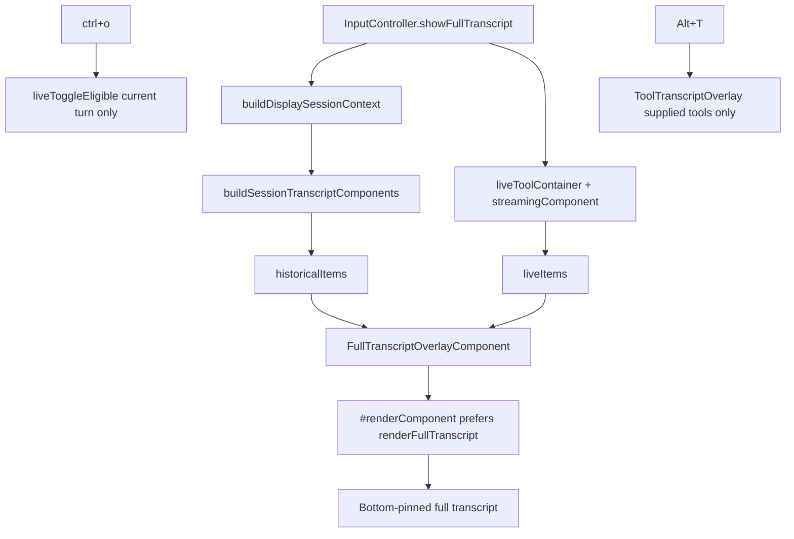

# PABCD P-plan — H1 ctrl+t component replay hardening

Date: 2026-06-15

## Objective

Implement H1 ctrl+t component replay hardening:

- add a side-effect-light session transcript component builder;
- wire ctrl+t full transcript to prebuilt `{ historicalItems, liveItems, itemCount }` component arrays;
- remove the active ctrl+t session string-rendering path;
- preserve ctrl+o current-turn inline expansion and Alt+T tool-only transcript behavior;
- verify read grouping, assistant segmentation, rich tool/bash/eval rendering, custom/skill/branch/compaction rendering, bottom-open scroll, and item-count behavior.

This plan is the implementation follow-up to:

- `27_ctrl_t_component_replay_hardening_brief.md`
- `28_ctrl_t_component_replay_extraction_plan.md`
- `29_ctrl_t_component_replay_test_matrix.md`
- `30_ctrl_t_component_replay_research_synthesis.md`
- `31_ctrl_t_component_replay_external_hardening.md`
- `32_ctrl_t_component_replay_receipt_addendum.md`

## Constraints

- H1 only: do **not** refactor `UiHelpers.renderSessionContext()` to consume the helper in this phase.
- Do not change ctrl+o semantics: current live turn only.
- Do not change Alt+T semantics: supplied tool components only.
- Do not touch welcome/banner/scroll-fill visual identity files except the full transcript overlay itself.
- Do not use raw `JSON.stringify(toolCall.arguments)` as a rendered transcript row.
- The helper must not mutate `ctx.chatContainer`, `ctx.pendingTools`, `ctx.lastToolComponent`, editor history, footer/status state, or live chat component expansion state.

## Files

### NEW — `packages/coding-agent/src/modes/utils/session-transcript-replay.ts`

Purpose: Build detached historical transcript components from `SessionContext` for ctrl+t overlay rendering.

Exports:

```ts
export type SessionTranscriptReplayDeps = {
  ui: TUI;
  cwd: string;
  hideThinkingBlock: boolean;
  toolOutputExpanded: boolean;
  retryAttempt: number;

  getToolByName(name: string): AgentTool | undefined;
  getUserMessageText?(message: AgentMessage): string;
  getMessageRenderer?(customType: string): MessageRenderer | undefined;
  requestRender(): void;
  showImages: boolean;
  readToolResultPreview: boolean;
  editFuzzyThreshold: number;
  editAllowFuzzy: boolean;
  hashlineAutoDropPureInsertDuplicates: boolean;
};

export type SessionTranscriptReplayOptions = {
  mode: "transcript" | "chat";
};


export function buildSessionTranscriptComponents(
  sessionContext: SessionContext,
  deps: SessionTranscriptReplayDeps,
  options: SessionTranscriptReplayOptions,
): Component[];
```

The exact `AgentTool` and `MessageRenderer` imported type names may be adjusted to match existing repo exports, but the dependency shape must stay narrow and injected. `toolOutputExpanded` is present for H2 compatibility; H1 transcript rendering does not use it for output visibility because the overlay calls `renderFullTranscript(width)` on each component.
`session-transcript-replay.ts` must import and reuse the existing exported `markLiveToggleEligible` helper from `ui-helpers.ts`; do not duplicate the live-toggle marker property name.
H1 implements only `{ mode: "transcript" }`; `{ mode: "chat" }` is reserved for H2 and must throw or remain unexported unless implemented with tests.
`session-transcript-replay.ts` must import `isSilentAbort`, `SKILL_PROMPT_MESSAGE_TYPE`, and related `CustomMessage`/`SkillPromptDetails` types from the existing `../../session/messages` path used by `ui-helpers.ts`.
H1 ctrl+t wiring passes `requestRender: () => this.ctx.ui.requestRender()` so async image/diff conversions can refresh the open overlay; if tests use a no-op, that is a test fixture only.

#### Internal state

Use local state only:

```ts
const pendingTools = new Map<string, ToolExecutionComponent | ReadToolGroupComponent>();
let readGroup: ReadToolGroupComponent | null = null;
const readToolCallArgs = new Map<string, Record<string, unknown>>();
const readToolCallAssistantComponents = new Map<string, AssistantMessageComponent>();
let lastToolComponent: { setMinimized?(minimized: boolean): void } | undefined;
```

#### Message mapping

- `user` / `developer` / `fileMention`: produce the same component or `Text` rows used by `UiHelpers.addMessageToChat()` where possible, then call `markLiveToggleEligible(item, false)` on each returned object.
- `assistant`:
  - split content at `toolCall` blocks;
  - flush visible text/thinking slices into `AssistantMessageComponent` segments;
  - use `hideThinkingBlock` from deps;
  - set historical thinking expanded state to false, relying on `renderFullTranscript()` to show full content in overlay;
  - apply `setUsageInfo(message.usage)` to the final assistant segment.
  - reset `readGroup = null` at the start of each assistant message, matching `renderSessionContext()`.
  - at the start of each assistant message, close the previous historical tool batch before resetting read state:
    ```ts
    lastToolComponent?.setMinimized?.(true);
    lastToolComponent = undefined;
    readGroup = null;
    ```
  - when flushing a visible assistant segment after tool rows, reset the local historical tool chain just like `ui-helpers.ts` does:
    ```ts
    lastToolComponent?.setMinimized?.(true);
    lastToolComponent = undefined;
    ```
  - implement the assistant flush loop with a `segmentStart` cursor, matching `ui-helpers.ts`:
    ```ts
    let segmentStart = 0;
    const flushSegment = (end: number): void => {
      const slice = contentBlocks.slice(segmentStart, end);
      segmentStart = end;
      const visible = slice.some(
        c => (c.type === "text" && c.text.trim()) || (c.type === "thinking" && c.thinking.trim()),
      );
      if (!visible) return;
      lastToolComponent?.setMinimized?.(true);
      lastToolComponent = undefined;
      const segmentMessage =
        end < contentBlocks.length
          ? { ...message, content: slice, stopReason: "stop" as const, errorMessage: undefined }
          : { ...message, content: slice };
      const component = new AssistantMessageComponent(segmentMessage, deps.hideThinkingBlock, deps.requestRender);
      component.setThinkingExpanded(false);
      markLiveToggleEligible(component, false);
      items.push(component);
      assistantComponent = component;
    };
    ```
- assistant `toolCall` blocks:
  - if `name === "read"`, `readArgsHaveTarget(arguments)`, and not `readArgsTargetInternalUrl(arguments)`, store read args for later grouping;
  - read toolCall branch must mirror the existing deferred bookkeeping:
    ```ts
    if (hasErrorStop && errorMessage) {
      if (!readGroup) {
        readGroup = new ReadToolGroupComponent({ showContentPreview: deps.readToolResultPreview });
        readGroup.setExpanded(false);
        markLiveToggleEligible(readGroup, false);
        items.push(readGroup);
      }
      readGroup.updateArgs(content.arguments, content.id);
      readGroup.updateResult({ content: [{ type: "text", text: errorMessage }], isError: true }, false, content.id);
    } else {
      const normalizedArgs =
        content.arguments && typeof content.arguments === "object" && !Array.isArray(content.arguments)
          ? (content.arguments as Record<string, unknown>)
          : {};
      readToolCallArgs.set(content.id, normalizedArgs);
      if (assistantComponent) {
        readToolCallAssistantComponents.set(content.id, assistantComponent);
      }
    }
    continue;

    ```
  - before every non-read `ToolExecutionComponent` construction, run `readGroup = null`, matching `ui-helpers.ts` before it starts a non-read tool row.
  - otherwise create `ToolExecutionComponent` using the existing `UiHelpers.renderSessionContext()` constructor shape plus the H1-specific `setArgsComplete(content.id)` finalization:
    ```ts
    const tool = deps.getToolByName(content.name);
    const renderArgs =
      "partialJson" in content
        ? { ...content.arguments, __partialJson: content.partialJson }
        : content.arguments;
    const component = new ToolExecutionComponent(
      content.name,
      renderArgs,
      {
        showImages: deps.showImages,
        editFuzzyThreshold: deps.editFuzzyThreshold,
        editAllowFuzzy: deps.editAllowFuzzy,
        hashlineAutoDropPureInsertDuplicates: deps.hashlineAutoDropPureInsertDuplicates,
      },
      tool,
      deps.ui,
      deps.cwd,
      content.id,
    );
    component.setExpanded(false);
    component.setArgsComplete(content.id);
    markLiveToggleEligible(component, false);
    ```
  - every historical `ToolExecutionComponent` must call `markLiveToggleEligible(component, false)` before being pushed.
  - for H1 transcript replay, deliberately call `component.setArgsComplete(content.id)` after construction and before storing/updating the component so historical tool arguments are finalized before `renderFullTranscript()`.
  - after construction, run the same local sequence as `renderSessionContext()` without mutating `ctx`:
    ```ts
    lastToolComponent?.setMinimized?.(true);
    lastToolComponent = component;
    items.push(component);
    if (hasErrorStop && errorMessage) {
      component.updateResult(
        { content: [{ type: "text", text: errorMessage }], isError: true },
        false,
        content.id,
      );
    } else {
      pendingTools.set(content.id, component);
    }
    ```
- `toolResult`:
  - pair with local `pendingTools` by `toolCallId`;
  - for read results, create/update a `ReadToolGroupComponent` and apply `updateArgs()` + `updateResult()`;
  - after a paired `updateResult()`, delete the entry from `pendingTools` and read bookkeeping maps, matching `ui-helpers.ts` cleanup;
    ```ts
    component.updateResult(message, false, message.toolCallId);
    pendingTools.delete(message.toolCallId);
    readToolCallArgs.delete(message.toolCallId);
    readToolCallAssistantComponents.delete(message.toolCallId);
    ```
  - read group creation must use the deps preview flag and mark the historical group non-live:
    ```ts
    readGroup = new ReadToolGroupComponent({
      showContentPreview: deps.readToolResultPreview,
    });
    readGroup.setExpanded(false);
    markLiveToggleEligible(readGroup, false);
    ```
  - attach read image results to preceding `AssistantMessageComponent` when `deps.showImages` is enabled;
  - image-only read results must match `ui-helpers.ts`: after `setToolResultImages()`, if the result has no text block, delete `readToolCallArgs` and `readToolCallAssistantComponents` for that id and `continue` without creating/updating a visible `ReadToolGroupComponent`.
  - the image-only read-result early-continue must happen before creating/updating a read group for that result.
  - if no matching pending tool exists, emit a compact non-JSON fallback component or text component, but never raw JSON args.
  - read result handling must start with the same gate as `ui-helpers.ts`:
    ```ts
    const pendingReadComponent = pendingTools.get(message.toolCallId);
    const isReadGroupResult =
      message.toolName === "read" &&
      (!pendingReadComponent || pendingReadComponent instanceof ReadToolGroupComponent);
    ```
  - when `isReadGroupResult` is true and no component exists, lazily create the group, push it, update args, and register it:
    ```ts
    if (!component) {
      if (!readGroup) {
        readGroup = new ReadToolGroupComponent({ showContentPreview: deps.readToolResultPreview });
        readGroup.setExpanded(false);
        markLiveToggleEligible(readGroup, false);
        items.push(readGroup);
      }
      const args = readToolCallArgs.get(message.toolCallId);
      if (args) readGroup.updateArgs(args, message.toolCallId);
      component = readGroup;
      pendingTools.set(message.toolCallId, readGroup);
    }
    ```
- `bashExecution`:
  - `new BashExecutionComponent(command, ui, excludeFromContext)`;
  - if `message.output` exists, call `appendOutput(message.output)` before completion to mirror `addMessageToChat()`;
  - `setComplete(exitCode, cancelled, { truncation: message.meta?.truncation })`;
  - `markLiveToggleEligible(component, false)`.
- `pythonExecution`:
  - `new EvalExecutionComponent(code, ui, excludeFromContext)`;
  - if `message.output` exists, call `appendOutput(message.output)` before completion to mirror `addMessageToChat()`;
  - `setComplete(exitCode, cancelled, { truncation: message.meta?.truncation })`;
  - `markLiveToggleEligible(component, false)`.
  - H1 chooses `addMessageToChat()` parity for persisted `bashExecution`/`pythonExecution`: `appendOutput(message.output)` then `setComplete(..., { truncation })`; the older receipt note that `setComplete({ output })` is sufficient is superseded for this phase.
- `custom` / `hookMessage`:
  - if `customType === "async-result"`, render the same background-job `Text` rows as `addMessageToChat()` and mark each row non-live;
  - if `customType === SKILL_PROMPT_MESSAGE_TYPE`, use `SkillMessageComponent`, call `setExpanded(false)`, then `markLiveToggleEligible(component, false)`;
  - if `customType` is `irc:incoming`, `irc:autoreply`, or `irc:relay`, render the same IRC `Text` rows as `addMessageToChat()` and mark each row non-live;
  - otherwise use `CustomMessageComponent(message, deps.getMessageRenderer?.(message.customType))`, call `setExpanded(false)`, then `markLiveToggleEligible(component, false)`.
- `branchSummary`: insert the same leading `Spacer(1)`, create `BranchSummaryMessageComponent`, call `setExpanded(false)`, then mark both spacer/component non-live where object markers are supported.
- `compactionSummary`: insert the same leading `Spacer(1)`, create `CompactionSummaryMessageComponent`, call `setExpanded(false)`, then mark both spacer/component non-live where object markers are supported.

#### H1 parity checklist copied from `renderSessionContext()`

The helper implementation must explicitly port these behaviors from `UiHelpers.renderSessionContext()` before H1 is accepted:

- assistant flushSegment behavior around each `toolCall`;
- final assistant segment keeps usage/error footer while earlier segments use `stopReason: "stop"` and no `errorMessage`;
- `read` call routing through `readArgsHaveTarget()` and `readArgsTargetInternalUrl()`;
- `ReadToolGroupComponent` creation, `updateArgs()`, `updateResult()`, and image handoff to the preceding assistant segment;
- non-read `ToolExecutionComponent` construction with real `tool`, cwd, showImages, and edit settings;
- local pending tool pairing by `toolCallId`;
- non-silent assistant error/abort synthetic tool result injection;
- local historical tool minimization chain;
- standard message routing for user/developer/fileMention/bash/python/custom/hook/branch/compaction roles through component classes.
- `custom` / `hookMessage` routing mirrors `addMessageToChat()`:
  - `async-result` details become the same background-job `Text` rows;
  - `SKILL_PROMPT_MESSAGE_TYPE` becomes `SkillMessageComponent` with `setExpanded(false)`;
  - `irc:incoming`, `irc:autoreply`, and `irc:relay` become the same IRC `Text` rows;
  - otherwise use `CustomMessageComponent(message, deps.getMessageRenderer?.(message.customType))` with `setExpanded(false)`;
- `compactionSummary` and `branchSummary` insert the same leading `Spacer(1)` before their rich summary component and call `setExpanded(false)`;
- `fileMention` produces the same compact file mention `Text` rows as `addMessageToChat()`;
- `user` / `developer` uses `deps.getUserMessageText?.(message)` fallback to message text and creates `UserMessageComponent(text, isSynthetic)`;
- read group construction uses `deps.readToolResultPreview` for `{ showContentPreview }`.
- every component or `Text`/`Spacer` item returned by the helper in transcript mode must be explicitly historical/non-live: call `markLiveToggleEligible(item, false)` where the item supports object markers, including bash/python/custom/skill/branch/compaction/user/fileMention/IRC/background-job rows, not only assistant/tool/read components;
- orphan pending tools left at the end of replay must remain visible as incomplete historical tool components if they were pushed, but must not leave any exported mutable pending map; helper local maps are discarded after return.
Text/Spacer rows cannot expand/collapse, but they are objects; call `markLiveToggleEligible(row, false)` on them too so tests can prove ctrl+o cannot treat reconstructed transcript rows as live.

#### Standard-role replay helper table

Implement an internal `replayStandardMessage(message, options): Component[]` inside `session-transcript-replay.ts` for non-assistant roles instead of scattering ad-hoc rows. It mirrors `UiHelpers.addMessageToChat()` but returns detached items:

| Role/custom type | H1 replay item(s) |
|---|---|
| `user` / `developer` | `UserMessageComponent(text, isSynthetic)` from `deps.getUserMessageText?.(message)` fallback; mark non-live. |
| `fileMention` | same compact `Text` rows as `addMessageToChat()`; mark non-live. |
| `bashExecution` | `BashExecutionComponent`; `appendOutput(message.output)` if present; `setComplete(..., { truncation })`; mark non-live. |
| `pythonExecution` | `EvalExecutionComponent`; `appendOutput(message.output)` if present; `setComplete(..., { truncation })`; mark non-live. |
| `customType === "async-result"` | same background-job `Text` rows; mark non-live. |
| `customType === SKILL_PROMPT_MESSAGE_TYPE` | `SkillMessageComponent`; `setExpanded(false)`; mark non-live. |
| `customType` in `irc:incoming` / `irc:autoreply` / `irc:relay` | same IRC `Text` rows; mark non-live. |
| generic `custom` / `hookMessage` | `CustomMessageComponent(message, deps.getMessageRenderer?.(message.customType))`; `setExpanded(false)`; mark non-live. |
| `compactionSummary` | `Spacer(1)` + `CompactionSummaryMessageComponent`; `setExpanded(false)`; mark both non-live. |
| `branchSummary` | `Spacer(1)` + `BranchSummaryMessageComponent`; `setExpanded(false)`; mark both non-live. |

This table is the implementation source of truth for non-assistant roles in H1.

#### Error / abort handling

Mirror the relevant `UiHelpers.renderSessionContext()` behavior for assistant error stops:

- silent abort remains silent through `isSilentAbort(errorMessage)`;
- non-silent abort/error can synthesize an error result into pending tool components;
- retry attempt text uses `deps.retryAttempt`.

```ts
const isAbortedSilently = message.stopReason === "aborted" && isSilentAbort(message.errorMessage);
const hasErrorStop = !isAbortedSilently && (message.stopReason === "aborted" || message.stopReason === "error");
const errorMessage = hasErrorStop
  ? message.stopReason === "aborted"
    ? deps.retryAttempt > 0
      ? `Aborted after ${deps.retryAttempt} retry attempt${deps.retryAttempt > 1 ? "s" : ""}`
      : "Operation aborted"
    : message.errorMessage || "Error"
  : null;
```

### MODIFY — `packages/coding-agent/src/modes/components/full-transcript-overlay.ts`

#### Current shape

```ts
export type FullTranscriptSource =
  | { kind: "components"; items: Component[] }
  | { kind: "session"; sessionContext: SessionContext; liveItems: Component[] };
```

The session path currently calls `sessionMessagesToTranscriptLines()` and locally reconstructs bash/eval/tool components.

#### Target shape

```ts
export type FullTranscriptSource =
  | { kind: "components"; items: Component[] }
  | { kind: "session"; historicalItems: Component[]; liveItems: Component[]; itemCount: number };
```

#### Required removals / simplification

- Remove active session rendering through `sessionMessagesToTranscriptLines()`.
- Remove overlay-local imports of `AgentMessage`, `ToolCall`, `SessionContext`, `BashExecutionComponent`, `EvalExecutionComponent`, and `ToolExecutionComponent` if they become unused. Keep `theme` because the overlay header/footer render still uses theme tokens.
- Keep `FullTranscriptRenderable` and `#renderComponent()` protocol.
- Session branch in `#transcriptLines(width)` becomes:

```ts
for (const item of this.#source.historicalItems) {
  lines.push(...this.#renderComponent(item, width));
}
lines.push(...this.#renderLiveTail(this.#source.liveItems, width));
```

- Header item count becomes:

```ts
const itemCount =
  this.#source.kind === "components" ? this.#source.items.length : this.#source.itemCount;
```

- Footer/close keys/scroll behavior remain unchanged.

### MODIFY — `packages/coding-agent/src/modes/controllers/input-controller.ts`

#### Current ctrl+t source assembly

```ts
const liveItems = [...this.ctx.liveToolContainer.children];
const componentItems = [...this.ctx.chatContainer.children, ...liveItems];
if (this.ctx.streamingComponent && !componentItems.includes(this.ctx.streamingComponent)) {
  componentItems.push(this.ctx.streamingComponent);
  liveItems.push(this.ctx.streamingComponent);
}
const sessionContext = this.ctx.session.buildDisplaySessionContext();
const source =
  sessionContext.messages.length > 0
    ? { kind: "session" as const, sessionContext, liveItems }
    : { kind: "components" as const, items: componentItems };
```

#### Target ctrl+t source assembly

Keep the existing live-tail/component fallback and empty-transcript gate explicit; only replace the session-history source.

```ts
const liveItems = [...this.ctx.liveToolContainer.children];
const componentItems = [...this.ctx.chatContainer.children, ...liveItems];
if (this.ctx.streamingComponent && !componentItems.includes(this.ctx.streamingComponent)) {
  componentItems.push(this.ctx.streamingComponent);
  liveItems.push(this.ctx.streamingComponent);
}

const sessionContext = this.ctx.session.buildDisplaySessionContext();
const historicalItems =
  sessionContext.messages.length > 0
    ? buildSessionTranscriptComponents(sessionContext, {
        ui: this.ctx.ui,
        cwd: this.ctx.sessionManager.getCwd(),
        hideThinkingBlock: this.ctx.hideThinkingBlock,
        toolOutputExpanded: this.ctx.toolOutputExpanded,
        retryAttempt: this.ctx.session.retryAttempt,

        getToolByName: name => this.ctx.session.getToolByName(name),
        getUserMessageText: message => this.ctx.getUserMessageText(message),
        getMessageRenderer: customType => this.ctx.session.extensionRunner?.getMessageRenderer(customType),
        requestRender: () => this.ctx.ui.requestRender(),
        showImages: this.ctx.settings.get("terminal.showImages"),
        readToolResultPreview: this.ctx.settings.get("read.toolResultPreview"),
        editFuzzyThreshold: this.ctx.settings.get("edit.fuzzyThreshold"),
        editAllowFuzzy: this.ctx.settings.get("edit.fuzzyMatch"),
        hashlineAutoDropPureInsertDuplicates: this.ctx.settings.get("edit.hashlineAutoDropPureInsertDuplicates"),
      }, { mode: "transcript" })
    : [];

if (componentItems.length === 0 && sessionContext.messages.length === 0) {
  this.ctx.showStatus("No transcript to show");
  return;
}

const source =
  sessionContext.messages.length > 0
    ? {
        kind: "session" as const,
        historicalItems,
        liveItems,
        itemCount: historicalItems.length + liveItems.length,
      }
    : { kind: "components" as const, items: componentItems };
```

The branch condition intentionally remains `sessionContext.messages.length > 0`, not `historicalItems.length > 0`, so a malformed/empty helper result cannot silently fall back to stale `chatContainer.children` and hide a replay failure.
If `sessionContext.messages.length > 0` but `historicalItems.length === 0`, keep the session source instead of falling back to `chatContainer.children`; the overlay should render an empty historical transcript plus any live tail, making replay failure visible in tests rather than hiding it.

After `source` is built, keep the existing overlay mount/focus tail unchanged:

```ts
const close = () => {
  this.ctx.editorContainer.clear();
  this.ctx.editorContainer.addChild(this.ctx.editor);
  this.ctx.ui.setFocus(this.ctx.editor);
  this.ctx.ui.requestRender();
};
const overlay = new FullTranscriptOverlayComponent(source, {
  close,
  requestRender: () => this.ctx.ui.requestRender(),
});
this.ctx.editorContainer.clear();
this.ctx.editorContainer.addChild(overlay);
this.ctx.ui.setFocus(overlay.getFocus());
this.ctx.ui.requestRender();
```

Adjust exact extension renderer access if the session API differs; do not guess at compile time without reading the actual type.

### MODIFY — `packages/coding-agent/test/full-transcript-overlay.test.ts`

Update overlay tests to use component-based session source:

- replace raw `sessionContext` fixture in overlay-only tests with `historicalItems` fixture;
- keep component protocol and scroll tests;
- add item-count header test asserting the literal header contains `Full transcript (N entries,`;
- add historical-before-live ordering test under the new source shape;
- keep bottom-open tests with rich historical components;
- keep close-key tests.

### NEW — `packages/coding-agent/test/session-transcript-replay.test.ts`

Add helper-focused tests.

Required P1 cases:

1. assistant segmentation order: text A → tool → text B.
2. paired toolCall/toolResult creates rich tool output and no raw JSON.
3. read tool grouping for multiple path reads and internal URL exclusion.
4. historicalItems render before liveItems through overlay.
5. pre-compact/user marker fixture:
   - unit fixture message: `{ role: "user", content: "PRE_COMPACT_SCRIPT_MARKER", timestamp }`;
   - build historical replay components from that session context;
   - render `FullTranscriptOverlayComponent`;
   - assert output contains `PRE_COMPACT_SCRIPT_MARKER` and it appears before any `LIVE_COMPONENT_MARKER`;
   - integration-style fixture follows `render-initial-messages-dedupe.test.ts`: use `SessionManager.inMemory()`, append the marker user message, build a display/session context once, then assert the helper/overlay path renders the marker without reusing stale `chatContainer.children`.

Required P2 cases:

6. thinking body appears through `renderFullTranscript()`.
7. error/aborted assistant stop maps to pending tool error result.
8. custom/skill/branch/compaction use rich components rather than dim role-label fallback.
9. bashExecution/evalExecution remain rich.
10. assistant-only toolCall does not dump JSON.
11. `deps.readToolResultPreview` is passed into `ReadToolGroupComponent({ showContentPreview })` and a test toggles it to prove the preview option is wired.
12. helper unit coverage must include every case from `29_ctrl_t_component_replay_test_matrix.md` unit section: assistant ordering, paired tool result, assistant-only toolCall, read grouping, thinking expansion, error/abort stop, and custom/skill/branch/compaction components.
13. replay components produced for historical transcript mode are not `isLiveToggleEligible(component)`.
14. paired toolResult cleanup leaves no retained `pendingTools` entry for the completed `toolCallId` (prove via observable result or test-only debug return; do not expose production mutable maps).
15. orphan pending toolCall at replay end remains visible as an incomplete historical component and no raw JSON is emitted.
16. user, skill/custom, branch/compaction, Text, and Spacer rows produced by replay are not `isLiveToggleEligible`.
17. orphan `toolResult` without preceding toolCall keeps compact non-JSON fallback and does not emit raw arguments.
18. non-live fixture coverage includes `fileMention`, `irc:incoming` custom text rows, `async-result` background-job `Text` rows, and generic `hookMessage`.
19. image-only read toolResult attaches images to the preceding assistant component, performs read bookkeeping cleanup, and does not create an empty read group row.
20. long single-line output fixture (`"X".repeat(1000)` from bash or tool result) has an explicit ctrl+t assertion: either wrapped/inspectable content is present, or current truncation is captured as a known-limit test and follow-up without reintroducing raw JSON.

### MODIFY — `packages/coding-agent/test/input-controller-keybindings.test.ts`

Add or adjust focused controller test:

- ctrl+t still mounts `FullTranscriptOverlayComponent`;
- session source now has `historicalItems`, not raw `sessionContext`;
- spy/mock `buildSessionTranscriptComponents` and assert it is called with `session.buildDisplaySessionContext()` result;
- assert deps wiring includes `ui`, `cwd`, `hideThinkingBlock`, `toolOutputExpanded`, `retryAttempt`, `getToolByName`, `getUserMessageText`, `getMessageRenderer`, `requestRender`, `showImages`, `readToolResultPreview`, `editFuzzyThreshold`, `editAllowFuzzy`, and `hashlineAutoDropPureInsertDuplicates`;
- assert overlay source `itemCount === historicalItems.length + liveItems.length`;
- assert `liveItems` dedupe behavior is preserved;
- assert mount/focus tail still clears `editorContainer`, adds overlay, focuses `overlay.getFocus()`, and requests render;
- ctrl+o live-only expansion tests remain unchanged.

### MODIFY — `packages/coding-agent/test/modes/components/tool-execution-minimize.test.ts`

No product behavior change expected. Keep existing Alt+T scoping test green. Add only if H1 accidentally changes shared tool transcript behavior.

## Verification plan

Focused tests:

```bash
bun test \
  packages/coding-agent/test/session-transcript-replay.test.ts \
  packages/coding-agent/test/full-transcript-overlay.test.ts \
  packages/coding-agent/test/input-controller-keybindings.test.ts \
  packages/coding-agent/test/keybindings-display.test.ts \
  packages/coding-agent/test/modes/controllers/command-controller-hotkeys.test.ts \
  packages/coding-agent/test/thinking-collapse.test.ts \
  packages/coding-agent/test/modes/components/tool-execution-minimize.test.ts \
  packages/coding-agent/test/read-tool-group.test.ts \
  packages/coding-agent/test/modes/utils/render-initial-messages-dedupe.test.ts
```

Package check:

```bash
bun --cwd=packages/coding-agent run check:types
```

Workspace check:

```bash
bun run check
```

## Acceptance criteria

- ctrl+t session source uses `historicalItems + liveItems`, not raw `sessionContext` string conversion.
- active ctrl+t session path cannot emit raw `Tool call ... { JSON }` rows.
- `FullTranscriptOverlayComponent` is a dumb component pager for session sources.
- read grouping appears in ctrl+t historical replay.
- assistant text/tool/text segmentation order is preserved.
- custom/skill/branch/compaction messages render through rich components.
- Bash/Eval/toolResult rich rendering from the completed fix does not regress.
- ctrl+o current-turn inline expansion remains unchanged.
- Alt+T remains tool-only.
- bottom-open, scroll, fresh overlay re-pin, and close keys remain unchanged and are covered by overlay tests against `historicalItems`.
- item-count header follows the explicit `historicalItems.length + liveItems.length` policy and is covered by a header assertion.
- long single-line output in ctrl+t has an explicit known-limit regression test: either it wraps/retains inspectable content, or the test documents current truncation behavior as an accepted follow-up without hiding data behind raw JSON.
- `FullTranscriptOverlayComponent` has no active session-history imports of Bash/Eval/Tool execution components and no active ctrl+t call site for `sessionMessagesToTranscriptLines()`.
- H1 supports only `mode: "transcript"`; a `mode: "chat"` call is rejected or unavailable until H2.
- If `sessionContext.messages.length > 0` but the helper returns no historical components, ctrl+t does not silently fall back to stale chat children.

## Mermaid



## P-stage note

This P plan intentionally excludes H2 (`UiHelpers.renderSessionContext()` deduplication) from implementation. H2 should be planned separately after H1 tests prove the detached helper.
