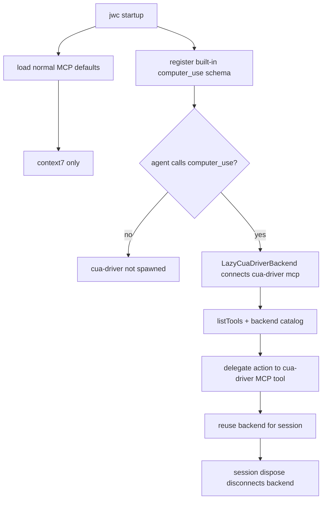

# 80 — Execution Plan: Lazy cua-driver MCP Proxy

> 상태: 🟡 PABCD/P plan draft (260614)
> 상위 결정: [70_lazy_cua_mcp_proxy.md](./70_lazy_cua_mcp_proxy.md)
> 목표: `cua-driver`를 jwc 기본 MCP 선연결 경로에서 제거하고, agent-visible `computer_use` 단일 built-in tool이 첫 호출 시점에만 backend MCP를 연결하도록 패치한다.

## Scope

### In

- macOS managed MCP defaults에서 `cua-driver` 제거.
- 기존 exact managed `cua-driver` entry cleanup. 사용자 커스텀 `cua-driver` 설정은 보존.
- `computer_use` built-in discoverable tool 추가.
- `computer_use` 첫 실행 시 `cua-driver mcp` lazy connect.
- 같은 세션 내 backend 연결 재사용.
- session dispose 시 lazy backend 연결 정리.
- focused tests + docs/status update.

### Out

- cua-driver 36개 MCP tool 전체를 agent-facing tool로 노출하지 않는다.
- 기존 일반 MCP discovery/runtime 전체를 재설계하지 않는다.
- cu-mcp-server 통합/삭제는 하지 않는다.
- raw backend escape hatch는 MVP에서 제외한다.

## Files and diff-level plan

### 1. MODIFY `packages/coding-agent/src/defaults/jwc-defaults.ts`

#### Current

```ts
export function getManagedDefaultMcpServers(
	platform: NodeJS.Platform = process.platform,
): Record<string, MCPServerConfig> {
	const defaults = mcpDefaults as MCPConfigFile;
	const defaultContext7 = defaults.mcpServers?.context7;
	if (!defaultContext7) throw new Error("Bundled MCP defaults are missing the context7 server entry.");

	const managedServers: Record<string, MCPServerConfig> = {
		context7: defaultContext7,
	};

	if (platform === "darwin") {
		managedServers["cua-driver"] = {
			command: "cua-driver",
			args: ["mcp"],
		};
	}

	return managedServers;
}
```

#### Change

- Remove the `platform === "darwin"` branch from managed defaults.
- Add a small helper for legacy cleanup:

```ts
const LEGACY_MANAGED_CUA_DRIVER_SERVER: MCPServerConfig = {
	command: "cua-driver",
	args: ["mcp"],
};

function removeLegacyManagedCuaDriver(existing: MCPConfigFile): {
	config: MCPConfigFile;
	changed: boolean;
} {
	const current = existing.mcpServers?.["cua-driver"];
	if (!current || !configsEqual(current, LEGACY_MANAGED_CUA_DRIVER_SERVER)) {
		return { config: existing, changed: false };
	}
	const { ["cua-driver"]: _removed, ...remaining } = existing.mcpServers ?? {};
	return { config: { ...existing, mcpServers: remaining }, changed: true };
}
```

- Apply cleanup in `installDefaultMcpConfig()` before status evaluation and force a write when cleanup changed the file:

```ts
const rawExisting = await readMCPConfigFile(destination);
const legacyCleanup = removeLegacyManagedCuaDriver(rawExisting);
const existing = legacyCleanup.config;
const status = getManagedDefaultMcpStatus(existing, managedDefaults);
const effectiveStatus = legacyCleanup.changed && status === "matching" ? "different" : status;

if (options.check) {
	return { targetRoot, path: destination, serverNames, status: effectiveStatus };
}
if (effectiveStatus === "matching") {
	return { targetRoot, path: destination, serverNames, status: effectiveStatus };
}

await writeMCPConfigFile(destination, {
	...existing,
	mcpServers: {
		...existing.mcpServers,
		...managedDefaults,
	},
});
```

- Rationale: only exact old managed entry is removed. Any user-customized `cua-driver` config with env/cwd/args remains a deliberate advanced MCP setup.

### 2. MODIFY `packages/coding-agent/test/default-mcp-config.test.ts`

#### Current expectations

- macOS install expects `cua-driver` managed default.
- preservation test expects default install to add `cua-driver`.

#### Change

- macOS default install expects only `context7` and no `cua-driver`.
- check-mode matching on darwin uses only context7 managed defaults.
- preservation test cases:
  - exact legacy `{ command: "cua-driver", args: ["mcp"] }` is removed during install.
  - custom `{ command: "cua-driver", args: ["mcp"], env: { FOO: "bar" } }` is preserved.
  - matching `context7` plus exact legacy `cua-driver` still returns remediation-needed in check mode and writes cleanup in normal mode.
  - check mode reports `different` when the only remediation is exact legacy `cua-driver` cleanup.
- non-macOS behavior remains platform-neutral.

### 3. NEW `packages/coding-agent/src/tools/computer-use.ts`

#### Shape

- Export `ComputerUseTool` implementing `AgentTool` conventions used by existing tools.
- `name = "computer_use"`.
- `label = "ComputerUse"`.
- `loadMode = "discoverable"`.
- `summary = "Control desktop apps through lazy cua-driver backend"`.
- Strict object schema with action discriminator.

#### MVP schema and per-action contract

MVP excludes screenshot. Screenshot/crop support stays in a follow-up after the exact cua-driver backend tool is pinned from current docs/source.

```ts
const computerUseSchema = {
	type: "object",
	properties: {
		action: {
			type: "string",
			enum: [
				"start_session",
				"list_apps",
				"observe",
				"window_state",
				"click",
				"type_text",
				"press_key",
				"scroll",
				"end_session",
			],
		},
		session: { type: "string" },
		app: { type: "string" },
		pid: { type: "number" },
		window_id: { type: "number" },
		element_index: { type: "number" },
		x: { type: "number" },
		y: { type: "number" },
		text: { type: "string" },
		key: { type: "string" },
		dx: { type: "number" },
		dy: { type: "number" },
	},
	required: ["action"],
	additionalProperties: false,
} satisfies TSchema;
```

Result envelope:

```ts
type ComputerUseSuccess = {
	ok: true;
	action: string;
	backend: "cua-driver";
	result: unknown;
};

type ComputerUseFailure = {
	ok: false;
	action: string;
	backend: "cua-driver";
	error: string;
};
```

The tool returns `CustomToolResult` content containing this JSON envelope. Backend missing, permission denied, unknown backend tool, invalid per-action arguments, and connection timeout map to `ok: false` tool results. Cancellation/abort is the only exception: implementation must rethrow abort through the existing tool abort path (`rethrowIfAborted`/equivalent) instead of wrapping it in `{ ok: false }`.

Per-action contract:

| proxy action | required args | optional args | session behavior | backend tool | backend arg mapping | expected result |
|---|---|---|---|---|---|---|
| `start_session` | `session` | none | Creates/declares the named cua-driver session. Does not auto-generate: callers must pass a stable id. | `start_session` | `{ session }` | Backend session declaration result. |
| `list_apps` | none | `session` | Does not require an existing session. | `list_apps` | `{ session? }` with undefined keys omitted | Backend app list. |
| `observe` | `pid`, `window_id` | `session` | Session is forwarded when provided. | `get_window_state` | `{ session?, pid, window_id }` | AX/window state markdown/tree from backend. |
| `window_state` | `pid`, `window_id` | `session` | Alias of `observe`; same mapping. | `get_window_state` | `{ session?, pid, window_id }` | AX/window state markdown/tree from backend. |
| `click` | `pid` plus either `element_index` or both `x`/`y` | `session`, `window_id` | Session is forwarded when provided. Prefer `element_index`; coordinates are fallback. | `click` | `{ session?, pid, window_id?, element_index? }` or `{ session?, pid, window_id?, x, y }` | Backend click result. |
| `type_text` | `pid`, `text` | `session` | Session is forwarded when provided. | `type_text` | `{ session?, pid, text }` | Backend type result. |
| `press_key` | `pid`, `key` | `session` | Session is forwarded when provided. | `press_key` | `{ session?, pid, key }` | Backend keypress result. |
| `scroll` | `pid` plus at least one of `dx`/`dy` | `session`, `window_id` | Session is forwarded when provided. | `scroll` | `{ session?, pid, window_id?, dx?, dy? }` | Backend scroll result. |
| `end_session` | `session` | none | Ends the named cua-driver session. Backend connection remains reusable for later calls. | `end_session` | `{ session }` | Backend end-session result. |

Validation rules:
- Reject `click` when neither `element_index` nor full `x`/`y` coordinates are present.
- Reject `scroll` when both `dx` and `dy` are missing.
- Reject empty `text`, `key`, or `session` where required.
- Omit undefined optional keys before backend dispatch.
- Before dispatch, verify the named backend tool exists in the raw `listTools()` catalog; otherwise return `ok: false` with a clear missing-backend-tool error.
Backend catalog pin:
- Add `packages/coding-agent/test/fixtures/cua-driver-tools.json` with the raw tool names required by the MVP actions: `start_session`, `list_apps`, `get_window_state`, `click`, `type_text`, `press_key`, `scroll`, `end_session`.
- `ComputerUseTool` tests load this fixture and assert every proxy action maps to a raw tool name present in the fixture.
- If implementation-time source verification finds a required raw tool absent from current `cua-driver mcp`, remove or gate that proxy action before coding; do not ship a supported-looking action that only fails at runtime.


### 4. NEW `packages/coding-agent/src/tools/computer-use-backend.ts`

#### Responsibilities

- Own a session-scoped lazy MCP manager/connection for `cua-driver`.
- Do not participate in startup `discoverAndLoadMCPTools()`.
- First `call()` does:
  1. resolve the fixed backend config `{ type: "stdio", command: "cua-driver", args: ["mcp"] }`;
  2. connect directly with `connectToServer("cua-driver", config, { signal })`;
  3. call `listTools(connection)` and index the raw returned `MCPToolDefinition.name` values;
  4. dispatch through `callTool(connection, rawBackendToolName, backendArgs, { signal })`.
- Do not use `MCPManager.getTools()` for backend lookup; those are normalized wrappers named like `mcp__cua-driver_<tool>`, while the proxy action table uses raw backend names.
- Subsequent calls reuse the same pending/fulfilled connection promise.
- If the first connection or tool catalog load rejects, clear `#connectPromise` so a later call can retry.
- `dispose()` closes the connection via `disconnectServer(connection)`, clears `#connection`, `#toolNames`, and `#connectPromise`, and is idempotent.

#### Preferred implementation

Use a dedicated helper rather than changing general MCP startup semantics:

```ts
export class LazyCuaDriverBackend {
	#connection: MCPServerConnection | undefined;
	#connectPromise: Promise<MCPServerConnection> | undefined;
	#toolNames = new Set<string>();

	async call(rawToolName: string, args: Record<string, unknown>, signal?: AbortSignal): Promise<unknown>;
	async dispose(): Promise<void>;
}
```

The helper imports the existing runtime MCP primitives (`connectToServer`, `disconnectServer`, `listTools`, `callTool`) directly. This avoids coupling lazy desktop control to normal startup discovery, source metadata, tool-cache, or normalized `MCPTool` wrapper names.
The helper must wrap connect/list/call in an abort-aware timeout consistent with the existing MCP client timeout behavior; it must not rely on `MCPManager.connectServers()` or the 250ms startup grace path.

### 5. MODIFY `packages/coding-agent/src/tools/index.ts`

#### Current

`BUILTIN_TOOLS` has no `computer_use` entry.

#### Change

- Add import:

```ts
import { ComputerUseTool } from "./computer-use";
```

- Add export:

```ts
export * from "./computer-use";
```

- Add registry entry:

```ts
computer_use: s => new ComputerUseTool(s),
```

- Do not add `computer_use` to `DEFAULT_ESSENTIAL_TOOL_NAMES`; it must remain discoverable and inactive by default.

### 6. MODIFY session cleanup ownership

Chosen ownership path:

- Add a session-scoped cleanup registry to `ToolSession` in `packages/coding-agent/src/tools/index.ts`:

```ts
registerSessionCleanup?: (name: string, cleanup: () => Promise<void> | void) => void;
```

- In `packages/coding-agent/src/sdk.ts`, back this hook with a `Map<string, () => Promise<void> | void>` created before `toolSession`.
- Pass `registerSessionCleanup` on `toolSession`; repeated registration with the same name replaces the previous callback.
- Add `toolCleanups?: Map<string, () => Promise<void> | void>` to `AgentSessionConfig` in `packages/coding-agent/src/session/agent-session.ts`.
- Pass the same cleanup map at the existing `new AgentSession({ ... })` construction site in `packages/coding-agent/src/sdk.ts`.
- In `AgentSession.dispose()`, call all `toolCleanups` entries immediately after `session_shutdown` extension emission and before async job/MCP/LSP teardown. Each cleanup is awaited with `Promise.allSettled`; failures are logged and do not skip remaining cleanup. Clear the map after cleanup so dispose remains idempotent.
- `ComputerUseTool` registers exactly one cleanup name, `computer_use.lazy_cua_driver`, which calls `LazyCuaDriverBackend.dispose()`.

Rationale:
- Cleanup is per session, not a process-global singleton.
- The backend does not depend on custom-tool `onSession` events.
- `postmortem` is still only a last-ditch process cleanup path; normal session disposal owns the resource.

### 7. MODIFY docs/status

- `structure/21_extensibility.md`
  - Replace “macOS에서 `cua-driver` managed default로 설치” with “`computer_use` built-in proxy is discoverable; backend `cua-driver` starts on first use.”
  - Mention exact legacy managed entry cleanup.
- `packages/coding-agent/test/fixtures/cua-driver-tools.json`
  - NEW fixture pinning the raw backend tool names used by the MVP proxy action table.
- `devlog/_plan/computer_use/00_moc_computer_use.md`
  - Mark this plan as implementation reference after patch.
### 8. Legacy/manual `computer-use` MCP decision

- Do not remove user-configured `computer-use` MCP entries. They are no longer managed defaults and may represent deliberate cu-mcp setups with local paths/env such as `CU_NATIVE_PATH`.
- Add tests documenting coexistence:
  - with manual MCP `computer-use` present, startup behavior is unchanged for that manual server;
  - built-in `computer_use` remains discoverable as source `builtin`;
  - MCP-provided `mcp__computer-use_*` tools remain separate source `mcp`;
  - BM25 can return both surfaces with distinct names/sources, avoiding silent replacement.
- Operational guidance in `structure/21_extensibility.md` should state that disabling/removing manual `computer-use` MCP entries is the user's control for old cu-mcp startup cost; this patch only removes jwc-managed `cua-driver` autoload and adds the lazy proxy.


## Acceptance criteria

1. Starting a normal jwc session no longer spawns `cua-driver mcp` from managed defaults.
2. `jwc setup defaults` on macOS writes only `context7` as managed MCP default.
3. An old exact managed `cua-driver` entry is removed; a customized user `cua-driver` entry is preserved.
4. `computer_use` appears in the discoverable tool corpus when `tools.discoveryMode = "all"`.
5. `computer_use` is not active by default unless explicitly requested or activated via `search_tool_bm25`.
6. The first `computer_use` execution connects to `cua-driver`; concurrent first executions share one connection promise and perform only one backend connect.
7. Session disposal closes the lazy backend connection.
8. Missing `cua-driver` binary or macOS permission failure returns a clear tool error without breaking jwc startup.
9. Abort/cancellation rethrows through the existing abort path and is not converted to an `{ ok: false }` envelope.
10. The MVP intentionally has no `screenshot` action; screenshot support requires a later plan naming the exact backend tool and mapping.
11. Implementation must re-read/verify every referenced source path before editing; the P-stage critic did not inspect source files beyond the plan.

## Verification plan

Focused tests:

```sh
bun test packages/coding-agent/test/default-mcp-config.test.ts
bun test packages/coding-agent/test/sdk-mcp-discovery.test.ts
bun test packages/coding-agent/test/tools/search-tool-bm25.test.ts
bun test packages/coding-agent/test/mcp-lifecycle-cleanup.test.ts
bun test packages/coding-agent/test/tool-discovery/initial-tools.test.ts
```

Add/extend tests as needed:

- default MCP cleanup and preservation in `default-mcp-config.test.ts`.
- discoverable `computer_use` in an existing tool discovery test or a new focused test.
- action contract tests for required/optional arguments and result envelopes in a new `computer-use.test.ts`.
- lazy backend unit test with mocked `connectToServer`/`listTools`/`callTool` proving no backend connect during startup/discovery.
- backend raw-name lookup test proving dispatch checks `MCPToolDefinition.name`, not normalized `mcp__...` wrapper names.
- concurrent first-call test proving two simultaneous `computer_use` calls share one connect promise.
- rejected first-connect retry test proving `#connectPromise` is cleared on failure.
- repeated-call test proving the second call reuses the fulfilled backend connection.
- cleanup test proving `session.dispose()` calls `LazyCuaDriverBackend.dispose()` once and that `dispose()` is idempotent.
- abort test proving cancellation is rethrown through the existing abort path.
- coexistence test for manual `computer-use` MCP plus built-in `computer_use`, covering BM25/source distinction.
Manual smoke after tests:

```sh
jwc setup defaults --check
```

Expected: no check failure from missing `cua-driver` managed default.

## Mermaid


