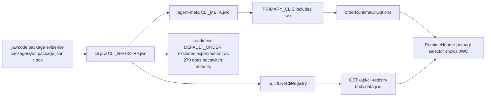

# 270.1 — P/A plan: Manager selector + `/api/cli-registry` JWC exposure

> PABCD stage: P approved, A r2 reached audit cap; this revision folds r2 findings into the B-stage handoff.
> Scope: 270 only — cli-jaw Manager selector and `/api/cli-registry` JWC exposure verification.
> Repos: implementation in `../cli-jaw`; jawcode provides package evidence and devlog contract.
> Classification: C3 cross-repo integration surface. No product-source mutation in P/A.

## Objective

Make `JWC` a primary Manager runtime choice in cli-jaw while preserving the registry/API as the runtime source of truth.

The phase is complete only when both surfaces are verified:

1. cli-jaw backend `/api/cli-registry` exposes key `jwc` at `body.data.jwc` with normalized label/defaults.
2. Manager Settings > Agent runtime selector treats `jwc` as a primary visible option and displays label `JWC`, not lowercase fallback and not overflow-only.

## Current evidence

| Area | Evidence |
|---|---|
| jawcode package | `packages/jwc/package.json:3,7-18` => package `jawcode`, bin `jwc`, export `./sdk`. |
| cli-jaw dependency | `../cli-jaw/package.json:143` and package-lock contain `"jawcode": "file:../jawcode/packages/jwc"`. |
| cli-jaw backend registry | `../cli-jaw/src/cli/registry.ts:146-157` already defines key `jwc` with binary `jwc`, `experimental: true`, default model `claude-fable-5`, effort `high`, and model list. |
| live registry API implementation | `../cli-jaw/src/cli/registry-live.ts:4-16` returns a structured clone of `CLI_REGISTRY`; `../cli-jaw/src/routes/settings.ts:310-311` exposes `GET /api/cli-registry`. |
| response envelope | `../cli-jaw/src/http/response.ts:12-14` returns `{ ok: true, data, ...extra }`; `/api/cli-registry` JWC path is `body.data.jwc`. |
| frontend gap | `../cli-jaw/public/manager/src/settings/pages/components/agent/agent-meta.ts:28` `PRIMARY_CLIS` omits `jwc`; `CLI_META` has no `jwc`, so `metaFor('jwc')` falls back to lowercase label `jwc` and empty model/effort metadata. |
| selector behavior | `../cli-jaw/public/manager/src/settings/pages/Agent.tsx:169` derives `cliOptions` from `Object.keys(perCli)`; `RuntimeHeader.tsx:50-56` filters that list by `PRIMARY_CLIS` but preserves `cliOptions` order. Adding `jwc` to `PRIMARY_CLIS` alone does not guarantee placement after `claude-e` / before `agy`. |
| readiness/default boundary | `../cli-jaw/src/cli/readiness.ts:154` `DEFAULT_ORDER` omits `jwc`; this is intentional for 270 because default runtime selection belongs to slice 280. |
| test owner | `../cli-jaw/tests/unit/manager-settings-model.test.ts:113-131` owns `PRIMARY_CLIS`/`metaFor` expectations; `../cli-jaw/tests/unit/cli-registry.test.ts:19-21` currently says 13 known entries despite registry containing `jwc`; `cli-registry.test.ts:214-217` requires every `CLI_KEYS` entry in `DEFAULT_ORDER`, which must be narrowed for experimental `jwc` without changing default runtime behavior. |

## Planned changes

### 1. MODIFY `../cli-jaw/src/cli/registry.ts`

Normalize the backend registry label to the user-facing spelling required by 270.

```diff
 jwc: {
-    label: 'jwc',
+    label: 'JWC',
     // In-process / resident ACP engine — no external binary spawned in the
```

Rationale: 270 requires runtime truth to come from registry/API, with `JWC` as the user-facing runtime identity. Fixing only frontend `CLI_META` would make `/api/cli-registry` and UI disagree.

### 2. MODIFY `../cli-jaw/public/manager/src/settings/pages/components/agent/agent-meta.ts`

Add `jwc` to primary runtimes and provide frontend metadata consistent with the backend registry.

```diff
-export const PRIMARY_CLIS: ReadonlyArray<string> = ['pi', 'claude', 'claude-e', 'agy', 'codex', 'cursor', 'kiro-code', 'gemini'];
+export const PRIMARY_CLIS: ReadonlyArray<string> = ['pi', 'claude', 'claude-e', 'jwc', 'agy', 'codex', 'cursor', 'kiro-code', 'gemini'];
```

Add a `jwc` entry in `CLI_META` with arrays byte-identical to `CLI_REGISTRY.jwc`:

```ts
jwc: {
    label: 'JWC',
    models: ['claude-fable-5', 'claude-opus-4-8', 'claude-sonnet-4-6', 'claude-haiku-4-5'],
    efforts: ['off', 'min', 'low', 'medium', 'high', 'xhigh'],
},
```

Add a small ordering helper so RuntimeHeader does not depend on `Object.keys(perCli)` insertion order:

```ts
export function orderRuntimeCliOptions(cliOptions: ReadonlyArray<string>): string[] {
    const primary = PRIMARY_CLIS.filter((value) => cliOptions.includes(value));
    const secondary = cliOptions.filter((value) => !PRIMARY_CLIS.includes(value));
    return [...primary, ...secondary];
}
```

Rationale: `CliMeta` currently has no icon/description fields, so `jwc` intentionally mirrors only the fields the type supports and current UI reads: `label`, `models`, and `efforts`. The helper centralizes selector ordering and makes `jwc` visible in the primary band near Claude runtimes.

### 3. MODIFY `../cli-jaw/public/manager/src/settings/pages/components/agent/RuntimeHeader.tsx`

Use the helper from `agent-meta.ts` for selector option order and collapsed boundary.

Patch shape:

```ts
import { metaFor, orderRuntimeCliOptions, PRIMARY_CLIS } from './agent-meta';

const orderedCliOptions = orderRuntimeCliOptions(cliOptions);
const orderedPrimaryCliCount = orderedCliOptions.filter((value) => PRIMARY_CLIS.includes(value)).length;
```

Then render the Active CLI options from `orderedCliOptions` and set:

```tsx
collapsedAfter={orderedPrimaryCliCount}
```

Rationale: the existing code filters `cliOptions` twice but preserves `Object.keys(perCli)` order. This does not prove `jwc` appears after `claude-e` and before `agy`; the helper does.

### 4. MODIFY `../cli-jaw/tests/unit/cli-registry.test.ts`

Update registry expectations so backend/API truth is test-covered.

```diff
-test('CLI_KEYS contains exactly 13 known entries', () => {
-    assert.deepEqual([...CLI_KEYS].sort(), ['agy', 'ai-e', 'claude', 'claude-e', 'codex', 'codex-app', 'copilot', 'cursor', 'gemini', 'grok', 'kiro-code', 'opencode', 'pi']);
+test('CLI_KEYS contains exactly 14 known entries', () => {
+    assert.deepEqual([...CLI_KEYS].sort(), ['agy', 'ai-e', 'claude', 'claude-e', 'codex', 'codex-app', 'copilot', 'cursor', 'gemini', 'grok', 'jwc', 'kiro-code', 'opencode', 'pi']);
 });
```

Add a focused registry test:

```ts
test('JWC registry exposes package-backed runtime metadata', () => {
    assert.equal(CLI_REGISTRY.jwc.label, 'JWC');
    assert.equal(CLI_REGISTRY.jwc.binary, 'jwc');
    assert.equal(CLI_REGISTRY.jwc.experimental, true);
    assert.equal(CLI_REGISTRY.jwc.defaultModel, 'claude-fable-5');
    assert.equal(CLI_REGISTRY.jwc.defaultEffort, 'high');
    assert.ok(CLI_REGISTRY.jwc.models.includes('claude-fable-5'));
    assert.ok(CLI_REGISTRY.jwc.efforts.includes('high'));
});
```

Add a mandatory live-registry assertion in the same file or an adjacent focused unit test:

```ts
test('live CLI registry preserves JWC runtime metadata', async () => {
    const registry = await buildLiveCliRegistry();
    assert.equal(registry.jwc.label, 'JWC');
    assert.equal(registry.jwc.binary, 'jwc');
    assert.equal(registry.jwc.experimental, true);
    assert.equal(registry.jwc.defaultModel, 'claude-fable-5');
    assert.equal(registry.jwc.defaultEffort, 'high');
});
```

Revise the readiness-default test to preserve the 270/280 boundary without rewriting existing experimental runtime behavior:

```ts
test('readiness default order covers existing non-JWC canonical CLIs and keeps JWC out for slice 270', () => {
    const readinessSrc = fs.readFileSync(join(__dirname, '../../src/cli/readiness.ts'), 'utf8');
    const order = readinessSrc.split('\n').find(line => line.includes('const DEFAULT_ORDER')) || '';
    for (const key of CLI_KEYS) {
        if (key === 'jwc') {
            assert.doesNotMatch(order, /'jwc'/, 'jwc remains out of DEFAULT_ORDER until slice 280 explicitly switches defaults');
            continue;
        }
        assert.match(order, new RegExp(`'${key}'`), `DEFAULT_ORDER must include ${key}`);
    }
});
```

Do **not** add `jwc` to `DEFAULT_ORDER` in 270. That would risk default runtime behavior and belongs to slice 280 if ever chosen.

### 5. MODIFY `../cli-jaw/tests/unit/manager-settings-model.test.ts`

Extend frontend metadata and ordering expectations.

```diff
+import { readFileSync } from 'node:fs';
+import { join } from 'node:path';
+import { CLI_REGISTRY } from '../../src/cli/registry';
 import { buildResetOverridesPatch, orderModelCliKeys } from '../../public/manager/src/settings/pages/ModelProvider';
-import { metaFor, PRIMARY_CLIS, runtimeModelFor } from '../../public/manager/src/settings/pages/components/agent/agent-meta';
+import { metaFor, orderRuntimeCliOptions, PRIMARY_CLIS, runtimeModelFor } from '../../public/manager/src/settings/pages/components/agent/agent-meta';
```

Add assertions:

```ts
const jwcMeta = metaFor('jwc');
assert.equal(PRIMARY_CLIS.includes('jwc'), true);
assert.equal(jwcMeta.label, 'JWC');
assert.deepEqual(jwcMeta.models, CLI_REGISTRY.jwc.models);
assert.deepEqual(jwcMeta.efforts, CLI_REGISTRY.jwc.efforts);
assert.equal(PRIMARY_CLIS.indexOf('claude-e') < PRIMARY_CLIS.indexOf('jwc'), true);
assert.equal(PRIMARY_CLIS.indexOf('jwc') < PRIMARY_CLIS.indexOf('agy'), true);
assert.deepEqual(
    orderRuntimeCliOptions(['gemini', 'jwc', 'claude-e', 'agy', 'custom-cli']),
    ['claude-e', 'jwc', 'agy', 'gemini', 'custom-cli'],
);
```

Add a source-coupling assertion so RuntimeHeader actually uses the helper:

```ts
const runtimeHeaderSource = readFileSync(
    join(__dirname, '../../public/manager/src/settings/pages/components/agent/RuntimeHeader.tsx'),
    'utf8',
);
assert.ok(runtimeHeaderSource.includes('orderRuntimeCliOptions(cliOptions)'));
assert.ok(runtimeHeaderSource.includes('orderedCliOptions.map'));
assert.ok(runtimeHeaderSource.includes('collapsedAfter={orderedPrimaryCliCount}'));
```

### 6. ADD `../cli-jaw/tests/unit/cli-registry-route.test.ts`

The implementation must prove the HTTP API, not only source constants. This test pins the current `ok()` envelope path from `src/http/response.ts:12-14`.

Test shape:

```ts
import test, { mock } from 'node:test';
import assert from 'node:assert/strict';
import express, { type NextFunction, type Request, type Response } from 'express';
import { resolve } from 'node:path';

const kiroModelsPath = resolve(import.meta.dirname, '../../src/agent/kiro-models.js');

// Isolate the live-registry Kiro augmentation boundary; 270 is about JWC exposure.
mock.module(kiroModelsPath, {
    namedExports: {
        fetchKiroModelInventory: async () => null,
    },
});

const { registerSettingsRoutes } = await import('../../src/routes/settings.ts');

const noAuth = (_req: Request, _res: Response, next: NextFunction) => next();

test('/api/cli-registry exposes JWC runtime metadata', async () => {
    const app = express();
    app.use(express.json());
    registerSettingsRoutes(app, noAuth, async () => ({}), process.cwd());
    const server = app.listen(0);
    try {
        const address = server.address();
        assert.ok(address && typeof address === 'object');
        const response = await fetch(`http://127.0.0.1:${address.port}/api/cli-registry`);
        assert.equal(response.status, 200);
        const body = await response.json() as { ok: boolean; data: Record<string, Record<string, unknown>> };
        assert.equal(body.ok, true);
        assert.equal(body.data.jwc.label, 'JWC');
        assert.equal(body.data.jwc.binary, 'jwc');
        assert.equal(body.data.jwc.experimental, true);
        assert.equal(body.data.jwc.defaultModel, 'claude-fable-5');
        assert.equal(body.data.jwc.defaultEffort, 'high');
    } finally {
        await new Promise<void>((resolve) => server.close(() => resolve()));
    }
});
```

Use the repo's current Node test mocking API. If `mock.module()` is unavailable in the active Node test runtime, extract a tiny `registerCliRegistryRoute(app)` helper from `settings.ts` and test that helper instead; do not let the route test depend on real Kiro discovery.

### 7. B-stage evidence receipt: jawcode package pairing

Record a small B-stage evidence snippet tying cli-jaw registry metadata to the current jawcode package surface. This can be a command output or source-read note in the B receipt:

- `packages/jwc/package.json` has `name: "jawcode"`.
- `packages/jwc/package.json` has `bin.jwc === "bin/jwc.js"`.
- `packages/jwc/package.json` exports `"./sdk"` to `"./dist-node/sdk.js"`.
- `../cli-jaw/src/cli/registry.ts` keeps `CLI_REGISTRY.jwc.binary === "jwc"`.

This is evidence only; do not change `packages/jwc` in slice 270.

## Verification plan

Run from `/Users/jun/Developer/new/700_projects/cli-jaw` after implementation.

Mandatory focused tests:

```sh
tsx --import ./tests/setup/test-home.ts --experimental-test-module-mocks --test tests/unit/cli-registry.test.ts tests/unit/manager-settings-model.test.ts tests/unit/cli-registry-route.test.ts
```

Supplemental route-registration guard:

```sh
tsx --experimental-test-module-mocks --test tests/integration/route-registration.test.ts
```

Static check:

```sh
npm run typecheck
```

Supplemental manual/browser check from parent 270, not a substitute for tests:

```sh
curl -s localhost:<manager-port>/api/cli-registry | jq '.data.jwc'
# Browser: Settings > Agent > Active CLI dropdown shows JWC inside the primary band.
```

Expected `/api/cli-registry` output at `.data.jwc` includes `label: "JWC"`, `binary: "jwc"`, `experimental: true`, `defaultModel: "claude-fable-5"`, and `defaultEffort: "high"`.

## Acceptance criteria

- [ ] `/api/cli-registry` exposes `body.data.jwc` with `label: "JWC"`, `binary: "jwc"`, `experimental: true`, and existing package-backed default model/effort metadata, proven by `cli-registry-route.test.ts`.
- [ ] `buildLiveCliRegistry()` preserves `jwc.label === "JWC"` and does not drop `binary`, `experimental`, `defaultModel`, or `defaultEffort`.
- [ ] `PRIMARY_CLIS` includes `jwc`, ordered after `claude-e` and before `agy`.
- [ ] `RuntimeHeader` uses `orderRuntimeCliOptions(cliOptions)` and `collapsedAfter={orderedPrimaryCliCount}` so JWC is inside the primary visible band regardless of `Object.keys(perCli)` order.
- [ ] `metaFor('jwc')` returns label/model/effort metadata and does not fall back to lowercase `jwc` with empty arrays.
- [ ] Registry unit tests include `jwc` in canonical keys and assert its metadata.
- [ ] Readiness default-order test continues to cover existing canonical CLIs and explicitly asserts `jwc` remains out of `DEFAULT_ORDER` in 270 to avoid default runtime switching.
- [ ] B-stage evidence pairs cli-jaw `CLI_REGISTRY.jwc.binary === "jwc"` with current jawcode package evidence: package `jawcode`, bin `jwc`, export `./sdk`.
- [ ] No default runtime switch is performed in this slice; slice 280 remains separate.
- [ ] No Code mode UI or Jaw mode native attach work is included; slices 300 and 305 remain separate.

## Risks and mitigations

| Risk | Mitigation |
|---|---|
| Duplicating models/efforts in frontend `CLI_META` drifts from backend registry. | Keep arrays byte-identical to current `CLI_REGISTRY.jwc` and assert via tests. A later dynamic-registry frontend refactor is out of scope for 270. |
| Changing backend label from `jwc` to `JWC` affects snapshots/UI text. | This is intended by 270's user-facing label requirement; tests encode it. |
| Route test imports heavy settings machinery. | Keep the route test small and isolate the Kiro inventory/settings boundary with a resolved `.js` mock path before importing settings routes. Do not replace with registry constants alone. |
| Adding `jwc` to default readiness order flips runtime behavior. | Do not touch `DEFAULT_ORDER`; update the test with a JWC-specific absence assertion until slice 280 explicitly chooses any default-switch behavior. |

## Mermaid


