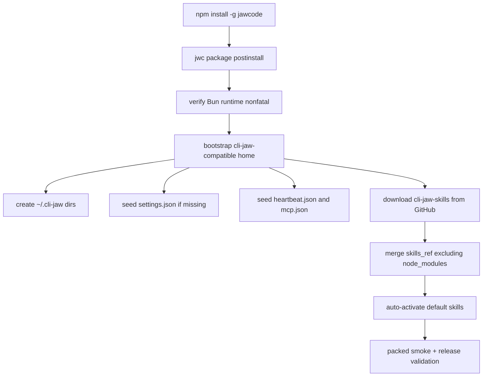

# 330.6 — P final summary

## Plan ref

`devlog/_plan/260614_cli_jaw_jwc_distribution_strategy/330_jawcode_cli_jaw_bootstrap_plan.md`

## Objective

Make `jawcode` installation bootstrap a cli-jaw-compatible user home for users who do not have cli-jaw installed.

## Approved plan shape

- Add bundled cli-jaw settings seed under `packages/jwc/defaults/cli-jaw/settings.json`.
- Add Node-only bootstrap script `packages/jwc/scripts/bootstrap-cli-jaw-home.cjs`.
- Wire the script into `packages/jwc/package.json` postinstall and publish `files`.
- Extend `packages/jwc/scripts/smoke-packed-sdk.mjs` to assert packed install creates cli-jaw-compatible home, settings, heartbeat, mcp, skills, and excludes skill `node_modules`.
- Add focused test `packages/coding-agent/test/jwc-cli-jaw-bootstrap.test.ts`.
- Include the bootstrap test in `scripts/jwc-release-validation.ts`.

## Critic status

- Round 1: ITERATE, all findings accepted in `330.2_p_synthesis_round1.md`.
- Round 2: ITERATE, all findings accepted in `330.4_p_synthesis_round2.md`.
- Round 3: OKAY, recorded in `330.5_p_critic_round3.md`.

## Mermaid

## Gate

Execution must not start until the user approves this pending plan.
