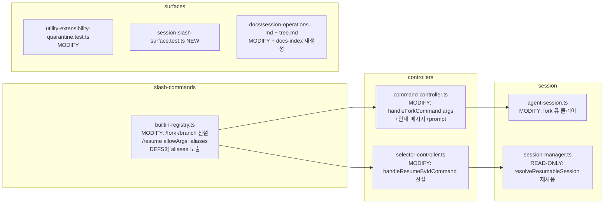

# 99.07.01 — 세션 계열 슬래시 표면 (/fork·/branch·/resume <id>·/sessions·/switch)

> 상태: ✅ 구현 완료 (260613 02:30 — 커밋 7fa8a9d0, PABCD 완주 + 독립 완료감사 9/9 PROVEN, 단독 tsc 0 · 슬래시 스위트 125 pass). C-stage 수리 2건: UUIDv7 풀 id 안내 + 병렬 세션 hunk 격리 재커밋.
> 클래스: C3 (공개 슬래시 계약 + 다모듈) · 선행: 99.07.00(시맨틱 조사), 인터뷰 5라운드(260613) · goal: 4983e5ca-c55 (pause-완료)
> 웹 연계: Code 모드 fork UX는 [D112-4](./112_moc_gui.md) — 기존 채팅 유지 + 새 convo 생성 (엔진 동사 재사용)

## 0. 인터뷰 확정 결정 (소스: 사용자 5라운드 + 직원 2기/서브에이전트 감사)

| # | 결정 | 값 |
|---|---|---|
| D1 | fork 시맨틱 | Claude Code `/branch` 식 — 전체 복제 + 즉시 전환 + 원본 id 복귀 안내 |
| D2 | 주 커맨드 | `/fork` (알리아스 아님 — `/branch`와 의미 분리) |
| D3 | `/fork <메시지>` | 분기 직후 메시지 즉시 prompt (인자 없으면 분기만) |
| D4 | `/branch` | **과거 시점 분기** 셀렉터(`showUserMessageSelector`) 독립 커맨드 신설 (semantic_split) |
| D5 | `/resume [id]` | id prefix 직접 점프 추가, 인자 없으면 기존 셀렉터 (add_id_jump) |
| D6 | `/sessions`·`/switch` | `/resume` 알리아스 + 알리아스 자동완성 인프라 개선 (alias_autocomplete) |
| D7 | 큐 정리 | fork 시 steering/followUp/nextTurn 큐 클리어 (`switchSession`/`newSession`과 일관) |

## 1. Part 1 — 쉬운 설명

jwc TUI에서 Claude Code처럼 대화를 즉석에서 갈라탈 수 있게 한다. `/fork`를 치면 현재 대화가 통째로 복제된 새 세션으로 즉시 넘어가고, "원본으로 돌아가려면 `/resume <원본id>` 또는 새 터미널에서 `jwc -r <원본id>`"라는 안내가 뜬다. `/fork ㅎㅇ`처럼 메시지를 붙이면 분기 직후 그 메시지가 바로 전송된다. `/branch`는 과거 메시지 시점에서 갈라타는 셀렉터(기존 키바인딩 전용 기능)를 슬래시로 노출하고, `/resume abc123`처럼 id를 주면 셀렉터 없이 바로 그 세션으로 점프한다. `/sessions`·`/switch`는 `/resume`의 별칭으로 추가하되, 별칭이 자동완성에 안 뜨던 인프라 구멍도 같이 고친다.

## 2. 변경 지도



## 3. Part 2 — diff 수준 명세

### 3.1 MODIFY `packages/coding-agent/src/slash-commands/builtin-registry.ts`

> ⚠ 라인 앵커는 감사 시점 실측치(A 1차 감사 보정): `/resume` 엔트리 **1077–1083**, `handleForkCommand` **945–972**, `modes/types.ts` **:228**, `interactive-mode.ts` **:2312**. 구현 시 재확인.

**(a) `/resume` 엔트리 교체** (현 1077–1083행):

현재:
```ts
{
    name: "resume",
    description: "Resume a different session",
    handleTui: (_command, runtime) => {
        runtime.ctx.showSessionSelector();
        runtime.ctx.editor.setText("");
    },
},
```
변경:
```ts
{
    name: "resume",
    aliases: ["sessions", "switch"],
    description: "Resume a different session (optionally by id prefix)",
    inlineHint: "[session id]",
    allowArgs: true,
    handleTui: async (command, runtime) => {
        const sessionArg = command.args?.trim();
        runtime.ctx.editor.setText("");
        if (!sessionArg) {
            runtime.ctx.showSessionSelector();
            return;
        }
        await runtime.ctx.handleResumeByIdCommand(sessionArg);
    },
},
```

**(b) `/fork`·`/branch` 신설** — `/resume` 엔트리 인접(뒤)에 삽입:
```ts
{
    name: "fork",
    description: "Fork the session and switch to the copy (optionally send a message)",
    inlineHint: "[message]",
    allowArgs: true,
    handleTui: async (command, runtime) => {
        const message = command.args?.trim();
        runtime.ctx.editor.setText("");
        await runtime.ctx.handleForkCommand(message || undefined);
    },
},
{
    name: "branch",
    description: "Branch from an earlier user message",
    handleTui: (_command, runtime) => {
        runtime.ctx.editor.setText("");
        runtime.ctx.showUserMessageSelector();
    },
},
```

**(c) DEFS에 aliases 노출** (현 1293–1301행):
```ts
export const BUILTIN_SLASH_COMMAND_DEFS: ReadonlyArray<BuiltinSlashCommand> = ACTIVE_BUILTIN_SLASH_COMMAND_REGISTRY.map(
    command => ({
        name: command.name,
        aliases: command.aliases,          // ← 추가
        description: command.description,
        subcommands: command.subcommands,
        inlineHint: command.inlineHint,
    }),
);
```
- `BuiltinSlashCommand` 타입(`slash-commands/types.ts:15`)에 `aliases?: readonly string[]` 필드 추가 (`SlashCommandSpec.aliases`는 :82에 이미 존재 — 호환).
- 자동완성 소비자 `packages/coding-agent/src/extensibility/slash-commands.ts:102` — `map` → **`flatMap`** 전환으로 alias를 별도 엔트리로 전개. 구체 diff:
```ts
> = BUILTIN_SLASH_COMMAND_DEFS.flatMap(cmd => {
    const decorate = (entry: BuiltinSlashCommand) => {
        if (entry.subcommands) {
            return {
                ...entry,
                getArgumentCompletions: buildArgumentCompletions(entry.subcommands),
                getInlineHint: buildSubcommandInlineHint(entry.subcommands),
            };
        }
        if (entry.inlineHint) {
            return { ...entry, getInlineHint: buildStaticInlineHint(entry.inlineHint) };
        }
        return entry;
    };
    const aliasEntries = (cmd.aliases ?? []).map(alias =>
        decorate({ ...cmd, name: alias, aliases: undefined, description: `${cmd.description} (alias of /${cmd.name})` }),
    );
    return [decorate(cmd), ...aliasEntries];
});
```
  - alias 엔트리는 주 커맨드의 `subcommands`/`inlineHint`를 **그대로 상속**(같은 핸들러로 디스패치되므로 동일 인자 표면), description에 `(alias of /<name>)` 표기 — `/help`·자동완성 양쪽에 이 형태로 노출.
  - ACP `ACP_BUILTIN_SLASH_COMMANDS`는 기존대로 name만(ACP 계약 불변, `acp-builtins.ts:17-18` 필터 무변경).

### 3.2 MODIFY `packages/coding-agent/src/modes/controllers/command-controller.ts`

`handleForkCommand()` (현 945–972행) 시그니처/본문 교체:
```ts
async handleForkCommand(message?: string): Promise<void> {
    if (this.ctx.session.isStreaming) { …기존 가드 유지… }
    …기존 loadingAnimation/statusContainer 정리 유지…

    const originalSessionId = this.ctx.session.sessionId;   // fork 전 선캡처

    const success = await this.ctx.session.fork();
    if (!success) { …기존 에러 유지… return; }

    …기존 statusLine/topBorder 갱신 유지…

    const newSessionId = this.ctx.session.sessionId;
    const shortOriginal = originalSessionId ? originalSessionId.slice(0, 8) : undefined;
    this.ctx.chatContainer.addChild(new Spacer(1));
    this.ctx.chatContainer.addChild(new Text(theme.fg("accent",
        `${theme.status.success} Forked conversation. You are now in the new session (${newSessionId}).`), 1, 1));
    if (shortOriginal) {
        this.ctx.chatContainer.addChild(new Text(theme.fg("muted",
            `Use /resume ${shortOriginal} to return to the original, or run \`${APP_NAME} -r ${shortOriginal}\` in a new terminal.`), 1, 1));
    }
    this.ctx.ui.requestRender();

    if (message) {
        await this.ctx.session.prompt(message);
    }
}
```
- `APP_NAME` import 추가(`@gajae-code/utils` — registry와 동일 소스).
- `modes/types.ts:228` 시그니처 `handleForkCommand(message?: string): Promise<void>`로 갱신, `interactive-mode.ts:2312` 위임도 인자 전달.

### 3.3 MODIFY `packages/coding-agent/src/modes/controllers/selector-controller.ts`

`handleResumeByIdCommand(sessionArg: string)` 신설 — `handleResumeSession`(1093행) 위에 추가:
```ts
async handleResumeByIdCommand(sessionArg: string): Promise<void> {
    const match = await resolveResumableSession(
        sessionArg,
        this.ctx.sessionManager.getCwd(),
        this.ctx.sessionManager.getSessionDir(),
    );
    if (!match) {
        this.ctx.showError(`No session matching "${sessionArg}". Use /resume to open the selector.`);
        return;
    }
    if (match.session.cwd !== this.ctx.sessionManager.getCwd()) {
        this.ctx.showError(`Session ${sessionArg} belongs to a different project (${match.session.cwd}). Run \`${APP_NAME} -r ${sessionArg}\` there.`);
        return;
    }
    await this.handleResumeSession(match.session.path);
}
```
- import `resolveResumableSession`(session-manager), `APP_NAME`.
- `modes/types.ts`에 `handleResumeByIdCommand(sessionArg: string): Promise<void>` 추가 + `interactive-mode.ts` 위임 1줄.
- 주의: `resolveResumableSession`은 글로벌 폴백 검색 포함 — 동일-프로젝트 외 매치는 위처럼 안내만(TUI 내 cross-project fork 프롬프트는 스코프 밖, CLI와 동일 UX 유지).

### 3.4 MODIFY `packages/coding-agent/src/session/agent-session.ts`

`fork()` (5696행~) — `#syncAgentSessionId()` 직전(L5740 부근)에 큐 클리어 추가 (newSession 5645–5648행과 **동일 4종** — A 1차 감사에서 4번째 항목 누락 지적 반영):
```ts
this.#steeringMessages = [];
this.#followUpMessages = [];
this.#pendingNextTurnMessages = [];
this.#scheduledHiddenNextTurnGeneration = undefined;
```

### 3.5 테스트

- **MODIFY** `packages/coding-agent/test/utility-extensibility-quarantine.test.ts:42` — `"fork"` 부재 단언 제거(등록되므로). `branch`도 동일 목록에 있으면 제거.
- **NEW** `packages/coding-agent/test/session-slash-surface.test.ts`:
  1. `/fork` 등록·allowArgs 확인, 디스패치 시 handleForkCommand 호출(인자 유/무)
  2. fork 후 안내 텍스트에 원본 id prefix + `/resume` + `-r` 포함
  3. `/fork msg` → `session.prompt("msg")` 호출
  4. `/resume abc` → handleResumeByIdCommand("abc"); 무인자 → showSessionSelector
  5. `/sessions`·`/switch` lookup이 resume spec으로 해석
  6. DEFS/자동완성 목록에 alias 엔트리 존재 (`sessions`, `switch`, 기존 `bg`)
  7. `/branch` → showUserMessageSelector 호출
  8. fork 시 steering 큐 클리어 (agent-session 단위)
- ACP 테스트(`acp-builtins.test.ts:501,517`): `/fork`·`/branch` 모두 handleTui 전용이라 ACP fallthrough 단언 **그대로 유효** — 변경 없음 예상, 깨지면 원인 보고.

### 3.6 문서

- **MODIFY** `docs/session-operations-export-share-fork-resume.md` — `/fork` 행에 `[message]` 인자·안내 메시지·큐 클리어 서술, `/resume` 행에 id 인자, `/sessions`·`/switch` 알리아스 행 추가.
- **MODIFY** `docs/tree.md` — `/tree`·`/branch`·`/fork`·`/resume` 비교표에 `/branch` 슬래시 신설 반영.
- 재생성: `packages/coding-agent/scripts/generate-docs-index.ts` 실행 → `docs-index.generated.ts` 갱신.

## 4. 불변 조건

- ACP 표면 불변: `/fork`·`/branch`·`/resume` 모두 `handle` 미정의(TUI 전용), `ACP_BUILTIN_SLASH_COMMAND` name-only 유지.
- 키바인딩 `app.session.fork` → `showUserMessageSelector` 라우팅 불변 (`/branch`와 같은 목적지).
- in-memory(`--no-session`) fork 기존 에러 경로 불변.
- `SessionManager.fork()`·`switchSession()` 본체 무변경 (3.4의 AgentSession 레벨 큐 클리어만).

## 5. 검증 게이트 (C3)

1. `bun test packages/coding-agent/test/session-slash-surface.test.ts` + quarantine + acp-builtins + 기존 세션 테스트 스위트
2. `tsc --noEmit` 0
3. 라이브 CLI: 임시 디렉터리에서 `/fork` → 안내 출력·전환 확인, `/resume <prefix>` 점프, `/sessions` 자동완성
4. docs-index 재생성 diff 확인
