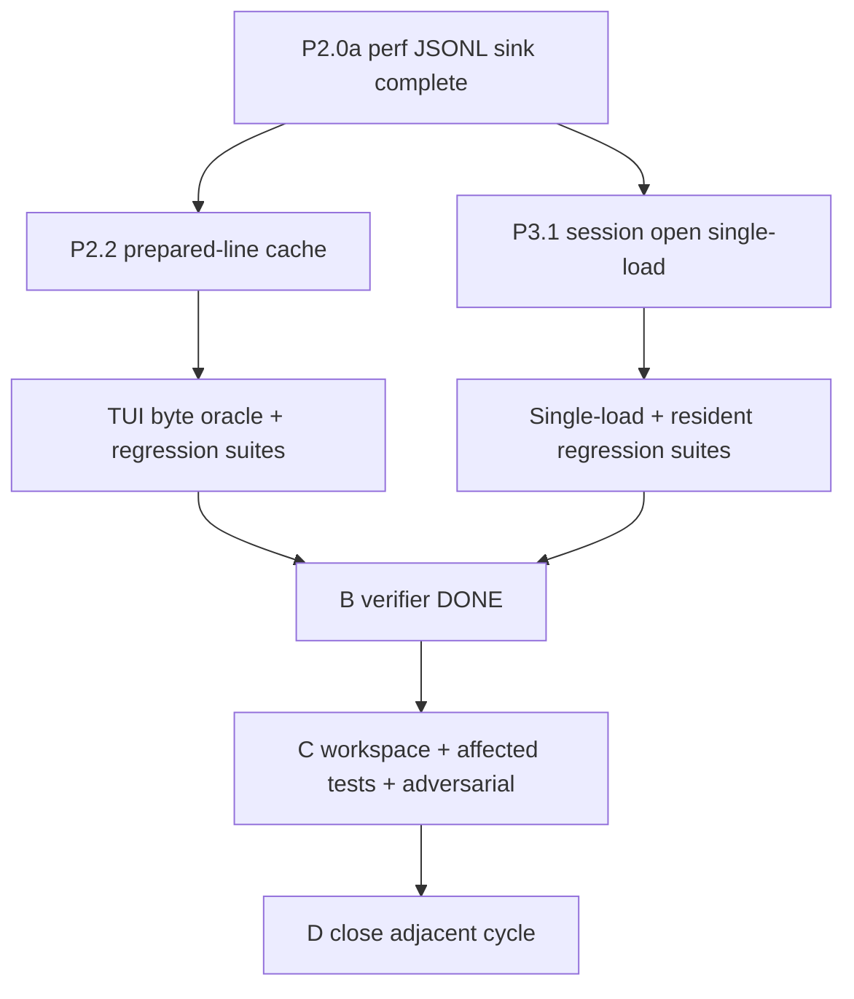

# 72 — P2.2 prepared-line cache + P3.1 single-load adjacent plan

Date: 2026-06-15

## Objective

Complete the next measured performance bundle after P2.0a: implement the TUI prepared-line cache (Bundle B / P2.2) and the session-open single-load fix (Bundle C / P3.1) in one adjacent PABCD cycle. The two slices touch disjoint runtime surfaces and can be implemented independently after one shared audit, but they close together through focused gates and C-stage adversarial review.

## Source-of-truth inputs

- P2/P3 measured plan: `devlog/_plan/260614_performance/69_p2_p3_measured_execution_plan.md`.
- External audit synthesis: `devlog/_plan/260614_performance/68_p2_p3_external_audit_synthesis.md`.
- P2.0a completed sink: `devlog/_plan/260614_performance/71.16_d_p2_0a_done_summary.md`.
- Scroll/fill boundary: `structure/31_scroll.md` remains frozen; do not edit scroll/fill/gap behavior.

## Scope

### Slice B — P2.2 TUI prepared-line cache

Purpose: reduce repeated per-frame work in the TUI line-preparation path without changing rendered bytes, viewport fill, scroll behavior, or input render priority.

Files:

- MODIFY `packages/tui/src/tui.ts`
- MODIFY `packages/tui/src/utils.ts` only if the ASCII fast path needs a shared helper rather than a local `tui.ts` helper
- MODIFY `packages/tui/test/perf-events-p2_0.test.ts`
- NEW `packages/tui/test/prepared-line-cache.test.ts`

Non-goals:

- No welcome visual changes.
- No viewport-fill / sticky-gap / compactViewportFill rewrite.
- No render scheduling changes beyond clearing the new cache inside existing forced-render and width-change invalidation boundaries.
- No markdown/assistant child reuse; that is Bundle D / P2.1.

### Slice C — P3.1 session open single-load

Purpose: remove the known double read/parse on `SessionManager.open(filePath)` while preserving loaded-session migration, persisted blob resolution, resident store reset/re-externalization, replay metadata sanitization, index rebuild, breadcrumb, and empty-file rewrite behavior.

Files:

- MODIFY `packages/coding-agent/src/session/session-manager.ts`
- NEW `packages/coding-agent/test/session-open-single-load.test.ts`

Non-goals:

- No `buildSessionContext()` path-only materialization.
- No `sdk.ts` startup flag dedupe.
- No full-tree API behavior changes (`getEntries()`, `getTree()`, usage statistics remain intentionally materializing/expensive).

## Implementation plan

### MODIFY `packages/tui/src/tui.ts`

#### Before

- `#doRender()` prepares lines by calling `#applyLineResets(newLines)` followed by `#truncateLinesToWidth(newLines, width)`.
- `commitLines()` duplicates the same preparation sequence.
- P2.0a emits placeholder `tui.preparedLine` counters with all zeroes.
- Every frame re-runs normalization, OSC8 terminator selection, `visibleWidth()`, and truncation for repeated lines.
- Differential emit paths still contain defensive truncation branches after line preparation; the cache plan must either remove those branches once inputs are prepared or share the exact same truncation terminator helper so no second divergent truncation policy survives.

#### After

Add bounded content-keyed caches and one shared line-preparation path:

```ts
const PREPARED_LINE_CACHE_LIMIT = 4096;

interface PreparedLineStats {
  normalizeHit: number;
  normalizeMiss: number;
  truncateHit: number;
  truncateMiss: number;
}
```

Add private fields on `TUI`:

```ts
#preparedNormalizeCache = new Map<string, string>();
#preparedTruncateCache = new Map<string, string>();
```

Add helpers:

```ts
#rememberPreparedLine(cache: Map<string, string>, key: string, value: string): string
#clearPreparedLineCaches(): void
#emptyPreparedLineStats(): PreparedLineStats
#prepareLineForTerminal(line: string, width: number, stats: PreparedLineStats): string
#prepareLinesForTerminal(lines: string[], width: number): { lines: string[]; stats: PreparedLineStats }
#isPrintableAsciiLine(line: string): boolean
#recordPreparedLineStats(stats: PreparedLineStats, owner: "render" | "commit"): void
```

Required behavior:

- Image lines (`TERMINAL.isImageLine(line)`) bypass both caches and remain byte-identical.
- Add a printable-ASCII fast path inside `#prepareLineForTerminal()`:
  - for lines with no escape/control/tab/non-ASCII bytes and `line.length <= width`, skip `visibleWidth()` and truncation and return the normalized/reset value through the normalization cache;
  - if this predicate is useful outside `tui.ts`, add a named helper in `packages/tui/src/utils.ts`; otherwise keep it private to `tui.ts`.
- Normalization cache key is exactly the raw component line string.
- Normalization cache value is the current post-`normalizeTerminalOutput()` line plus the same reset terminator policy currently used by `#applyLineResets()`:
  - if normalized output contains `"\x1b]8;"`, append `LINE_TERMINATOR`;
  - otherwise append `SEGMENT_RESET`.
- Truncation cache key is `${width}\0${preparedLine}` where `preparedLine` is the normalized/terminated output.
- Truncation cache value is byte-identical to the current `#truncateLinesToWidth()` result:
  - if `visibleWidth(preparedLine) <= width`, return `preparedLine` and do not populate the truncation cache;
  - otherwise cache `truncateToWidth(preparedLine, width, Ellipsis.Omit) + terminator`, using one shared helper for OSC8 terminator selection on the truncated line.
- `#prepareLinesForTerminal()` replaces both `#applyLineResets()` and `#truncateLinesToWidth()` call sites in `#doRender()` and `commitLines()`.
- Delete the defensive inline `truncateToWidth()` branches in viewport repaint / differential emit paths after `newLines` has passed through `#prepareLinesForTerminal()`, or make those branches call the same shared truncation helper. Do not leave a copied truncation+terminator policy.
- Keep `#applyLineResets()` / `#truncateLinesToWidth()` only if needed as tiny wrappers around the new helper for local readability; do not leave divergent logic.
- Cache bound: when either map reaches `PREPARED_LINE_CACHE_LIMIT`, evict the oldest 25% of entries by insertion order before inserting the new value. Do not let streaming unique lines grow unbounded.
- Clear both caches in:
  - `stop()` after clearing `#previousLines` / dimensions;
  - inside `requestRender(true, ...)` when `force === true`, before scheduling the forced render;
  - at the start of `#doRender()` when `widthChanged` is true, before line preparation.
- Do not clear caches on ordinary input-priority renders; repeated streaming/input lines should benefit.
- Replace the P2.0a placeholder `renderMetrics.recordEvent("tui.preparedLine", ...)` in `#doRender()` with exactly one aggregated `recordEvent()` per anchored render containing summed hit/miss counters and label `{ owner: "render" }`.
- The aggregated render event counters are short keys: `normalize.hit`, `normalize.miss`, `truncate.hit`, `truncate.miss`.
- Optionally record exactly one aggregated `{ owner: "commit" }` event from `commitLines()` only when metrics are enabled and a commit attempt reaches line preparation; do not emit placeholder rows from `commitLines()` when no commit occurs.
- Preserve existing `tui.frame` and `tui.text` P2.0a rows.

### MODIFY `packages/tui/test/perf-events-p2_0.test.ts`

#### Before

- Expects the P2.0a prepared-line row to be a placeholder with `labels.placeholder === "true"` and all zero counters.

#### After

- Update the prepared-line JSONL assertion to accept real P2.2 stats:
  - `source === "tui.preparedLine"`;
  - counters include numeric short keys `normalize.hit`, `normalize.miss`, `truncate.hit`, `truncate.miss`;
  - labels include `owner: "render"`;
  - no `placeholder: "true"` requirement for prepared-line rows.
- In `prepared-line-cache.test.ts`, assert the in-memory snapshot keys for the same counters use source-qualified names: `tui.preparedLine.normalize.hit`, `tui.preparedLine.normalize.miss`, `tui.preparedLine.truncate.hit`, and `tui.preparedLine.truncate.miss`.
- Keep the frame placeholder and text placeholder assertions unchanged unless their owning rows are deliberately changed in a later bundle.

### NEW `packages/tui/test/prepared-line-cache.test.ts`

Add a focused integration/oracle suite using `VirtualTerminal`, `TUI`, and the process-wide `renderMetrics` singleton.

Required cases:

1. **Byte parity across cache miss/hit**
   - Render the same fixture twice at the same width.
   - Fixture lines must include plain printable ASCII, ANSI SGR, OSC 8 hyperlink, wide Unicode, combining marks, tabs, a line that truncates, and at least one Thai/Lao AM/NIKHAHIT line that changes under `normalizeTerminalOutput()`.
   - Assert the second render produces the same viewport/scrollback-visible bytes as the first render.
   - Assert `tui.preparedLine` metrics show misses on first render and hits on second render using both JSONL row counters and `renderMetrics.snapshot().counters` source-qualified keys.
2. **Commit lane shares preparation**
   - Use an existing `commitLines()`-capable fixture shape from `commit-lane.test.ts`.
   - Commit lines containing ANSI/OSC8/wide/truncating content.
   - Assert committed terminal bytes match the same content rendered through the normal `#doRender()` path at the same width.
3. **Bounded growth under streaming unique lines**
   - Render more than `PREPARED_LINE_CACHE_LIMIT` unique line contents with metrics enabled.
   - Assert the process remains bounded by observing that repeated final-window lines can still hit after eviction and no unbounded public state is exposed.
   - If the private cache size cannot be directly observed, assert behavior through metrics: unique first pass mostly misses; immediate repeat of the latest window produces hits.
4. **Invalidation boundaries**
   - Force render clears caches: after `requestRender(true, ...)`, the repeated same-width line records normalize/truncate misses again.
   - Width change clears caches before preparation: resize terminal width and assert normalize/truncate misses after the next render.
   - Stop clears caches using a fresh fixture: create a new `VirtualTerminal` + new `TUI` at the same width with the same lines after `tui.stop()`, and expect normalize/truncate misses again.
5. **Regression suites remain green**
   - Existing render goldens, input latency/redteam, commit-lane, viewport-fill, and above-viewport repaint tests must pass.

## MODIFY `packages/coding-agent/src/session/session-manager.ts`

### Before

`SessionManager.open(filePath, sessionDir, storage)` does:

1. `loadEntriesFromFile(filePath, storage)` to extract `cwd` from the header.
2. Construct manager.
3. `manager.#initSessionFile(filePath)` → `setSessionFile(filePath)` → second `loadEntriesFromFile()`.

### After

Introduce a loaded-entry adoption path used by both `open()` and `setSessionFile()`:

```ts
async #adoptLoadedSessionFile(sessionFile: string, entries: FileEntry[]): Promise<void>
```

`#adoptLoadedSessionFile()` owns the current post-load logic from `setSessionFile()`:

- `setSessionFile()` keeps the current pre-load setup before calling adoption:
  - `await this.#closePersistWriter()`;
  - `this.#resetResidentStores()`;
  - clear `#persistError` and `#persistErrorReported`;
  - resolve `const resolvedSessionFile = path.resolve(sessionFile)`;
  - load once with `loadEntriesFromFile(resolvedSessionFile, this.storage)`;
  - call `#adoptLoadedSessionFile(resolvedSessionFile, entries)`.
- `static open(filePath, sessionDir, storage)` resolves `const resolved = path.resolve(filePath)` once, loads once with `loadEntriesFromFile(resolved, storage)`, derives `cwd` from those entries, constructs a fresh manager, and calls `#adoptLoadedSessionFile(resolved, entries)` directly. A fresh manager has no persist writer to close; adoption still starts by resetting resident stores so `open()` and `setSessionFile()` share the same resident pre-adoption state.
- `#adoptLoadedSessionFile()` owns the current post-load logic from `setSessionFile()`:
  - call `this.#resetResidentStores()` before assigning new `#fileEntries` so both `open()` and `setSessionFile()` enter adoption with clean resident stores;
  - `#sessionFile = path.resolve(sessionFile)`;
  - `writeTerminalBreadcrumb(this.cwd, this.#sessionFile)`;
  - assign `#fileEntries = entries`;
  - if entries exist:
    - derive header/session id/title/titleSource;
    - assign `this.#needsFullRewriteOnNextPersist = migrateToCurrentVersion(this.#fileEntries)`;
    - await `resolveBlobRefsInEntries()`;
    - prepare resident entries with `prepareEntryForResidentSync()`;
    - run `sanitizeLoadedOpenAIResponsesReplayMetadata()`;
    - `#buildIndex()`;
    - set `#flushed = true` and `#ensuredOnDisk = true`;
  - if entries are empty:
    - preserve explicit path;
    - call `#newSessionSync()`;
    - restore `#sessionFile` to explicit path;
    - rewrite file;
    - set `#flushed = true` and `#ensuredOnDisk = true`.
- Preserve `#initSessionFile()` as a thin `await this.setSessionFile(sessionFile)` wrapper for `continueRecent()` and existing callers.

Do not add open-only divergent migration or resident logic.
- Add a migrated-session assertion: a session fixture below the current version must set `#needsFullRewriteOnNextPersist` through adoption and perform the expected cold full rewrite on the first persist-triggering write.

## NEW `packages/coding-agent/test/session-open-single-load.test.ts`

Add a focused test with a counting storage wrapper around `MemorySessionStorage`.

Wrapper contract:

- `CountingSessionStorage` delegates every `SessionStorage` method to an inner `MemorySessionStorage`.
- It increments counts in async `readText(path)` for the exact path key used by `loadEntriesFromFile()`.
- `readTextCountFor(path)` resolves the path with `path.resolve(path)` before lookup.
- It may count `readTextPrefix()` separately for future-proofing, but the P3.1 assertion is specifically `readText()` count for the opened JSONL path.

Required cases:

1. **Valid resident-heavy open reads once**
   - Create a persistent in-memory session with large resident text/image payloads using constants inline in this file: `LARGE_TEXT = "single load ".repeat(60_000) + "TEXT_TAIL"` and a base64 image payload containing `IMAGE_TAIL`.
   - Capture/write a session file through the normal session APIs.
   - Reopen via `SessionManager.open(sessionFile, "/sessions", countingStorage)`.
   - Assert `countingStorage.readTextCountFor(path.resolve(sessionFile)) === 1`.
   - Define `TRUNCATION_NOTICE = "[Session persistence truncated large content]"` inline and assert reopened `buildSessionContext().messages` contains `TEXT_TAIL` or `TRUNCATION_NOTICE`, and contains `IMAGE_TAIL` for durable image materialization when applicable.
   - Assert `JSON.stringify(reopened.captureState().fileEntries)` does not contain `LARGE_TEXT.slice(0, 100)` or the raw image payload prefix.
2. **Empty/missing explicit file path behavior unchanged**
   - Open a path absent from `MemorySessionStorage`.
   - Assert the file is created/re-written through existing empty-session behavior.
   - Assert reads are still exactly one for the attempted path.
3. **Migrated session cold full-rewrite behavior**
   - Add a pre-current-version JSONL fixture in `session-open-single-load.test.ts` using the previous schema version and a minimal message entry.
   - Reopen it through `SessionManager.open(sessionFile, "/sessions", countingStorage)`.
   - Assert the open still reads the target JSONL exactly once.
   - Trigger the first persist write with a normal append/update path.
   - Assert the resulting stored JSONL has been fully rewritten to the current session version rather than only appended, proving adoption preserved `#needsFullRewriteOnNextPersist`.
4. **Existing resident regression suites remain green**
   - `resident-materialization.test.ts`
   - `session-resident-cache.test.ts`
   - `session-resident-lifecycle.test.ts`
   - `session-resident-ownership.test.ts`

## Verification plan

Focused gates after B implementation:

```bash
bun test packages/tui/test/prepared-line-cache.test.ts packages/tui/test/perf-events-p2_0.test.ts packages/tui/test/render-goldens.test.ts packages/tui/test/input-render-latency.test.ts packages/tui/test/input-render-redteam.test.ts packages/tui/test/commit-lane.test.ts packages/tui/test/viewport-fill.test.ts packages/tui/test/above-viewport-repaint.test.ts
bun test packages/coding-agent/test/session-open-single-load.test.ts packages/coding-agent/test/resident-materialization.test.ts packages/coding-agent/test/session-resident-cache.test.ts packages/coding-agent/test/session-resident-lifecycle.test.ts packages/coding-agent/test/session-resident-ownership.test.ts
bun --cwd=packages/tui run check
bun --cwd=packages/coding-agent run check:types
```

C-stage gates after B verifier DONE:

```bash
bun run check
bun test packages/tui/test/prepared-line-cache.test.ts packages/tui/test/perf-events-p2_0.test.ts packages/tui/test/render-goldens.test.ts packages/tui/test/input-render-latency.test.ts packages/tui/test/input-render-redteam.test.ts packages/tui/test/commit-lane.test.ts packages/tui/test/viewport-fill.test.ts packages/tui/test/above-viewport-repaint.test.ts packages/coding-agent/test/session-open-single-load.test.ts packages/coding-agent/test/resident-materialization.test.ts packages/coding-agent/test/session-resident-cache.test.ts packages/coding-agent/test/session-resident-lifecycle.test.ts packages/coding-agent/test/session-resident-ownership.test.ts
```

## Done criteria

- P2.2 real prepared-line metrics replace placeholder rows for render-owned line preparation.
- Repeated identical rendered lines show cache hits without changing terminal-visible bytes.
- Printable ASCII lines use the fast path without bypassing reset/terminator byte parity.
- Commit-lane preparation and render-path preparation share one implementation and byte contract.
- Cache growth is bounded under streaming unique lines.
- Viewport repaint and differential emit paths either trust already prepared `newLines` or call the same shared truncation helper; no second copied truncation+terminator policy remains after `#prepareLinesForTerminal()`.
- Forced render, width change, and stop clear caches.
- P1.5.1 input-priority tests remain green.
- Scroll/fill/gap and welcome visuals are untouched.
- `SessionManager.open()` reads/parses the target session JSONL once for valid resident-heavy sessions.
- Migration, blob resolution, resident bounded persistence, resident fail-closed ownership, empty-session rewrite, and breadcrumb behavior remain intact.
- Migrated session opens preserve `#needsFullRewriteOnNextPersist` and cold full-rewrite behavior on first persist-triggering write.

## Mermaid


