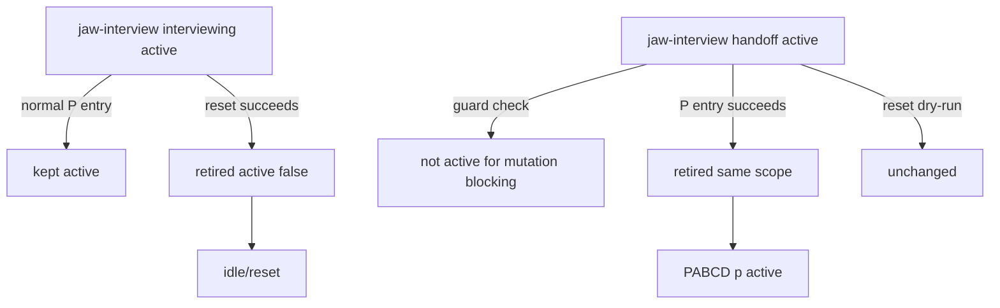

# 21.3 P — Jaw-Interview Handoff Cleanup Implementation Plan R2

Date: 2026-06-15
Stage: PABCD P
Supersedes: `21_p_jaw_interview_handoff_cleanup_plan.md`
Critic synthesis: `21.2_p_synthesis_round1.md`

## Objective

Implement stale `jaw-interview` cleanup across mutation guard and native PABCD runtime:

1. `current_phase:"handoff"` must release jaw-interview product/source mutation blocking regardless of ambiguity score.
2. Successful native PABCD P entry must retire same-scope stale `jaw-interview` handoff state.
3. Native PABCD reset/idle must retire same-scope `jaw-interview` state after the reset actually succeeds.
4. Active `interviewing` must still block product/source mutation and must not be silently retired by normal P entry.

Work class: C3. This touches runtime workflow state and PABCD transition behavior, so execution proceeds through PABCD audit/build/check.

## Requirements

- Plain `jwc interview --write` remains `active:true + current_phase:"handoff"`; existing persistence tests must keep passing.
- `handoff` is terminal only for the jaw-interview mutation guard's product/source blocking decision.
- Runtime cleanup uses sanctioned state writer APIs and `syncSkillActiveState()`.
- Cleanup is scope-isolated:
  - `sessionId` present → clean only `.jwc/state/sessions/<encoded-session>/jaw-interview-state.json` and that session's active-state snapshot.
  - `sessionId` absent/shared → clean only root `.jwc/state/jaw-interview-state.json` and root active-state snapshot.
- Normal `jwc orchestrate p` retires only `handoff` state.
- `jwc orchestrate reset` retires `handoff` and `interviewing` state for the reset scope, because reset means return to idle.
- Dry-run reset must not retire jaw-interview state.
- Absent or corrupt jaw-interview state returns `false` from cleanup and does not block PABCD.
- Discovered stale state write/sync failures should throw and fail the command; failing to retire a known stale state is runtime inconsistency.

## Non-goals

- No ambiguity-threshold algorithm changes.
- No automatic spec approval.
- No global changes to skill stop-hook semantics.
- No PABCD `complete` cleanup hook in this patch; the user asked for P/idle cleanup.
- No durable goal ledger/storage movement.

## File-level implementation plan

### 1. MODIFY `packages/coding-agent/src/skill-state/jaw-interview-mutation-guard.ts`

Patch `isTerminalModeState()` to include `handoff`:

```ts
function isTerminalModeState(state: ModeState | null): boolean {
	if (state?.active !== true) return true;
	const phase = String(state.current_phase ?? "")
		.trim()
		.toLowerCase();
	// For mutation blocking, handoff means jaw-interview stopped collecting requirements.
	// Downstream chain guards may still require explicit demotion before another skill activates.
	return ["complete", "completed", "handoff", "failed", "cancelled", "canceled", "inactive"].includes(phase);
}
```

### 2. MODIFY `packages/coding-agent/src/jwc-runtime/jaw-interview-runtime.ts`

Add exported type/helper near `persistJawInterviewSpec()` or before `handleSpecWrite()`:

```ts
export type JawInterviewWorkflowExitReason = "orchestrate-p" | "orchestrate-reset";

export async function retireJawInterviewStateForWorkflowExit(input: {
	cwd: string;
	sessionId?: string;
	reason: JawInterviewWorkflowExitReason;
	includeActiveInterview?: boolean;
}): Promise<boolean> {
	const statePath = jawInterviewStatePath(input.cwd, input.sessionId);
	const existingRead = await readExistingStateForMutation(statePath);
	if (existingRead.kind !== "valid") return false;

	const existing = existingRead.value;
	if (existing.active !== true) return false;
	const phase = String(existing.current_phase ?? "").trim().toLowerCase();
	const canRetire = phase === "handoff" || (input.includeActiveInterview === true && phase === "interviewing");
	if (!canRetire) return false;

	const now = new Date().toISOString();
	const retiredPhase = phase || "inactive";
	await writeWorkflowEnvelopeAtomic(
		statePath,
		{
			...existing,
			active: false,
			current_phase: retiredPhase,
			workflow_exit_reason: input.reason,
			updated_at: now,
			...(input.sessionId ? { session_id: input.sessionId } : {}),
		},
		{
			cwd: input.cwd,
			receipt: {
				cwd: input.cwd,
				skill: "jaw-interview",
				owner: "jwc-runtime",
				command: `jwc interview retire ${input.reason}`,
				sessionId: input.sessionId,
				nowIso: now,
			},
			audit: {
				category: "state",
				verb: "retire",
				owner: "jwc-runtime",
				skill: "jaw-interview",
				fromPhase: phase,
				toPhase: retiredPhase,
			},
		},
	);

	await syncSkillActiveState({
		cwd: input.cwd,
		skill: "jaw-interview",
		active: false,
		phase: retiredPhase,
		sessionId: input.sessionId,
		source: "jwc-interview-native",
		hud: buildJawInterviewHudSummary({
			phase: retiredPhase,
			specStatus: "retired",
			updatedAt: now,
		}),
	});
	return true;
}
```

Notes:

- Do not catch `writeWorkflowEnvelopeAtomic()` or `syncSkillActiveState()` errors after a valid retire target is found.
- Do not change `persistJawInterviewSpec()` active semantics.

### 3. MODIFY `packages/coding-agent/src/jwc-runtime/orchestrate-runtime.ts`

Add import:

```ts
import { retireJawInterviewStateForWorkflowExit } from "./jaw-interview-runtime";
```

In `runNativeOrchestrateCommand()`, after this existing line:

```ts
await recordGoalCheckpointForTransition(cwd, from ?? "idle", target, envelope);
```

insert:

```ts
if (target === "p") {
	await retireJawInterviewStateForWorkflowExit({
		cwd,
		sessionId: parsed.sessionId,
		reason: "orchestrate-p",
	});
}
```

This is the exact insertion point: after PABCD state persistence and goal checkpoint, before JSON/text response returns. It runs only on successful transitions.

In `resetPabcdState()`, place cleanup inside the per-target success branch only. The intended shape is:

```ts
try {
	await fs.rm(target.path, { force: true });
	removed.push(target.path);
	await retireJawInterviewStateForWorkflowExit({
		cwd,
		sessionId: target.label === "shared" ? undefined : parsed.sessionId,
		reason: "orchestrate-reset",
		includeActiveInterview: true,
	});
	lines.push(`${target.label}: reset (${summary}) — ${target.path}`);
} catch (error) {
	return { stderr: `failed to reset ${target.label}: ${(error as Error).message}\n`, status: 2 };
}
```

Dry-run branch remains before this block and returns `would reset` without cleanup.

### 4. MODIFY `packages/coding-agent/test/jaw-interview-mutation-guard.test.ts`

Update helper signature:

```ts
async function writeActiveJawInterview(
	cwd: string,
	sessionId = "session-a",
	phase = "interviewing",
	modeStatePatch: Record<string, unknown> = {},
): Promise<void> {
	...
	await Bun.write(
		path.join(sessionDir, "jaw-interview-state.json"),
		`${JSON.stringify({ active: true, current_phase: phase, session_id: sessionId, ...modeStatePatch }, null, 2)}\n`,
	);
}
```

Add test near terminal phase test:

```ts
it("does not block after jaw-interview reaches handoff even above threshold", async () => {
	const cwd = await makeTempRoot();
	await writeActiveJawInterview(cwd, "session-a", "handoff", {
		state: { current_ambiguity: 0.9, threshold: 0.05 },
	});

	const decision = await getJawInterviewMutationDecision({
		cwd,
		sessionId: "session-a",
		tool: tool("write"),
		args: { path: "src/product.ts", content: "x" },
	});
	expect(decision.blocked).toBe(false);
});
```

Existing active-interview blocking tests remain the positive guard.

### 5. MODIFY `packages/coding-agent/test/jwc-runtime/jaw-interview-runtime.test.ts`

Import:

```ts
import {
	retireJawInterviewStateForWorkflowExit,
	runNativeJawInterviewCommand,
} from "@gajae-code/coding-agent/jwc-runtime/jaw-interview-runtime";
```

Add concrete tests:

```ts
it("retires persisted handoff state for workflow exit", async () => {
	const root = await tempDir();
	const result = await runNativeJawInterviewCommand(
		["--write", "--stage", "final", "--slug", "retire-me", "--spec", "# Spec", "--json"],
		root,
	);
	expect(result.status).toBe(0);

	expect(await retireJawInterviewStateForWorkflowExit({ cwd: root, reason: "orchestrate-p" })).toBe(true);
	const state = JSON.parse(await fs.readFile(path.join(root, ".jwc", "state", "jaw-interview-state.json"), "utf-8"));
	expect(state.active).toBe(false);
	expect(state.current_phase).toBe("handoff");
	expect(state.workflow_exit_reason).toBe("orchestrate-p");
	expect(state.receipt).toMatchObject({ skill: "jaw-interview", owner: "jwc-runtime" });
});

it("does not retire active interviewing on normal P exit", async () => {
	const root = await tempDir();
	expect((await runNativeJawInterviewCommand(["--json", "vague idea"], root)).status).toBe(0);
	expect(await retireJawInterviewStateForWorkflowExit({ cwd: root, reason: "orchestrate-p" })).toBe(false);
	const state = JSON.parse(await fs.readFile(path.join(root, ".jwc", "state", "jaw-interview-state.json"), "utf-8"));
	expect(state.active).toBe(true);
	expect(state.current_phase).toBe("interviewing");
});

it("retires active interviewing on reset exit", async () => {
	const root = await tempDir();
	expect((await runNativeJawInterviewCommand(["--json", "vague idea"], root)).status).toBe(0);
	expect(
		await retireJawInterviewStateForWorkflowExit({
			cwd: root,
			reason: "orchestrate-reset",
			includeActiveInterview: true,
		}),
	).toBe(true);
	const state = JSON.parse(await fs.readFile(path.join(root, ".jwc", "state", "jaw-interview-state.json"), "utf-8"));
	expect(state.active).toBe(false);
	expect(state.current_phase).toBe("interviewing");
	expect(state.workflow_exit_reason).toBe("orchestrate-reset");
});
```

### 6. MODIFY `packages/coding-agent/test/jwc-runtime/orchestrate-state.test.ts`

Add local helpers near the `orchestrate runtime full cycle` describe:

```ts
function encodeSessionSegment(value: string): string {
	return encodeURIComponent(value).replaceAll(".", "%2E");
}

function jawInterviewStatePathForTest(cwd: string, sessionId?: string): string {
	const stateDir = path.join(cwd, ".jwc", "state");
	if (sessionId) return path.join(stateDir, "sessions", encodeSessionSegment(sessionId), "jaw-interview-state.json");
	return path.join(stateDir, "jaw-interview-state.json");
}

function activeStatePathForTest(cwd: string, sessionId?: string): string {
	const stateDir = path.join(cwd, ".jwc", "state");
	if (sessionId) return path.join(stateDir, "sessions", encodeSessionSegment(sessionId), "skill-active-state.json");
	return path.join(stateDir, "skill-active-state.json");
}

async function seedJawInterviewStateForTest(cwd: string, phase: string, sessionId?: string): Promise<void> {
	const now = new Date().toISOString();
	const statePath = jawInterviewStatePathForTest(cwd, sessionId);
	await fs.mkdir(path.dirname(statePath), { recursive: true });
	await fs.writeFile(
		statePath,
		`${JSON.stringify({ active: true, current_phase: phase, skill: "jaw-interview", session_id: sessionId, updated_at: now }, null, 2)}\n`,
		"utf-8",
	);
	await fs.writeFile(
		activeStatePathForTest(cwd, sessionId),
		`${JSON.stringify({
			version: 1,
			active: true,
			skill: "jaw-interview",
			phase,
			updated_at: now,
			active_skills: [{ skill: "jaw-interview", phase, active: true, updated_at: now, session_id: sessionId }],
		}, null, 2)}\n`,
		"utf-8",
	);
}

async function readJsonForTest(filePath: string): Promise<Record<string, unknown>> {
	return JSON.parse(await fs.readFile(filePath, "utf-8")) as Record<string, unknown>;
}
```

Add tests:

```ts
it("retires same-scope jaw-interview handoff after direct p entry", async () => {
	await seedJawInterviewStateForTest(cwd, "handoff");
	expect((await run(["p"])).status).toBe(0);
	const state = await readJsonForTest(jawInterviewStatePathForTest(cwd));
	expect(state.active).toBe(false);
	expect(state.workflow_exit_reason).toBe("orchestrate-p");
	const active = await readJsonForTest(activeStatePathForTest(cwd));
	expect(active.active_skills).toEqual([]);
});

it("retires only session-scoped jaw-interview handoff after session p entry", async () => {
	await seedJawInterviewStateForTest(cwd, "handoff");
	await seedJawInterviewStateForTest(cwd, "handoff", "session-A");
	const result = await withPabcdSessionEnv({ jwc: "session-A" }, () => run(["p"]));
	expect(result.status).toBe(0);
	expect((await readJsonForTest(jawInterviewStatePathForTest(cwd, "session-A"))).active).toBe(false);
	expect((await readJsonForTest(jawInterviewStatePathForTest(cwd))).active).toBe(true);
});

it("does not retire active interviewing during normal p entry", async () => {
	await seedJawInterviewStateForTest(cwd, "interviewing");
	expect((await run(["p"])).status).toBe(0);
	expect((await readJsonForTest(jawInterviewStatePathForTest(cwd))).active).toBe(true);
});
```

If `syncSkillActiveState()` retains inactive entries rather than emptying `active_skills`, assert the actual contract after inspecting `active-state.ts`; the required assertion is that no active jaw-interview entry remains.

### 7. MODIFY `packages/coding-agent/test/jwc-runtime/orchestrate-reset.test.ts`

Add equivalent test helpers or import duplicated local helpers if tests do not share utilities.

Add tests:

```ts
it("retires same-scope jaw-interview state after reset succeeds", async () => {
	await runNativeOrchestrateCommand(["p"], cwd);
	await seedJawInterviewStateForTest(cwd, "interviewing");
	const result = await runNativeOrchestrateCommand(["reset"], cwd);
	expect(result.status).toBe(0);
	const state = await readJsonForTest(jawInterviewStatePathForTest(cwd));
	expect(state.active).toBe(false);
	expect(state.workflow_exit_reason).toBe("orchestrate-reset");
});

it("does not retire jaw-interview state during reset dry-run", async () => {
	await runNativeOrchestrateCommand(["p"], cwd);
	await seedJawInterviewStateForTest(cwd, "interviewing");
	const result = await runNativeOrchestrateCommand(["reset", "--dry-run"], cwd);
	expect(result.status).toBe(0);
	expect((await readJsonForTest(jawInterviewStatePathForTest(cwd))).active).toBe(true);
});
```

Also assert session isolation if reset tests already have session fixtures:

- env/session reset retires only session state unless `--shared` is passed.

## Acceptance criteria

- `handoff` jaw-interview mode no longer blocks product/source mutation even with high ambiguity.
- Active `interviewing` still blocks product/source mutation.
- Interview `.md` / static mockup `.html` exceptions remain unchanged.
- `.jwc/**` direct mutation remains blocked.
- Retire helper returns `true` and writes receipt/audit for valid stale state.
- Retire helper returns `false` for absent/corrupt state or active interviewing without reset inclusion.
- P entry retires same-scope `handoff` and leaves active `interviewing` alone.
- Reset retires same-scope `handoff`/`interviewing` only after successful reset and not in dry-run.
- Active-state/HUD snapshot no longer reports active jaw-interview after runtime cleanup.
- Session/shared scope isolation is tested.

## Verification

Run after implementation:

```sh
bun test packages/coding-agent/test/jaw-interview-mutation-guard.test.ts packages/coding-agent/test/jwc-runtime/jaw-interview-runtime.test.ts packages/coding-agent/test/jwc-runtime/orchestrate-state.test.ts packages/coding-agent/test/jwc-runtime/orchestrate-reset.test.ts
```

Run formatter/lint on touched files:

```sh
bunx biome check packages/coding-agent/src/skill-state/jaw-interview-mutation-guard.ts packages/coding-agent/src/jwc-runtime/jaw-interview-runtime.ts packages/coding-agent/src/jwc-runtime/orchestrate-runtime.ts packages/coding-agent/test/jaw-interview-mutation-guard.test.ts packages/coding-agent/test/jwc-runtime/jaw-interview-runtime.test.ts packages/coding-agent/test/jwc-runtime/orchestrate-state.test.ts packages/coding-agent/test/jwc-runtime/orchestrate-reset.test.ts
```

If prompt docs are touched later, separately add `default-jwc-definitions.test.ts` and visible-definition scripts. R2 does not require prompt doc edits.

## Mermaid flow



## Rollback plan

If P/reset cleanup introduces state churn, revert the helper and orchestrate calls while keeping the guard `handoff` terminal patch. That keeps the immediate product/source edit unblock while deferring HUD cleanup.
