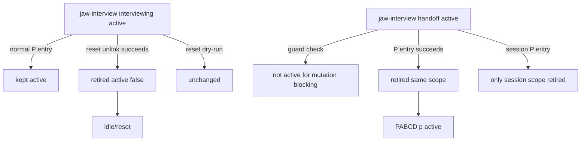

# 21.6 P — Jaw-Interview Handoff Cleanup Implementation Plan R3

Date: 2026-06-15
Stage: PABCD P
Supersedes: `21.3_p_jaw_interview_handoff_cleanup_plan_r2.md`
Critic syntheses: `21.2_p_synthesis_round1.md`, `21.5_p_synthesis_round2.md`

## Objective

Implement stale `jaw-interview` cleanup across mutation guard and native PABCD runtime:

1. `current_phase:"handoff"` releases jaw-interview product/source mutation blocking regardless of ambiguity score.
2. Successful native PABCD P entry retires same-scope stale `jaw-interview` handoff state.
3. Native PABCD reset/idle retires same-scope `jaw-interview` state only after the existing reset operation succeeds.
4. Active `interviewing` still blocks product/source mutation and is not silently retired by normal P entry.

Work class: C3. Proceed through PABCD audit/build/check.

## Requirements

- Preserve existing plain `jwc interview --write` behavior: `active:true + current_phase:"handoff"`.
- Treat `handoff` as terminal only for jaw-interview mutation blocking.
- Use sanctioned runtime writers and active-state sync APIs.
- Scope isolation:
  - session command → only `.jwc/state/sessions/<encoded-session>/...`.
  - shared command → only root `.jwc/state/...`.
- P entry retires only `handoff`.
- Reset retires `handoff` and `interviewing` for the reset scope because reset means idle.
- Reset dry-run does not retire jaw-interview.
- Absent/corrupt jaw-interview state returns `false` and does not block PABCD.
- Valid stale state write/sync failures throw and fail the PABCD command.

## Non-goals

- No ambiguity-threshold changes.
- No automatic spec approval.
- No global stop-hook semantics change.
- No PABCD complete cleanup hook.
- No goal/PABCD storage movement.

## File-level implementation plan

### 1. MODIFY `packages/coding-agent/src/skill-state/jaw-interview-mutation-guard.ts`

Patch `isTerminalModeState()`:

```ts
function isTerminalModeState(state: ModeState | null): boolean {
	if (state?.active !== true) return true;
	const phase = String(state.current_phase ?? "")
		.trim()
		.toLowerCase();
	// For mutation blocking, handoff means jaw-interview stopped collecting requirements.
	// Downstream chain guards may still require explicit demotion before another skill activates.
	return ["complete", "completed", "handoff", "failed", "cancelled", "canceled", "inactive"].includes(phase);
}
```

### 2. MODIFY `packages/coding-agent/src/jwc-runtime/jaw-interview-runtime.ts`

Add exported helper:

```ts
export type JawInterviewWorkflowExitReason = "orchestrate-p" | "orchestrate-reset";

export async function retireJawInterviewStateForWorkflowExit(input: {
	cwd: string;
	sessionId?: string;
	reason: JawInterviewWorkflowExitReason;
	includeActiveInterview?: boolean;
}): Promise<boolean> {
	const statePath = jawInterviewStatePath(input.cwd, input.sessionId);
	const existingRead = await readExistingStateForMutation(statePath);
	if (existingRead.kind !== "valid") return false;

	const existing = existingRead.value;
	if (existing.active !== true) return false;
	const phase = String(existing.current_phase ?? "").trim().toLowerCase();
	const canRetire = phase === "handoff" || (input.includeActiveInterview === true && phase === "interviewing");
	if (!canRetire) return false;

	const now = new Date().toISOString();
	const retiredPhase = phase || "inactive";
	await writeWorkflowEnvelopeAtomic(
		statePath,
		{
			...existing,
			active: false,
			current_phase: retiredPhase,
			workflow_exit_reason: input.reason,
			updated_at: now,
			...(input.sessionId ? { session_id: input.sessionId } : {}),
		},
		{
			cwd: input.cwd,
			receipt: {
				cwd: input.cwd,
				skill: "jaw-interview",
				owner: "jwc-runtime",
				command: `jwc interview retire ${input.reason}`,
				sessionId: input.sessionId,
				nowIso: now,
			},
			audit: {
				category: "state",
				verb: "retire",
				owner: "jwc-runtime",
				skill: "jaw-interview",
				fromPhase: phase,
				toPhase: retiredPhase,
			},
		},
	);

	await syncSkillActiveState({
		cwd: input.cwd,
		skill: "jaw-interview",
		active: false,
		phase: retiredPhase,
		sessionId: input.sessionId,
		source: "jwc-interview-native",
		hud: buildJawInterviewHudSummary({
			phase: retiredPhase,
			specStatus: "retired",
			updatedAt: now,
		}),
	});
	return true;
}
```

Do not catch writer/sync errors after a valid retire target is found. Do not change spec persistence semantics.

### 3. MODIFY `packages/coding-agent/src/jwc-runtime/orchestrate-runtime.ts`

Import:

```ts
import { retireJawInterviewStateForWorkflowExit } from "./jaw-interview-runtime";
```

In `runNativeOrchestrateCommand()`, after:

```ts
await recordGoalCheckpointForTransition(cwd, from ?? "idle", target, envelope);
```

insert:

```ts
if (target === "p") {
	await retireJawInterviewStateForWorkflowExit({
		cwd,
		sessionId: parsed.sessionId,
		reason: "orchestrate-p",
	});
}
```

This is after successful PABCD persistence and goal checkpoint, before JSON/text response.

In `resetPabcdState()`, merge with the existing try block exactly after `fs.unlink(target.path)` succeeds. Current block shape is actor-registry retirement → `fs.unlink` → `removed.push` → `lines.push`. Change to:

```ts
try {
	const namespaceId =
		current?.ok && typeof current.value.ctx?.actor_namespace_id === "string"
			? current.value.ctx.actor_namespace_id
			: undefined;
	if (namespaceId && parsed.sessionId) {
		const registry = await readActorRegistry(cwd, parsed.sessionId);
		await writeActorRegistryAtomic(cwd, parsed.sessionId, retireNamespaceActors(registry, namespaceId));
	}
	await fs.unlink(target.path);
	await retireJawInterviewStateForWorkflowExit({
		cwd,
		sessionId: target.label === "shared" ? undefined : parsed.sessionId,
		reason: "orchestrate-reset",
		includeActiveInterview: true,
	});
	removed.push(target.path);
	lines.push(`${target.label}: reset (${summary})`);
} catch (error) {
	return { stderr: `orchestrate reset failed for ${target.path}: ${String(error)}\n`, status: 1 };
}
```

Dry-run branch stays before this try block and does not call cleanup.

### 4. MODIFY `packages/coding-agent/test/jaw-interview-mutation-guard.test.ts`

Update helper signature and body so mode state and active-state phase remain aligned:

```ts
async function writeActiveJawInterview(
	cwd: string,
	sessionId = "session-a",
	phase = "interviewing",
	modeStatePatch: Record<string, unknown> = {},
): Promise<void> {
	const now = new Date().toISOString();
	const sessionDir = path.join(cwd, ".jwc", "state", "sessions", encodePathSegment(sessionId));
	await fs.mkdir(sessionDir, { recursive: true });
	const activeState = {
		version: 1,
		active: true,
		skill: "jaw-interview",
		phase,
		updated_at: now,
		active_skills: [{ skill: "jaw-interview", phase, active: true, updated_at: now, session_id: sessionId }],
	};
	await Bun.write(path.join(sessionDir, "skill-active-state.json"), `${JSON.stringify(activeState, null, 2)}\n`);
	await Bun.write(
		path.join(sessionDir, "jaw-interview-state.json"),
		`${JSON.stringify({ active: true, current_phase: phase, session_id: sessionId, ...modeStatePatch }, null, 2)}\n`,
	);
}
```

Add handoff/high-ambiguity test:

```ts
it("does not block after jaw-interview reaches handoff even above threshold", async () => {
	const cwd = await makeTempRoot();
	await writeActiveJawInterview(cwd, "session-a", "handoff", {
		state: { current_ambiguity: 0.9, threshold: 0.05 },
	});

	const decision = await getJawInterviewMutationDecision({
		cwd,
		sessionId: "session-a",
		tool: tool("write"),
		args: { path: "src/product.ts", content: "x" },
	});
	expect(decision.blocked).toBe(false);
});
```

### 5. MODIFY `packages/coding-agent/test/jwc-runtime/jaw-interview-runtime.test.ts`

Import helper and add three concrete tests:

- `retires persisted handoff state for workflow exit` using argv:
  `[
    "--write", "--stage", "final", "--slug", "retire-me", "--spec", "# Spec", "--json"
  ]`.
- `does not retire active interviewing on normal P exit` using argv:
  `["--json", "vague idea"]`.
- `retires active interviewing on reset exit` using same active interview argv plus `includeActiveInterview:true`.

Assertions:

- returned boolean (`true`/`false`),
- `active`, `current_phase`, `workflow_exit_reason`,
- receipt owner/skill for retired state.

### 6. MODIFY `packages/coding-agent/test/jwc-runtime/orchestrate-state.test.ts`

Add local test helpers unless an existing shared helper already exists nearby; do not create a new shared utility solely for this patch.

Helpers:

```ts
function encodeSessionSegment(value: string): string {
	return encodeURIComponent(value).replaceAll(".", "%2E");
}

function jawInterviewStatePathForTest(cwd: string, sessionId?: string): string {
	const stateDir = path.join(cwd, ".jwc", "state");
	if (sessionId) return path.join(stateDir, "sessions", encodeSessionSegment(sessionId), "jaw-interview-state.json");
	return path.join(stateDir, "jaw-interview-state.json");
}

function activeStatePathForTest(cwd: string, sessionId?: string): string {
	const stateDir = path.join(cwd, ".jwc", "state");
	if (sessionId) return path.join(stateDir, "sessions", encodeSessionSegment(sessionId), "skill-active-state.json");
	return path.join(stateDir, "skill-active-state.json");
}

async function seedJawInterviewStateForTest(cwd: string, phase: string, sessionId?: string): Promise<void> {
	const now = new Date().toISOString();
	const statePath = jawInterviewStatePathForTest(cwd, sessionId);
	await fs.mkdir(path.dirname(statePath), { recursive: true });
	await fs.writeFile(
		statePath,
		`${JSON.stringify({ active: true, current_phase: phase, skill: "jaw-interview", session_id: sessionId, updated_at: now }, null, 2)}\n`,
		"utf-8",
	);
	await fs.writeFile(
		activeStatePathForTest(cwd, sessionId),
		`${JSON.stringify({
			version: 1,
			active: true,
			skill: "jaw-interview",
			phase,
			updated_at: now,
			active_skills: [{ skill: "jaw-interview", phase, active: true, updated_at: now, session_id: sessionId }],
		}, null, 2)}\n`,
		"utf-8",
	);
}

async function readJsonForTest(filePath: string): Promise<Record<string, unknown>> {
	return JSON.parse(await fs.readFile(filePath, "utf-8")) as Record<string, unknown>;
}

async function expectNoActiveJawInterviewForTest(cwd: string, sessionId?: string): Promise<void> {
	const active = await readJsonForTest(activeStatePathForTest(cwd, sessionId));
	const entries = Array.isArray(active.active_skills) ? active.active_skills : [];
	expect(entries.some(entry => (entry as { skill?: string; active?: boolean }).skill === "jaw-interview" && (entry as { active?: boolean }).active === true)).toBe(false);
}
```

Tests:

1. `p` retires same-scope handoff:
   - seed root handoff,
   - run `p`,
   - assert mode `active:false`, `workflow_exit_reason:"orchestrate-p"`, and `expectNoActiveJawInterviewForTest(cwd)`.
2. Session `p` retires only same session:
   - seed root handoff and `session-A` handoff,
   - run under `JWC_SESSION_ID=session-A`,
   - assert session inactive/no active entry and root still active.
3. `p` does not retire active interviewing:
   - seed root `interviewing`,
   - run `p`,
   - assert root mode remains active.

### 7. MODIFY `packages/coding-agent/test/jwc-runtime/orchestrate-reset.test.ts`

Add local helpers equivalent to §6 or reuse existing test-local helpers if present. Do not introduce a new cross-file test utility just for this patch.

Tests:

1. `reset` retires same-scope jaw-interview after unlink success:
   - create PABCD state with `runNativeOrchestrateCommand(["p"], cwd)`,
   - seed root `jaw-interview` as `interviewing`,
   - run `reset`,
   - assert reset status 0,
   - assert PABCD state file is gone using existing reset test patterns,
   - assert jaw-interview mode `active:false`, `workflow_exit_reason:"orchestrate-reset"`,
   - assert no active jaw-interview entry in `skill-active-state.json`.
2. `reset --dry-run` does not retire jaw-interview:
   - same setup,
   - run `reset --dry-run`,
   - assert jaw-interview remains `active:true` and active-state still contains active jaw-interview.
3. If existing reset tests already cover session/shared reset, add one session isolation assertion there; otherwise add a compact session case:
   - root handoff + session handoff,
   - env `JWC_SESSION_ID=session-A`, run `reset`,
   - assert session inactive and root still active.

## Acceptance criteria

- `handoff` jaw-interview mode no longer blocks product/source mutation even with high ambiguity.
- Active `interviewing` still blocks product/source mutation.
- Interview `.md` / static mockup `.html` exceptions remain unchanged.
- `.jwc/**` direct mutation remains blocked.
- Retire helper returns `true` and writes receipt/audit for valid stale state.
- Retire helper returns `false` for absent/corrupt state or active interviewing without reset inclusion.
- P entry retires same-scope `handoff` and leaves active `interviewing` alone.
- Reset retires same-scope `handoff`/`interviewing` only after successful reset and not in dry-run.
- Active-state snapshot no longer reports active jaw-interview after runtime cleanup.
- Session/shared scope isolation is tested.

## Verification

```sh
bun test packages/coding-agent/test/jaw-interview-mutation-guard.test.ts packages/coding-agent/test/jwc-runtime/jaw-interview-runtime.test.ts packages/coding-agent/test/jwc-runtime/orchestrate-state.test.ts packages/coding-agent/test/jwc-runtime/orchestrate-reset.test.ts

bunx biome check packages/coding-agent/src/skill-state/jaw-interview-mutation-guard.ts packages/coding-agent/src/jwc-runtime/jaw-interview-runtime.ts packages/coding-agent/src/jwc-runtime/orchestrate-runtime.ts packages/coding-agent/test/jaw-interview-mutation-guard.test.ts packages/coding-agent/test/jwc-runtime/jaw-interview-runtime.test.ts packages/coding-agent/test/jwc-runtime/orchestrate-state.test.ts packages/coding-agent/test/jwc-runtime/orchestrate-reset.test.ts
```

No prompt doc edits are required in this patch.

## Mermaid flow



## Rollback plan

If P/reset cleanup causes state churn, revert the helper and orchestrate calls while keeping the guard `handoff` terminal patch. That preserves the immediate product/source edit unblock while deferring HUD cleanup.
