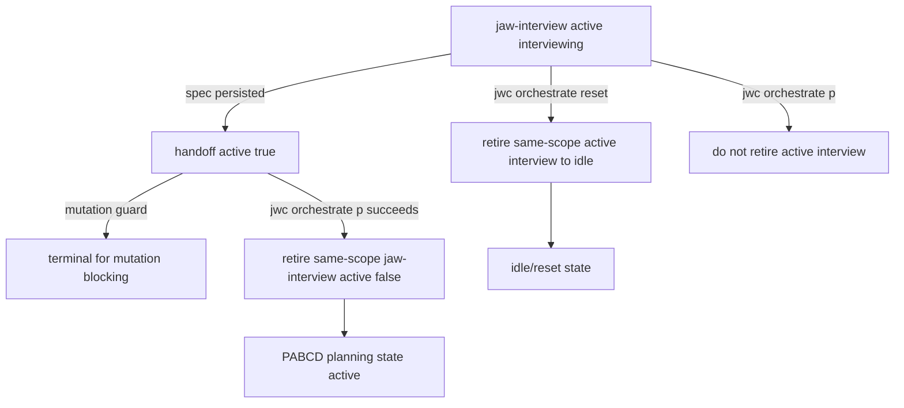

# 21 P — Jaw-Interview Handoff Cleanup Implementation Plan

Date: 2026-06-15
Stage: PABCD P
Source finding: `20_jaw_interview_handoff_cleanup_plan.md`

## Objective

Fix stale `jaw-interview` state after workflow exit:

1. A `jaw-interview` mode state at `current_phase:"handoff"` must not keep product/source mutation tools blocked, even if ambiguity remains above the normal interview completion threshold.
2. Native PABCD P entry and reset/idle paths must retire stale `jaw-interview` active state for the same scope, so the HUD/runtime no longer appears stuck in interview after leaving interview.
3. Active `jaw-interview` phases must continue to block product/source mutation, and `.jwc/**` workflow state must remain runtime-owned.

Work class: C3. This crosses runtime workflow state, mutation guard behavior, and PABCD transition semantics, so it proceeds through PABCD with audit and focused regression tests.

## Requirements and non-goals

### Requirements

- Preserve existing spec-persistence behavior: plain `jwc interview --write` may still persist a final spec as `active:true + current_phase:"handoff"` for resume/chain visibility.
- Release mutation blocking for `handoff` because the interview is no longer actively gathering requirements.
- Retire stale `jaw-interview` state only through sanctioned runtime writers and active-state sync APIs.
- Cleanup must be session-aware:
  - session-scoped PABCD command cleans only the same session's jaw-interview state.
  - shared PABCD command cleans only shared/root jaw-interview state.
- Cleanup must be narrow:
  - P entry retires `jaw-interview` only when the interview state is already `handoff`.
  - reset may retire `handoff` and active interview state for the reset scope because reset means return to idle.
- Keep direct `.jwc/**` edits blocked by mutation guard.

### Non-goals

- Do not change the interview ambiguity threshold algorithm.
- Do not auto-approve or auto-complete incomplete specs.
- Do not alter general skill stop-hook semantics outside jaw-interview mutation/runtime cleanup.
- Do not move durable goal ledger or PABCD state storage.

## Current evidence

- `packages/coding-agent/src/jwc-runtime/jaw-interview-runtime.ts`
  - `persistJawInterviewSpec()` writes `active:true`, `current_phase:"handoff"`.
  - `syncJawInterviewHud()` sets active HUD state for every phase except `complete`.
  - explicit `--deliberate` / `--handoff plan` path runs `jwc state ... handoff`, which demotes jaw-interview.
- `packages/coding-agent/src/skill-state/jaw-interview-mutation-guard.ts`
  - `isTerminalModeState()` omits `handoff`, so stale handoff blocks product edits.
- `packages/coding-agent/src/jwc-runtime/orchestrate-runtime.ts`
  - Stage transitions persist only PABCD envelopes.
  - `resetPabcdState()` deletes only `pabcd-state.json` and does not touch jaw-interview state.
- Existing tests already assert plain spec persistence remains `handoff + active:true`, so the implementation should not make spec persistence inactive by default.

## File-level patch plan

### 1. MODIFY `packages/coding-agent/src/skill-state/jaw-interview-mutation-guard.ts`

Purpose: release product/source mutation blocking once interview is in handoff.

Patch:

```ts
function isTerminalModeState(state: ModeState | null): boolean {
	if (state?.active !== true) return true;
	const phase = String(state.current_phase ?? "")
		.trim()
		.toLowerCase();
	return ["complete", "completed", "handoff", "failed", "cancelled", "canceled", "inactive"].includes(phase);
}
```

Add a short comment above or near the `handoff` inclusion:

```ts
// For mutation blocking, handoff means jaw-interview has stopped collecting requirements.
// Other skill-chain hooks may still require an explicit demotion before activating a downstream skill.
```

### 2. MODIFY `packages/coding-agent/src/jwc-runtime/jaw-interview-runtime.ts`

Purpose: expose a sanctioned runtime cleanup helper without changing plain spec persistence semantics.

Add exported helper near `persistJawInterviewSpec()` / `syncJawInterviewHud()`:

```ts
export type JawInterviewWorkflowExitReason = "orchestrate-p" | "orchestrate-reset" | "orchestrate-complete" | "idle";

export async function retireJawInterviewStateForWorkflowExit(input: {
	cwd: string;
	sessionId?: string;
	reason: JawInterviewWorkflowExitReason;
	includeActiveInterview?: boolean;
}): Promise<boolean> {
	const statePath = jawInterviewStatePath(input.cwd, input.sessionId);
	const existingRead = await readExistingStateForMutation(statePath);
	if (existingRead.kind !== "valid") return false;

	const existing = existingRead.value;
	if (existing.active !== true) return false;
	const phase = String(existing.current_phase ?? "").trim().toLowerCase();
	const canRetire = phase === "handoff" || (input.includeActiveInterview === true && phase === "interviewing");
	if (!canRetire) return false;

	const now = new Date().toISOString();
	await writeWorkflowEnvelopeAtomic(
		statePath,
		{
			...existing,
			active: false,
			current_phase: phase || "inactive",
			workflow_exit_reason: input.reason,
			updated_at: now,
			...(input.sessionId ? { session_id: input.sessionId } : {}),
		},
		{
			cwd: input.cwd,
			receipt: {
				cwd: input.cwd,
				skill: "jaw-interview",
				owner: "jwc-runtime",
				command: `jwc interview retire ${input.reason}`,
				sessionId: input.sessionId,
				nowIso: now,
			},
			audit: {
				category: "state",
				verb: "retire",
				owner: "jwc-runtime",
				skill: "jaw-interview",
				fromPhase: phase,
				toPhase: phase || "inactive",
			},
		},
	);

	await syncSkillActiveState({
		cwd: input.cwd,
		skill: "jaw-interview",
		active: false,
		phase: phase || "inactive",
		sessionId: input.sessionId,
		source: "jwc-interview-native",
		hud: buildJawInterviewHudSummary({
			phase: phase || "inactive",
			specStatus: "retired",
			updatedAt: now,
		}),
	});
	return true;
}
```

Implementation details:

- Reuse existing `jawInterviewStatePath()`, `readExistingStateForMutation()`, `writeWorkflowEnvelopeAtomic()`, `syncSkillActiveState()`, and `buildJawInterviewHudSummary()` imports already present in the file.
- Use `Promise<void>` only if the caller does not need a boolean; boolean is preferred for test observability.
- No direct filesystem writes except through state writer.
- Fail open on absent/corrupt state: absent/corrupt stale interview state should not fail PABCD transition. Corrupt handling remains the responsibility of explicit jaw-interview persistence commands.

### 3. MODIFY `packages/coding-agent/src/jwc-runtime/orchestrate-runtime.ts`

Purpose: call the runtime cleanup helper after successful PABCD writes/resets.

Add import:

```ts
import { retireJawInterviewStateForWorkflowExit } from "./jaw-interview-runtime";
```

After successful stage transition persistence and goal checkpoint, retire stale jaw-interview state for P entry and complete:

```ts
if (target === "p") {
	await retireJawInterviewStateForWorkflowExit({
		cwd,
		sessionId: parsed.sessionId,
		reason: "orchestrate-p",
	});
} else if (target === "complete") {
	await retireJawInterviewStateForWorkflowExit({
		cwd,
		sessionId: parsed.sessionId,
		reason: "orchestrate-complete",
	});
}
```

For reset, after deleting/resetting each target, retire jaw-interview state for the same scope:

```ts
if (!parsed.dryRun) {
	await retireJawInterviewStateForWorkflowExit({
		cwd,
		sessionId: target.label === "shared" ? undefined : parsed.sessionId,
		reason: "orchestrate-reset",
		includeActiveInterview: true,
	});
}
```

Important ordering:

- Stage transition cleanup happens only after PABCD `persist()` succeeds.
- Reset cleanup happens only for non-dry-run reset.
- Cleanup failure should not mask PABCD transition if the helper fail-opens on absent/corrupt state. If write/sync throws unexpectedly, let tests decide whether that should fail closed; default recommendation is state writer errors should surface because `.jwc` write failure means runtime state may be inconsistent.

### 4. MODIFY `packages/coding-agent/test/jaw-interview-mutation-guard.test.ts`

Add regression tests near terminal-phase coverage:

```ts
it("does not block after jaw-interview reaches handoff even above threshold", async () => {
	const cwd = await makeTempRoot();
	await writeActiveJawInterview(cwd, "session-a", "handoff");
	await Bun.write(
		path.join(cwd, ".jwc", "state", "sessions", encodePathSegment("session-a"), "jaw-interview-state.json"),
		`${JSON.stringify({
			active: true,
			current_phase: "handoff",
			session_id: "session-a",
			state: { current_ambiguity: 0.9, threshold: 0.05 },
		}, null, 2)}\n`,
	);

	const decision = await getJawInterviewMutationDecision({
		cwd,
		sessionId: "session-a",
		tool: tool("write"),
		args: { path: "src/product.ts", content: "x" },
	});
	expect(decision.blocked).toBe(false);
});
```

Keep existing active-interview blocking tests unchanged.

### 5. MODIFY `packages/coding-agent/test/jwc-runtime/jaw-interview-runtime.test.ts`

Import helper:

```ts
import { retireJawInterviewStateForWorkflowExit, runNativeJawInterviewCommand } from "@gajae-code/coding-agent/jwc-runtime/jaw-interview-runtime";
```

Add tests:

- Retires handoff state:
  - run `runNativeJawInterviewCommand(["--write", ...])` to create `handoff + active:true`.
  - call helper with `reason:"orchestrate-p"`.
  - assert result `true`, state `active:false`, `current_phase:"handoff"`, `workflow_exit_reason:"orchestrate-p"`, receipt owner `jwc-runtime`.
- Does not retire active interviewing by default:
  - run `runNativeJawInterviewCommand(["--json", "idea"])`.
  - call helper with `reason:"orchestrate-p"` and no `includeActiveInterview`.
  - assert result `false`, state remains `active:true`, phase `interviewing`.
- Retires active interviewing on reset:
  - run `runNativeJawInterviewCommand(["--json", "idea"])`.
  - call helper with `reason:"orchestrate-reset", includeActiveInterview:true`.
  - assert result `true`, state `active:false`.

### 6. MODIFY `packages/coding-agent/test/jwc-runtime/orchestrate-state.test.ts`

Add helper inside `orchestrate runtime full cycle` describe or local test scope to seed jaw-interview state and active-state:

```ts
async function seedJawInterviewHandoff(cwd: string, sessionId?: string): Promise<string> { ... }
async function readJawInterviewState(cwd: string, sessionId?: string): Promise<Record<string, unknown>> { ... }
```

Tests:

1. `p` direct entry retires same-scope handoff:
   - seed root jaw-interview `active:true,current_phase:"handoff"` and root `skill-active-state` row.
   - run `p`.
   - assert jaw-interview state `active:false`, `workflow_exit_reason:"orchestrate-p"`.
2. Session-scoped `p` retires only same session:
   - seed root handoff and `session-A` handoff.
   - run with `JWC_SESSION_ID=session-A` and `p`.
   - assert session-A inactive, root still active.
3. `p` does not retire active interviewing:
   - seed root `current_phase:"interviewing"`.
   - run `p`.
   - assert root still active.

### 7. MODIFY `packages/coding-agent/test/jwc-runtime/orchestrate-reset.test.ts`

Add reset regression:

- Seed active jaw-interview `interviewing` state for session/shared scope plus PABCD state.
- Run `reset` for that scope.
- Assert PABCD state is removed and jaw-interview state is `active:false`, `workflow_exit_reason:"orchestrate-reset"`.
- Add dry-run case if cheap: `reset --dry-run` must not retire jaw-interview.

### 8. OPTIONAL MODIFY `packages/coding-agent/src/defaults/jwc/skills/jaw-interview/SKILL.md`

Only if runtime patch lands cleanly and docs need clarity, update existing cleanup checklist from:

```md
- [ ] State cleaned up after approved workflow handoff
```

to:

```md
- [ ] State cleaned up after approved workflow handoff or idle/reset exit; cleanup is based on workflow exit, not ambiguity threshold alone
```

This is docs/prompt only and should be included in Biome/check-visible definitions only if touched.

## Acceptance criteria

- Guard: `handoff + active:true + ambiguity > threshold` no longer blocks product/source mutations.
- Guard: active `interviewing` still blocks product/source mutations.
- Guard: `.md` and static mockup `.html` exceptions continue to work while interview is active.
- Guard: direct `.jwc/**` workflow state mutation remains blocked.
- Runtime helper: stale handoff can be retired with sanctioned receipt/audit fields.
- PABCD `p`: after successful P entry, same-scope `jaw-interview` handoff is inactive.
- PABCD `p`: active `interviewing` is not silently retired.
- PABCD reset: same-scope stale/active jaw-interview state is inactive after reset, and dry-run does not mutate it.
- Session scope isolation is preserved.

## Verification

Focused test commands after implementation:

```sh
bun test packages/coding-agent/test/jaw-interview-mutation-guard.test.ts packages/coding-agent/test/jwc-runtime/jaw-interview-runtime.test.ts packages/coding-agent/test/jwc-runtime/orchestrate-state.test.ts packages/coding-agent/test/jwc-runtime/orchestrate-reset.test.ts
```

Focused formatting/lint:

```sh
bunx biome check packages/coding-agent/src/skill-state/jaw-interview-mutation-guard.ts packages/coding-agent/src/jwc-runtime/jaw-interview-runtime.ts packages/coding-agent/src/jwc-runtime/orchestrate-runtime.ts packages/coding-agent/test/jaw-interview-mutation-guard.test.ts packages/coding-agent/test/jwc-runtime/jaw-interview-runtime.test.ts packages/coding-agent/test/jwc-runtime/orchestrate-state.test.ts packages/coding-agent/test/jwc-runtime/orchestrate-reset.test.ts
```

If `SKILL.md` is touched, also run:

```sh
bun test packages/coding-agent/test/default-jwc-definitions.test.ts
bun scripts/check-visible-definitions.ts
```

## Mermaid flow



## Rollback plan

If runtime cleanup causes unexpected state churn, keep the guard-level `handoff` release and revert only the orchestrate cleanup calls/helper. That preserves the user-facing unblock while leaving HUD cleanup for a narrower follow-up.
