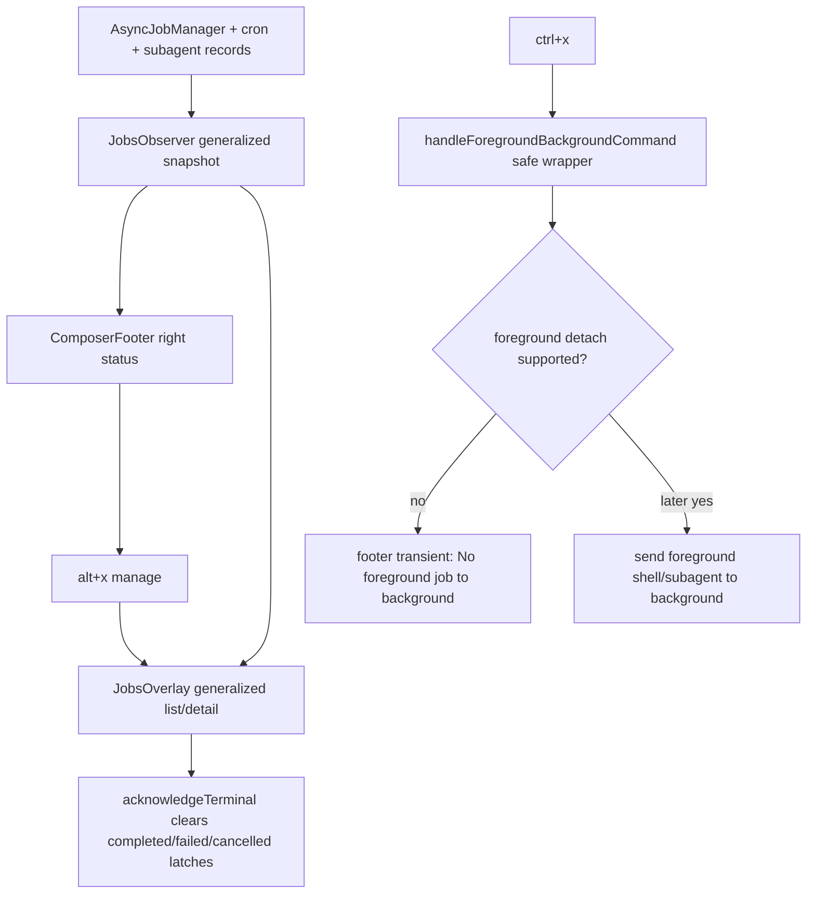

# Background footer/manage UI — pending approval

Plan path: `devlog/_plan/260615_background_terminal_tui/10_p_plan.md`
MOC/context: `devlog/_plan/260615_background_terminal_tui/000_moc_background_terminal_tui.md`
Critic receipts:
- `devlog/_plan/260615_background_terminal_tui/10.1_p_critic_round1.md` — ITERATE
- `devlog/_plan/260615_background_terminal_tui/10.3_p_critic_round2.md` — ITERATE
- `devlog/_plan/260615_background_terminal_tui/10.5_p_critic_round3.md` — OKAY
Syntheses:
- `devlog/_plan/260615_background_terminal_tui/10.2_p_synthesis_round1.md`
- `devlog/_plan/260615_background_terminal_tui/10.4_p_synthesis_round2.md`

## Summary

Implement the first slice of a Claude/Codex-style background-work UI for Jawcode without changing real detached terminal semantics yet.

- UI shape: Option C — compact composer-footer right status plus generalized manage overlay.
- Visible scope: async bash, monitor jobs, task/metadata subagents, queued background work, cron schedules, and unacknowledged completed/failed/cancelled terminal rows.
- Keys: `ctrl+x` is a safe foreground-background request; `alt+x` opens/manages the background overlay; existing `alt+j` remains a compatibility alias.
- Completion: structured TUI/footer/overlay visibility only, no assistant prose injection.
- Execution policy: keep `async.enabled` / auto-background opt-in for this slice.

## Mermaid flow



## Implementation boundaries

Modify only the files named in `10_p_plan.md`, primarily:

- `packages/coding-agent/src/modes/jobs-observer.ts`
- `packages/coding-agent/src/modes/components/jobs-overlay-model.ts`
- `packages/coding-agent/src/modes/components/jobs-overlay.ts`
- `packages/coding-agent/src/modes/components/composer-footer.ts`
- `packages/coding-agent/src/config/keybindings.ts`
- `packages/coding-agent/src/modes/controllers/input-controller.ts`
- `packages/coding-agent/src/modes/interactive-mode.ts`
- affected focused tests under `packages/coding-agent/test/`

Do not modify `packages/tui/src/tui.ts`; do not add below-composer roster; do not implement real PTY detachment in this slice.

## Verification required in implementation stage

```bash
bun test packages/coding-agent/test/jobs-observer.test.ts \
  packages/coding-agent/test/jobs-overlay-model.test.ts \
  packages/coding-agent/test/composer-footer.test.ts \
  packages/coding-agent/test/input-controller-keybindings.test.ts \
  packages/coding-agent/test/keybindings-display.test.ts

bun --cwd=packages/coding-agent run check
```

## Approval gate

This artifact is pending user approval. No product-source mutation is approved until the user explicitly approves execution and the workflow advances to PABCD A-stage.
