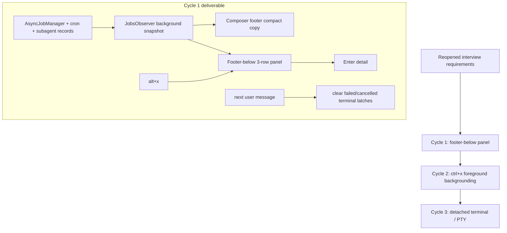

# 20_p_plan_revised — Footer-below background UI roadmap

Date: 2026-06-15
Stage: PABCD P, reopened after additional I-stage interview
Supersedes: `10_p_plan.md` and `10.6_p_final_pending_approval.md`
Source MOC: `000_moc_background_terminal_tui.md`

> Authority note: this revised roadmap supersedes older MOC slice proposals that mention `BackgroundJobsStrip`, Ctrl+B roster toggling, mount-above-status placement, chat/assistant completion prose, or generic `/jobs` overlay expansion as the cycle-1 path. Cycle 1 is footer-below panel + `alt+x`; cycles 2/3 require fresh I/P before execution.

## Locked requirements from reopened I-stage

- The implementation should be split into multiple devlog phase documents, each sized for an achievable PABCD loop.
- Compact footer text uses per-kind suffixes, e.g. `bg 3sub 1sh 1cron`.
  - `sub`: task/subagent background work.
  - `sh`: generic async shell/bash work.
  - `mon`: monitor jobs.
  - `cron`: cron schedules.
  - `q`: queued item only when it cannot be classified under a concrete kind.
- `alt+x` expands/collapses a real footer-below panel at the terminal bottom, closest to the Claude screenshot.
- Expanded panel shows three visible rows.
- Expanded rows support selection and `Enter` detail in the first implementation loop.
- Successful completed rows disappear automatically.
- Failed/cancelled rows remain visible after terminal state; they clear only after they have been rendered/marked visible and the user sends a later real user-agent prompt.
- Completion is structured TUI state only; do not inject assistant prose.
- Later loops may implement `ctrl+x` real foreground-to-background mechanics and real detached terminal/PTY behavior.

## Phase documents

1. `21_cycle1_footer_below_panel.md` — first executable PABCD cycle.
   - Generalize background state enough to render real footer counts/rows.
   - Add footer-below three-row panel and `alt+x` selection/detail behavior.
   - Implement terminal-row lifecycle: success auto-disappears; failed/cancelled clear after next user message.
2. `22_cycle2_foreground_backgrounding.md` — non-executable later-cycle outline.
   - `ctrl+x` foreground shell/subagent backgrounding requires a fresh I/P loop and explicit handle inventory after cycle 1.
3. `23_cycle3_detached_terminal.md` — non-executable later-cycle outline.
   - Codex-like real detached terminal/process semantics (process ids, stdin, PTY/follow, retention) require a fresh I/P loop if still desired.

## First-cycle implementation files

Detailed in `21_cycle1_footer_below_panel.md`. Expected source/test surface:

- NEW `packages/coding-agent/src/modes/components/background-footer-panel.ts`
- NEW `packages/coding-agent/src/modes/components/background-footer-panel-model.ts`
- MODIFY `packages/coding-agent/src/modes/jobs-observer.ts`
- MODIFY `packages/coding-agent/src/modes/components/composer-footer.ts`
- MODIFY `packages/coding-agent/src/modes/components/status-line.ts`
- MODIFY `packages/coding-agent/src/modes/components/status-line/segments.ts`
- MODIFY `packages/coding-agent/src/modes/components/jobs-overlay-model.ts`
- MODIFY `packages/coding-agent/src/config/keybindings.ts`
- MODIFY `packages/coding-agent/src/modes/controllers/input-controller.ts`
- MODIFY `packages/coding-agent/src/modes/interactive-mode.ts`
- MODIFY `packages/coding-agent/src/modes/types.ts`
- MODIFY `packages/coding-agent/src/modes/utils/ui-helpers.ts`
- MODIFY `packages/coding-agent/src/main.ts`
- NEW `packages/coding-agent/src/modes/components/background-footer-detail.ts`
- MODIFY focused tests under `packages/coding-agent/test/`

## Non-goals for cycle 1

- Do not implement real PTY/detached terminal semantics.
- Do not implement destructive cancel/stop from the three-row panel.
- Do not steal Ctrl+B/CtrlE.
- Do not inject background completion as assistant prose.
- Do not simplify or alter welcome banner or `packages/tui/src/tui.ts` scroll/fill behavior.
- Do not migrate `/jobs` overlay to all background kinds in cycle 1; footer row `Enter` detail is the all-background detail path.
- Do not implement chat/assistant completion prose; prior MOC completion-prose ideas are deferred to cycle 3 policy discussion and rejected for cycle 1.

## Mermaid roadmap

## Verification strategy

Cycle 1 focused tests are listed in `21_cycle1_footer_below_panel.md`. Later cycles must define their own focused tests before implementation.
