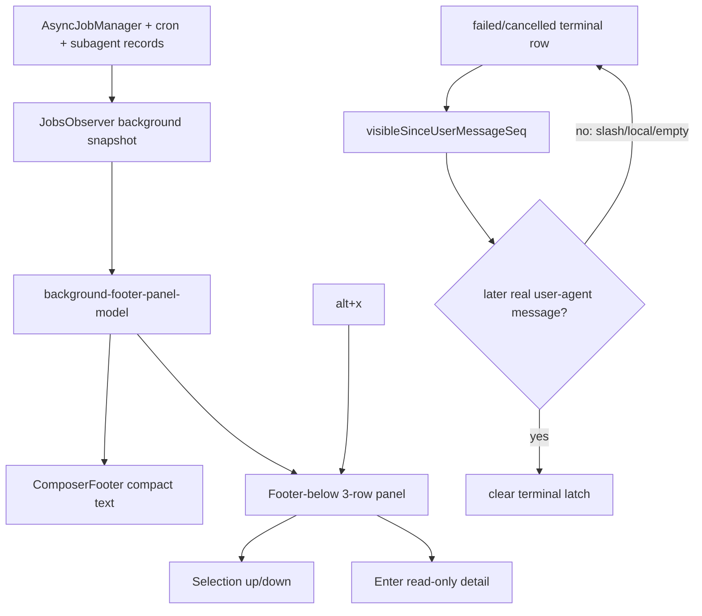

# Footer-below background UI — pending approval

Plan refs:
- Roadmap: `devlog/_plan/260615_background_terminal_tui/20_p_plan_revised.md`
- Cycle 1 executable plan: `devlog/_plan/260615_background_terminal_tui/21_cycle1_footer_below_panel.md`
- Later cycle outlines:
  - `devlog/_plan/260615_background_terminal_tui/22_cycle2_foreground_backgrounding.md`
  - `devlog/_plan/260615_background_terminal_tui/23_cycle3_detached_terminal.md`

Supersedes prior overlay-first plan:
- `devlog/_plan/260615_background_terminal_tui/10_p_plan.md`
- `devlog/_plan/260615_background_terminal_tui/10.6_p_final_pending_approval.md`

Critic receipts:
- `devlog/_plan/260615_background_terminal_tui/21.1_p_critic_round1.md` — ITERATE
- `devlog/_plan/260615_background_terminal_tui/21.3_p_critic_round2.md` — OKAY
Synthesis:
- `devlog/_plan/260615_background_terminal_tui/21.2_p_synthesis_round1.md`

## Summary

Implement cycle 1 of a Claude-like background footer UI:

- Compact footer copy replaces idle help while background work exists, e.g. `bg 3sub 1sh 1cron · alt+x`.
- `alt+x` expands/collapses a real footer-below panel at the terminal bottom.
- Expanded panel shows three visible rows, supports selection, and opens read-only detail with `Enter`.
- Success rows disappear automatically.
- Failed/cancelled rows remain visible after terminal state, then clear only after they have been rendered and the user submits a later real user-agent message.
- Slash/local commands, empty continuations, and extension-handled inputs do not clear failed/cancelled rows.
- Completion remains structured TUI state only; no assistant prose injection.
- Later cycles handle `ctrl+x` foreground backgrounding and real detached terminal/PTY behavior.

## Mermaid diagram



## Execution boundary

Approved execution should implement only cycle 1:

- NEW `packages/coding-agent/src/modes/components/background-footer-panel.ts`
- NEW `packages/coding-agent/src/modes/components/background-footer-panel-model.ts`
- MODIFY `packages/coding-agent/src/modes/jobs-observer.ts`
- MODIFY `packages/coding-agent/src/modes/components/composer-footer.ts`
- MODIFY `packages/coding-agent/src/modes/components/status-line.ts`
- MODIFY `packages/coding-agent/src/config/keybindings.ts`
- MODIFY `packages/coding-agent/src/modes/controllers/input-controller.ts`
- MODIFY `packages/coding-agent/src/modes/interactive-mode.ts`
- MODIFY `packages/coding-agent/src/modes/types.ts`
- MODIFY focused tests under `packages/coding-agent/test/`

Do not implement cycle 2/3 in this approval.

## Verification required

```bash
bun test packages/coding-agent/test/background-footer-panel-model.test.ts \
  packages/coding-agent/test/background-footer-panel.test.ts \
  packages/coding-agent/test/jobs-observer.test.ts \
  packages/coding-agent/test/composer-footer.test.ts \
  packages/coding-agent/test/input-controller-keybindings.test.ts \
  packages/coding-agent/test/keybindings-display.test.ts \
  packages/coding-agent/test/jobs-segment.test.ts

bun --cwd=packages/coding-agent run check
```

## Approval gate

This artifact is pending user approval. No product-source mutation is approved until the user explicitly approves execution and the workflow advances to PABCD A-stage.
