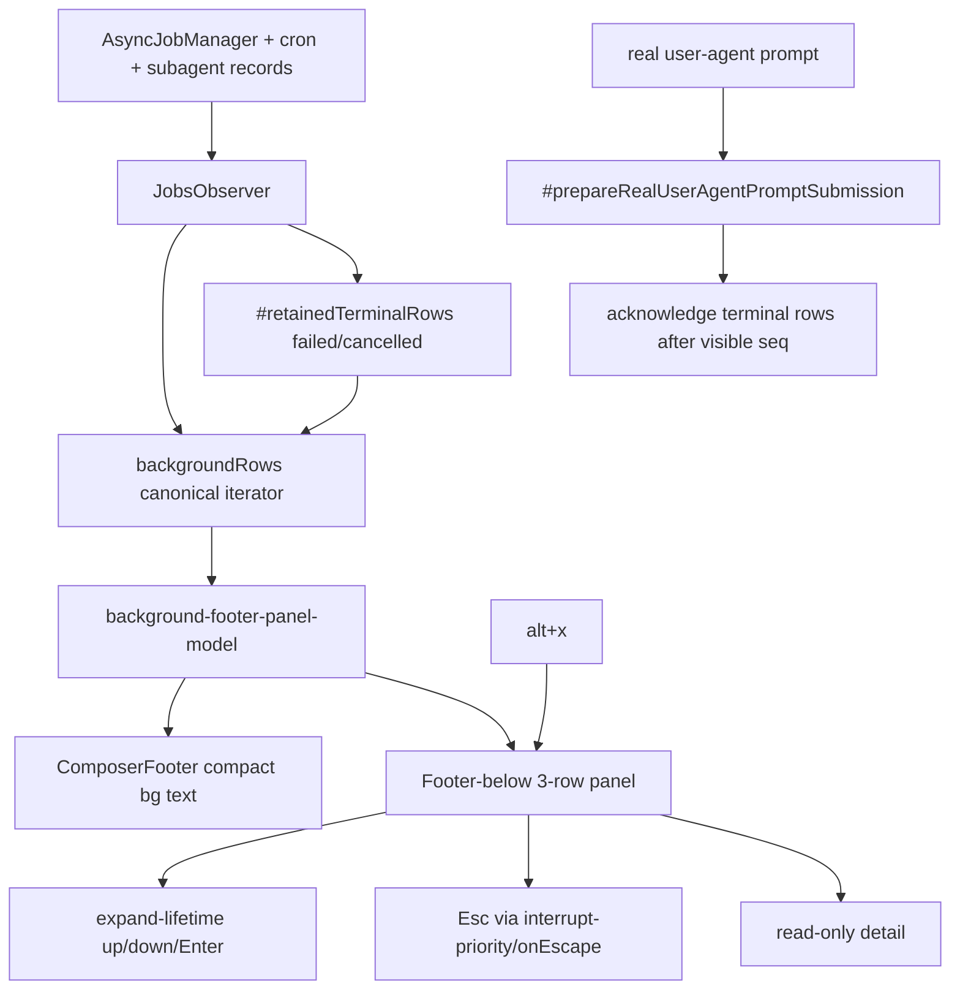

# Footer-below background UI cycle 1 — post-audit fixed plan

Spec: `.jwc/specs/jaw-interview-footer-below-background-ui-cycle1.md`
Executable plan: `devlog/_plan/260615_background_terminal_tui/21_cycle1_footer_below_panel.md`
Roadmap: `devlog/_plan/260615_background_terminal_tui/20_p_plan_revised.md`

This final P artifact supersedes earlier pending approvals:
- `21.4_p_final_pending_approval.md`
- `10.6_p_final_pending_approval.md`

Critical syntheses incorporated:
- `21.7_a_synthesis_round1.md`
- `21.10_a_synthesis_round2_cap.md`
- `31.2_p_synthesis_post_audit.md`
- `31.10_a_synthesis_round2.md`

P critic: `31.3_p_critic_okay.md` — OKAY.

## Summary

Implement cycle 1 only:

- compact footer copy such as `bg 3sub 1sh 1cron · alt+x`, computed from canonical `backgroundRows`;
- footer-below three-row panel toggled by `alt+x`;
- row selection + read-only detail;
- failed/cancelled retained row map that survives AsyncJob retention until a later real user-agent prompt clears it;
- expanded-panel key routing with expand-lifetime up/down/Enter handlers and Esc through interrupt-priority/onEscape;
- shared `#prepareRealUserAgentPromptSubmission()` acknowledgement helper;
- status-line suppression of duplicate non-monitor async `N jobs running` when footer owns `sh/sub` counts;
- no assistant prose injection, no real PTY/detached terminal, no `ctrl+x` foreground backgrounding in cycle 1.

## Mermaid



## Verification required

```bash
bun test packages/coding-agent/test/background-footer-panel-model.test.ts \
  packages/coding-agent/test/background-footer-panel.test.ts \
  packages/coding-agent/test/jobs-observer.test.ts \
  packages/coding-agent/test/composer-footer.test.ts \
  packages/coding-agent/test/input-controller-keybindings.test.ts \
  packages/coding-agent/test/keybindings-display.test.ts \
  packages/coding-agent/test/jobs-segment.test.ts \
  packages/coding-agent/test/jobs-overlay-model.test.ts

bun --cwd=packages/coding-agent run check
```

Acceptance criteria: §5 of `devlog/_plan/260615_background_terminal_tui/21_cycle1_footer_below_panel.md` is binding for implementation and verification; the summary above is not a substitute for those checkable AC bullets.
