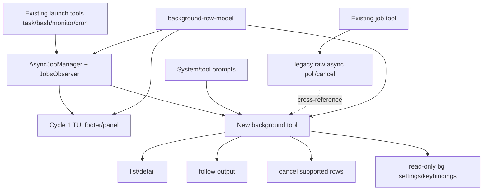

# 41_agent_background_contract_plan — A-revision a-r2

Date: 2026-06-15
Spec ref: `.jwc/specs/jaw-interview-agent-background-contract.md`
Parent commit: `5b8f2580 Add background footer task panel`
Status: A-stage revised plan a-r2 after synthesis `41.8_a_synthesis_r1.md`
Critic OKAY: `41.5_p_critic_round3.md`

## Goal

Make the cycle-1 background work infrastructure agent-usable. Existing launch tools remain the launch path; a new management surface lets the agent list, inspect, follow output, cancel supported rows, and discover read-only bg settings/keybindings without relying on TUI-only state.

## Non-goals

- Do not replace `task`, `bash`, `job`, `monitor`, or `cron` launch APIs.
- Do not add stdin/PTY/steer semantics for detached terminal jobs.
- Do not add settings mutation.
- Do not broaden cross-agent visibility; all operations remain owner-scoped.
- Do not make `background` essential by default; it is discoverable/activatable like `job`.

## Proposed API

Add a built-in discoverable tool named `background`.

```ts
type BackgroundToolParams =
  | { op: "list"; limit?: number }
  | { op: "detail"; id: string }
  | { op: "follow"; id: string; offset?: number; limitBytes?: number }
  | { op: "cancel"; id: string }
  | { op: "settings" };

interface BackgroundFollowDetails {
  id: string;
  status: "ok" | "unsupported" | "not_found";
  message?: string;
  text?: string;
  startOffset?: number;
  nextOffset?: number;
  truncated?: boolean;
}

interface BackgroundToolDetails {
  op: "list" | "detail" | "follow" | "cancel" | "settings";
  rows?: BackgroundRowView[];
  row?: BackgroundRowView;
  attention?: boolean;
  detailItems?: Array<{ label: string; description?: string }>;
  outputRef?: string;
  follow?: BackgroundFollowDetails;
  cancel?: { id: string; status: "cancelled" | "not_found" | "unsupported" | "already_terminal"; message: string };
  settings?: Array<{ key: string; value: unknown; source: "settings" | "keybinding-default"; description: string }>;
}
```

Rules:

- `background` is gated by `isBackgroundJobSupportEnabled(session.settings)`, same as `job`.
- `background` is discoverable, not in `DEFAULT_ESSENTIAL_TOOL_NAMES`.
- `list` returns canonical row ordering via NEW neutral `sortBackgroundRows()` from `packages/coding-agent/src/modes/background-row-model.ts`.
- `detail` returns the row, `buildBackgroundDetailItems()`-equivalent detail fields, explicit `attention`, and verified `agent://` output ref only when proof is available.
- `follow` returns `details.follow.status`. Unsupported/no-output rows return `status: "unsupported"` plus message and do not fabricate output.
- `settings` is read-only and uses exact keys; `app.background.expand` reports `KEYBINDINGS["app.background.expand"].defaultKeys` with source `keybinding-default` in v1.

## Background identity resolution

Implement a helper in `background.ts`:

```ts
interface BackgroundResolvedIds {
  rowId: string;
  subagentId?: string;
  jobIds: string[];
}
```

Algorithm for `resolveBackgroundIds(manager, row, ownerFilter)`:

1. Start with empty `jobIds`.
2. Resolve `row.id` as a job id with `const rowJob = manager.getJob(row.id)`; use it only when `rowJob` exists and `!ownerFilter?.ownerId || rowJob.ownerId === ownerFilter.ownerId`. If usable, add `row.id` to `jobIds`; if job metadata has `metadata.subagent.id`, set `subagentId` to that value.
3. If `row.kind === "sub"` and `manager.getSubagentRecord(row.id, ownerFilter)` exists, set `subagentId = row.id`; add `currentJobId` and `historicalJobIds` only after resolving each with `manager.getJob(id)` and applying the same owner check.
4. If `row.kind === "sub"` and no record was found by row id, scan `manager.getSubagentRecords(ownerFilter)` for a record whose `currentJobId` or `historicalJobIds` contains `row.id`; set `subagentId` to that record id and add only job ids that resolve via `manager.getJob(id)` and pass the owner check.
5. Never pass a job id to `cancelSubagent()`. Use `subagentId` for subagent cancellation and `jobIds` for output follow.

## Cancel matrix

| Row kind/status | Action |
|---|---|
| `sh`/`mon` running | `AsyncJobManager.cancel(row.id, ownerFilter)` |
| `sh`/`mon` paused | unsupported unless manager exposes paused bash cancel; return `unsupported` |
| `sh`/`mon` failed/cancelled/completed/latched | return `already_terminal`; do not clear retained row |
| `sub` running/paused/queued with resolved `subagentId` | `AsyncJobManager.cancelSubagent(subagentId, ownerFilter)` |
| `sub` task-backed row with only job id and no subagent record | cancel current job id through `manager.cancel(jobId, ownerFilter)`; if no job exists return `already_terminal` or `not_found` |
| `sub` completed/failed/cancelled/latched | return `already_terminal`; include verified `agent://` output ref in detail when available |
| `cron` scheduled | unsupported in this cycle; keep `CronDelete` as explicit cron deletion API |
| `q` queued generic row | unsupported unless it resolves to a subagent record |
| cross-owner id | `not_found` |
| unknown id | `not_found` |

## File-level plan

### NEW `packages/coding-agent/src/modes/background-row-model.ts`

- Export pure helpers and shared types as needed:
  - `isBackgroundAttention(row: BackgroundRowView): boolean`
  - `sortBackgroundRows(rows: BackgroundRowView[]): BackgroundRowView[]`
- Ordering: attention rows first, running/queued, paused, scheduled/other; newest-first within groups using `startTime ?? nextFireAt ?? 0`.
- No TUI imports. This module is the single canonical row ordering source for observer, footer model, and tool.

### MODIFY `packages/coding-agent/src/modes/components/background-footer-panel-model.ts`

- Import `isBackgroundAttention` and `sortBackgroundRows` from `../background-row-model`.
- Remove the private `rowAttention`/`sortRows` duplicate.
- Keep `buildBackgroundFooterModel()` and `buildBackgroundDetailItems()` public and stable.
- Add detail item or detail helper output for explicit attention if needed by `background` detail.

### MODIFY `packages/coding-agent/src/modes/jobs-observer.ts`

- Import `sortBackgroundRows` from `./background-row-model`.
- Remove private duplicate ordering helper.
- Keep `BackgroundRowView` as the canonical row shape.
- Do not add long-lived observer state for tool calls.

### NEW `packages/coding-agent/src/tools/background.ts`

- Import prompt text exactly:
  - `import backgroundDescription from "../prompts/tools/background.md" with { type: "text" };`
- Define `BackgroundTool` with `name = "background"`, `label = "Background"`, `summary = "Manage background work rows"`, `loadMode = "discoverable"`, strict schema, and `createIf(session)` gated by `isBackgroundJobSupportEnabled(session.settings)`.
- Use `AsyncJobManager.instance()` and `session.getAgentId?.()` for owner scoping.
- Build short-lived snapshots with `JobsObserver` in `try/finally { observer.dispose(); }`.
- Use `sortBackgroundRows()` and `buildBackgroundDetailItems()` for list/detail parity with footer UI.
- Sanitize/bound text with existing render utilities (`replaceTabs`, `truncateToWidth`, `getPreviewLines`, `PREVIEW_LIMITS`).
- Implement:
  - `resolveBackgroundIds(manager, row, ownerFilter)` using the algorithm above.
  - `readFollow(manager, row, offset, limitBytes, ownerFilter)` returning `BackgroundFollowDetails`.
  - `cancelRow(manager, row, ownerFilter)` using the cancel matrix.
  - `readBackgroundSettings(session)` returning exact settings plus `app.background.expand` default binding.
  - `resolveVerifiedOutputRef(session, row, resolvedIds)` which returns `agent://<subagentId>` only when existing session artifact/output metadata proves the ref is verified; otherwise omit.
- Bounded defaults:
  - `list.limit` default 20, max 100.
  - `follow.limitBytes` default 8192, max 32768.
- Export `backgroundToolRenderer` from this file.

### MODIFY `packages/coding-agent/src/tools/index.ts`

- Import `BackgroundTool` from `./background`.
- Export from `./background`.
- Register in `BUILTIN_TOOLS` as `background: s => BackgroundTool.createIf(s)`.
- Mirror `JobTool` gating through `createIf`; do not add a redundant `isToolAllowed` branch.
- Do not add `background` to `DEFAULT_ESSENTIAL_TOOL_NAMES`.

### MODIFY `packages/coding-agent/src/tools/renderers.ts`

- Import `backgroundToolRenderer` from `./background`.
- Add `background: backgroundToolRenderer as ToolRenderer` to `toolRenderers`.

### NEW `packages/coding-agent/src/prompts/tools/background.md`

Must state:

- Existing tools launch background work; `background` manages it.
- Long-running work should be background-launched when it can proceed independently while the user/agent continues other work; foreground stays appropriate for interactive commands or immediate user decisions.
- TUI footer/panel rows (`bg ... · alt+x`) and `background list/detail/follow/cancel` are two views over the same canonical background rows.
- Use `list` before claiming background state.
- Use `detail` for status/attention context.
- Use `follow` with `nextOffset` for output.
- Use `cancel` only on user request or clearly obsolete/unsafe work.
- Use `settings` only for read-only discovery.

### MODIFY `packages/coding-agent/src/prompts/tools/task.md`

- Say task/subagent launch remains through `task`.
- Say long-running subagent work can be managed afterward through `background`.
- Say TUI footer rows and background tool rows represent the same background work surface.

### MODIFY `packages/coding-agent/src/prompts/tools/bash.md`

- Say async/background bash launch remains through `bash`.
- Say backgrounding is for long-running, independently progressing commands with bounded/inspectable output; keep interactive/immediate-decision commands foreground.
- Cross-reference `background` for list/detail/follow/cancel.

### MODIFY `packages/coding-agent/src/prompts/tools/job.md`

- Add normative split:
  - `job` remains legacy/low-level async polling/cancel for raw async jobs.
  - `background` is canonical agent-facing row management after cycle 1, especially list/detail/follow/settings.
- Warn not to mix `job` and `background` claims without reading current state.

### MODIFY `packages/coding-agent/src/prompts/tools/monitor.md`

- Say monitor launch remains through `monitor`.
- Say monitor rows appear in `background list/detail/follow` because monitors are background rows.
- Preserve `CronDelete`/monitor-specific deletion semantics; note `background cancel` follows its support matrix and cron deletion remains separate.

### MODIFY `packages/coding-agent/src/prompts/system/system-prompt.md`

- Add a conditional guidance block for active `background` tool (using the existing prompt-template style used for tool conditionals if available):
  - `background` is the canonical background row management surface.
  - `job` remains low-level async job polling/cancel.
  - Use background list/detail/follow before making factual claims about background work.
- Keep progress-commentary policy from the previous cycle intact.

## Tests

### NEW `packages/coding-agent/test/background-tool.test.ts`

1. `list` returns owner-scoped rows for live `sh`, `mon`, task/sub rows, queued sub rows, and cron rows using `sortBackgroundRows()` order.
2. `list` enforces default limit, max limit, and bounded text output.
3. `detail` returns kind/label/status/description/timing/previews, explicit `attention`, and verified `agent://` output ref when available.
4. `detail` omits `agent://` output ref when verification is not provable.
5. `follow` reads bounded output for async bash/monitor rows and returns `status: "ok"`, offsets, and truncation metadata.
6. Repeated `follow` with `offset = nextOffset` returns only newer output.
7. `follow` on task-backed sub row is covered for manager-output-backed job id resolution.
8. `follow` on cron/queued/no-output row returns `status: "unsupported"` with message, not fake output.
9. `cancel` cancels a running owner-scoped async bash/monitor row.
10. `cancel` uses `cancelSubagent()` for running/paused/queued subagent records and never passes job id as subagent id.
11. `cancel` for cron returns unsupported and leaves cron deletion to `CronDelete`.
12. `cancel` for cross-owner id returns `not_found`.
13. `cancel` for terminal/latched row returns `already_terminal` and does not acknowledge/clear it.
14. `settings` returns exact read-only entries for `async.enabled`, `async.maxJobs`, `async.pollWaitDuration`, `bash.autoBackground.enabled`, `bash.autoBackground.thresholdMs`, `task.maxConcurrency`, and `app.background.expand` with `source: "keybinding-default"`.
15. Tool text output sanitizes tabs/newlines and applies byte/line limits.
16. Snapshot helper disposes short-lived `JobsObserver` in `finally` (spy/leak guard).

### NEW `packages/coding-agent/test/background-tool-prompts.test.ts`

- Assert `background.md` includes launch-timing guidance for long-running work.
- Assert `background.md` explains TUI footer/panel rows and background tool rows are the same canonical rows.
- Assert `task.md`, `bash.md`, `monitor.md`, and `job.md` contain required cross-references.
- Assert `system-prompt.md` contains conditional background guidance when the background tool is active.

### MODIFY `packages/coding-agent/test/tools.test.ts`

- Add exact cases for:
  - `background` registered/constructible when background support is enabled.
  - `background` discoverable and not essential by default.
  - disabled async/background support hides `background`, matching `job` behavior.

### Existing regression tests

Run existing cycle-1 regressions:

- `test/background-footer-panel-model.test.ts`
- `test/jobs-observer.test.ts`
- `test/jobs-overlay-model.test.ts`
- `test/main-interactive-input.test.ts`

## Verification plan

- Focused tests:
  - `bun test test/background-tool.test.ts test/background-tool-prompts.test.ts test/tools.test.ts test/background-footer-panel-model.test.ts test/jobs-observer.test.ts test/jobs-overlay-model.test.ts test/main-interactive-input.test.ts`
- Typecheck:
  - `bun run check:types` in `packages/coding-agent`.
- C-stage final:
  - `bun run check` from repo root.

## Acceptance mapping

- AC1 list/detail/cancel/follow: `background-tool.test.ts` cases 1, 3–13.
- AC2 canonical row model: `background-row-model.ts` + shared imports + list ordering test.
- AC3 bounded list output: list limit/max and sanitization tests.
- AC4 detail explainability/artifacts: explicit `attention`, preview fields, and verified output ref tests.
- AC5 follow without TUI: follow tests use tool path, not TUI overlay.
- AC6 owner-scoped cancel: cross-owner cancel, sub id-resolution, and cancel matrix tests.
- AC7 prompt/tool docs: `background-tool-prompts.test.ts` covers background/task/bash/monitor/job/system prompt guidance, launch timing, and footer/tool row parity.
- AC8 read-only settings discovery: settings op exact key/default-binding test and no mutation op.
- AC9 cycle 1 remains green: rerun existing background/footer tests.

## Mermaid flow



## Residual risks for implementation

- Verified `agent://` refs may need output-manager/artifact metadata lookup; omit refs unless proof is available.
- Some sub rows may only have terminal/evicted job metadata; follow may correctly return unsupported if no manager output remains.
- System prompt conditional style must match existing prompt templating conventions; if no tool conditional exists, use the nearest existing pattern and cover with tests.
