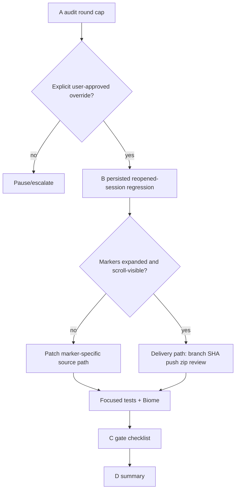

# 10 P — Ctrl+T historical expansion reopen plan

## Status

PABCD A-stage revision r2 after `20.6_a_synthesis_r1.md`. Runtime A-stage has reached round cap; this plan is the tightened implementation handoff for explicit user-approved override or user escalation.

## Objective

Fix and prove Ctrl+T full transcript behavior so prior/resumed session history expands beyond Ctrl+O live scope. Keep devlog evidence, use PABCD, push `dev` when safe, and prepare external review package with repo URL/path and zip if an authenticated surface exists.

## Current baseline in tree

Already landed in current `dev` tree:

- `input-controller.ts`: Ctrl+T uses full-screen `ui.showOverlay`, forces `readToolResultPreview: true`, and avoids duplicate session-backed live chat when replay history exists.
- `full-transcript-overlay.ts`: uses TUI-supplied row budget and calls `renderFullTranscript(width)` when present.
- `read-tool-group.ts`: expanded/full transcript read content renders even when inline preview setting is disabled.
- `tool-execution.ts`: `renderFullTranscript()` has transient fullTranscript mode and removes generic text/JSON line caps beyond Ctrl+O expanded limits.

## A-stage transition / gate

- Normal path: A PASS → B.
- Current state: A FAIL round cap reached. Proceed only with explicit user-approved override, or pause/escalate.

## B-stage implementation plan

### Step 1 — Add persisted/resumed Ctrl+T regression

Target file only:

- MODIFY `packages/coding-agent/test/input-controller-keybindings.test.ts`

Required imports:

```ts
import { SessionManager } from "../src/session/session-manager";
import { MemorySessionStorage } from "../src/session/session-storage";
```

Required ordered harness:

1. `const { InputController, ctx, editor, spies } = await createContext();`
2. Build/reopen `SessionManager` with `MemorySessionStorage`.
3. Install SESSION_DEPS stubs before triggering:
   - `ctx.settings.get` for `terminal.showImages`, `read.toolResultPreview`, `edit.fuzzyThreshold`, `edit.fuzzyMatch`, `edit.hashlineAutoDropPureInsertDuplicates`.
   - `ctx.session.getToolByName` observable for `generic_tool`, `read`, `bash`, `eval`.
   - `ctx.session.extensionRunner.getMessageRenderer` remains defined as in existing SESSION_DEPS test if needed.
   - `ctx.getUserMessageText` returns deterministic `TEXT:<content>`.
4. `ctx.session.buildDisplaySessionContext = vi.fn(() => reopened.buildVisibleTranscriptContext())`.
   - This is explicit visible-context injection; obfuscated-session/deobfuscation parity is out of scope unless a separate red fixture is found.
5. Add live duplicate markers before trigger:
   - `ctx.chatContainer.children.push(transcriptComponent("LIVE_CHAT_MARKER", true));`
   - `ctx.liveToolContainer.children.push(transcriptComponent("LIVE_TOOL_MARKER", true));`
6. Create controller and trigger:
   - `const controller = new InputController(ctx);`
   - `controller.setupKeyHandlers();`
   - `editor.onFullTranscript?.();`
   - `const overlay = shownOverlay(spies);`

Concrete fixture:

```ts
const zeroUsage = {
  input: 1,
  output: 1,
  cacheRead: 0,
  cacheWrite: 0,
  totalTokens: 2,
  premiumRequests: 0,
  cost: { input: 0, output: 0, cacheRead: 0, cacheWrite: 0, total: 0 },
};
const storage = new MemorySessionStorage();
const session = SessionManager.create("/cwd", "/sessions", storage);
session.appendMessage({ role: "user", content: "old prompt", timestamp: 1 });
session.appendMessage({
  role: "assistant",
  content: [
    { type: "thinking", thinking: "OLD_THINK_1\nOLD_THINK_2\nOLD_THINK_3" },
    { type: "toolCall", id: "old-generic", name: "generic_tool", arguments: { query: "old" } },
    { type: "toolCall", id: "old-read", name: "read", arguments: { path: "src/old.ts" } },
    { type: "toolCall", id: "old-bash", name: "bash", arguments: { command: "printf old" } },
    { type: "toolCall", id: "old-eval", name: "eval", arguments: { language: "js", code: "old" } },
  ],
  api: "anthropic-messages",
  provider: "anthropic",
  model: "claude-test",
  usage: zeroUsage,
  stopReason: "stop",
  timestamp: 2,
});
session.appendMessage({
  role: "toolResult",
  toolCallId: "old-generic",
  toolName: "generic_tool",
  content: [{ type: "text", text: Array.from({ length: 20 }, (_v, i) => `OLD_TOOL_LINE_${i}`).join("\n") }],
  isError: false,
  timestamp: 3,
});
session.appendMessage({
  role: "toolResult",
  toolCallId: "old-read",
  toolName: "read",
  content: [{ type: "text", text: Array.from({ length: 20 }, (_v, i) => `OLD_READ_LINE_${i}`).join("\n") }],
  isError: false,
  timestamp: 4,
});
session.appendMessage({
  role: "toolResult",
  toolCallId: "old-bash",
  toolName: "bash",
  content: [{ type: "text", text: Array.from({ length: 20 }, (_v, i) => `OLD_BASH_LINE_${i}`).join("\n") }],
  isError: false,
  timestamp: 5,
});
session.appendMessage({
  role: "toolResult",
  toolCallId: "old-eval",
  toolName: "eval",
  content: [{ type: "text", text: Array.from({ length: 20 }, (_v, i) => `OLD_EVAL_LINE_${i}`).join("\n") }],
  isError: false,
  timestamp: 6,
});
await session.flush();
const sessionFile = session.getSessionFile()!;
await session.close();
const reopened = await SessionManager.open(sessionFile, "/sessions", storage);
```

Assertions:

```ts
overlay.setOverlayViewportRows(500);
const all = Bun.stripANSI(overlay.render(160).join("\n"));
expect(all).toContain("OLD_THINK_2");
expect(all).toContain("OLD_TOOL_LINE_19");
expect(all).toContain("OLD_READ_LINE_19");
expect(all).toContain("OLD_BASH_LINE_19");
expect(all).toContain("OLD_EVAL_LINE_19");
expect(all).not.toMatch(/Thinking … \+\d+ lines/);
expect(all).not.toContain("ctrl+o to expand");
expect(all).not.toContain("LIVE_CHAT_MARKER");
expect(all).toContain("LIVE_TOOL_MARKER");

overlay.setOverlayViewportRows(10);
overlay.handleInput("g");
const top = Bun.stripANSI(overlay.render(160).join("\n"));
expect(top).toContain("OLD_THINK_2");
overlay.handleInput("G");
const tail = Bun.stripANSI(overlay.render(160).join("\n"));
expect(tail).toContain("OLD_EVAL_LINE_19");
```

### Step 2 — Patch only the red path

If Step 1 passes on current tree, stop source patching and record `20.7_b_persisted_regression_pass.md` with test output and branch SHA.

If Step 1 fails, patch only marker-specific red path:

- `OLD_THINK_2` missing/collapsed → `assistant-message.ts` `renderFullTranscript()` cache/expansion restoration.
- `OLD_TOOL_LINE_19`, `OLD_BASH_LINE_19`, or `OLD_EVAL_LINE_19` missing in this assistant-tool fixture → `tool-execution.ts` / tool renderer full transcript path. Do **not** patch `bash-execution.ts` or `eval-execution.ts` for this fixture; those are different `bashExecution`/`pythonExecution` session roles.
- `OLD_READ_LINE_19` missing → `read-tool-group.ts` or `session-transcript-replay.ts`, gated on missing rendered content after `renderFullTranscript()`.
- `all` contains markers but top/tail viewport checks fail → `full-transcript-overlay.ts` scroll/viewport behavior.

Dedicated `bashExecution`/`pythonExecution` role fixtures are out of scope unless the assistant-tool fixture passes and a role-specific regression is reproduced.

### Step 3 — Evidence artifacts

B-stage writes exactly one source outcome:

- `devlog/_plan/260615_full_transcript_overlay/20.7_b_persisted_regression_pass.md`, or
- `devlog/_plan/260615_full_transcript_overlay/20.7_b_persisted_regression_fail.md` plus `20.8_b_patch_summary.md`.

Manual/build check artifact:

- `devlog/_plan/260615_full_transcript_overlay/20.9_b_manual_overlay_check.md`

Required manual checklist in `20.9`:

- build/restart command or binary SHA used;
- Ctrl+O changes only current/live output;
- Ctrl+T shows prior history expanded;
- `g` jumps to old expanded history;
- `G` returns to latest tail without duplicate live chat replay;
- closing with `q`/Esc/Ctrl+T preserves editor focus/input;
- any screenshot/user confirmation reference if available.

### Step 4 — Verification and C gate

Focused tests:

```sh
bun test packages/coding-agent/test/input-controller-keybindings.test.ts packages/coding-agent/test/full-transcript-overlay.test.ts packages/coding-agent/test/session-transcript-replay.test.ts packages/coding-agent/test/read-tool-group.test.ts packages/coding-agent/test/modes/components/tool-execution-minimize.test.ts
```

Changed-file check:

```sh
bunx biome check <actual changed files>
```

C-stage exit checklist for `30_c_check_pass.md`:

- focused test command passes;
- changed-file Biome check passes;
- branch status and `origin/dev..dev` commit list captured;
- zip/review package exists or authenticated-review blocker recorded;
- no unrelated worktree files staged/committed by this task.

D-stage summary path:

- `devlog/_plan/260615_full_transcript_overlay/40_d_summary.md`

## Push and external review plan after B/C gates

1. Inspect branch:
   - `git status --short --branch`
   - `git log --oneline origin/dev..dev`
2. Confirm intended local commits versus unrelated worktree changes.
3. Push only when branch contents are intended:
   - `git push origin dev`
4. Zip manifest:
   - Delivery-only path: diff since `origin/dev`, devlog artifacts, test logs, branch SHA.
   - Patch path: changed source/test files, devlog artifacts, test logs, branch SHA.
5. Review metadata:
   - GitHub URL: `https://github.com/lidge-jun/jawcode`
   - Branch/path: `dev`, relevant files above.
6. If authenticated `agbrowse gpt pro` is available, submit zip + URL/path + review prompt. Otherwise produce zip path and exact manual-upload prompt, and record blocker.

## Mermaid


