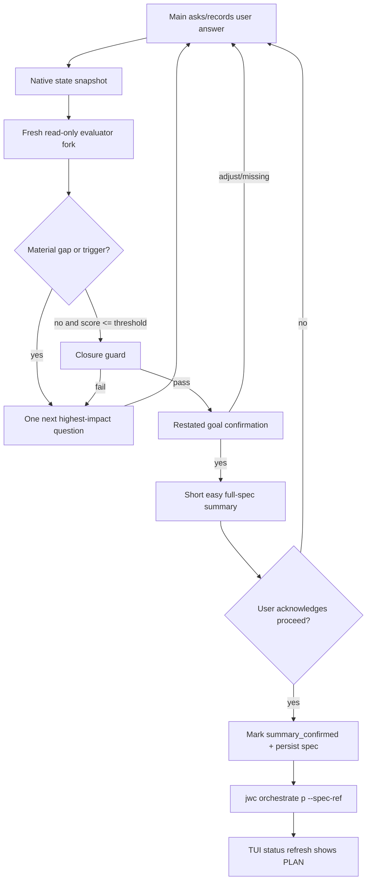

# 10.1 — P plan: jaw-interview fresh-fork scoring + pre-P summary gate

> PABCD stage: P · plan draft  
> Source spec: `.jwc/specs/jaw-interview-jaw-interview-fresh-fork-eval.md`  
> Scope: jaw-interview prompt/runtime handoff correctness plus PABCD status-line transition visibility.  
> Classification: C3 — workflow/public-contract behavior across bundled prompts, runtime state, CLI commands, tests, and TUI status display.  
> Mutation boundary: this document is planning only. Product-source mutation waits for explicit execution approval.

## Objective

Make JWC interview completion behave like the user-approved design:

1. The main agent remains the user-facing interviewer/recorder.
2. A fresh read-only fork evaluates each scored round critically and proposes the next single highest-leverage question.
3. Ambiguity scoring is bidirectional and anchored in established facts, not a monotonic countdown.
4. Final readiness uses a GJC-style closure guard and restated-goal confirmation, not only `ambiguity <= 5%`.
5. Even after readiness or human early-exit, JWC must show a short easy full-spec summary and ask for explicit acknowledgement before `jwc orchestrate p`.
6. After the P transition, the TUI status line should show `PLAN` for the current session instead of remaining visually stuck on `INTERV`.

## Non-goals

- Do not introduce a public workflow skill or public callable role named `interview_critic` in this patch.
- Do not use the implementation-capable `executor` persona as the interview evaluator.
- Do not route implementation from I/P; execution remains blocked until a pending plan is approved separately.
- Do not redesign the TUI visual style, welcome banner, composer, scroll model, or non-PABCD status segments.
- Do not make direct `jwc orchestrate p --spec-ref ...` impossible for non-interview/manual workflows; gate only the strict jaw-interview handoff path where JWC owns the preceding interview state.
- Defer full GJC convergence bookkeeping fields from MVP runtime unless listed in the strict handoff schema: `auto_answer_streak`, `refined_rounds`, `lateral_reviews`, `ambiguity_milestone`, and free-text answer refinement remain prompt/session-summary concerns for later hardening.
- Do not implement timer/file-watcher fallback in MVP; use command-tool completion + stage-change render hooks first, and revisit fallback only if those tests cannot observe shell command completion.

## Current evidence

| Area | Evidence |
|---|---|
| JWC prompt gap | `packages/coding-agent/src/defaults/jwc/skills/jaw-interview/SKILL.md:453-463` crystallizes the spec immediately when ambiguity is below threshold or early-exit triggers. |
| JWC prompt gap | `packages/coding-agent/src/defaults/jwc/skills/jaw-interview/SKILL.md:558-604` owns Phase 5 execution bridge; `571-573` runs `jwc orchestrate p --spec-ref ...` after option selection, and existing Phase 5b state-write handoff language must be replaced with strict `jwc interview --write ... --handoff-status ...` metadata. |
| JWC prompt gap | `packages/coding-agent/src/defaults/jwc/skills/jaw-interview/SKILL.md:435-451` uses fixed Round 4/6/8 challenge modes rather than a per-round evaluator hook. |
| Existing internal fragment pattern | `packages/coding-agent/src/defaults/jwc/skills/jaw-interview/SKILL.md:63-67`, `280-282`, and `318-320` already define on-demand internal fragments for read-only fork-context architects. The new evaluator should follow this pattern. |
| GJC convergence model | Upstream GJC deep-interview Phase 3/4 is used as a section-level design reference for milestone review, bidirectional scoring, closure guard, and restated-goal gate; do not rely on upstream line anchors as product-source anchors. |
| Runtime write surface | `packages/coding-agent/src/jwc-runtime/jaw-interview-runtime.ts:284-341` currently accepts only spec persistence flags; it has no first-class closure, ambiguity status, summary-presented, or summary-confirmed metadata. |
| Runtime write/handoff hazard | `packages/coding-agent/src/jwc-runtime/jaw-interview-runtime.ts:668-725` can still chain legacy `--handoff` / `--deliberate` behavior after `--write`; strict summary statuses must not be combinable with those shortcuts. |
| Command reference hazard | `packages/coding-agent/src/jwc-runtime/workflow-command-ref.ts:72-123` still publishes `jwc state jaw-interview write '{"current_phase":"handoff"}'` and `--deliberate` bridge examples. These must be replaced or command-reference regeneration can reintroduce the bypass. |
| Runtime P transition | `packages/coding-agent/src/jwc-runtime/orchestrate-runtime.ts:467-518` writes PABCD state, then retires jaw-interview handoff state when entering `p`; it does not inspect whether a strict interview handoff has passed the pre-P summary gate. |
| TUI status issue | `packages/coding-agent/src/modes/components/status-line.ts:445-481` refreshes PABCD state only during render-triggered polling. `interactive-mode.ts:452` currently updates editor chrome on PABCD stage change but does not explicitly request a render. |
| Existing test contract | `packages/coding-agent/test/jwc-runtime/orchestrate-state.test.ts:456-464` allows direct P entry with `--spec-ref`; new enforcement must not break this manual/direct entry path when no strict jaw-interview handoff is active. |

## Planned changes

### 1. MODIFY `packages/coding-agent/src/defaults/jwc/skills/jaw-interview/SKILL.md`

Patch the prompt contract to make the user-approved sequence explicit.

Required changes:

- Replace fixed challenge-mode-only guidance with a fresh-fork evaluation loop for each scored round:
  - main records raw answer and canonical state;
  - fresh read-only fork receives prompt-safe transcript summary, established facts, latest raw/refined answer, prior ambiguity/dimension scores as baseline/advisory, topology, and triggers;
  - fork reports contradictions, established-fact deltas, bidirectional ambiguity score, weakest material gap, and one next-question proposal;
  - main folds only concrete user-safe findings into the next user-facing question.
- Preserve GJC convergence semantics:
  - `established_facts` are the convergence anchor;
  - ambiguity can rise on contradiction, evasion, scope expansion, or newly discovered execution-blocking gaps;
  - final red-team/fork scoring must score transcript/spec absolutely; prior ambiguity is baseline/advisory only and must not anchor the final score.
- Add closure before spec crystallization:
  - closure/acceptance guard over all active topology components;
  - restated-goal gate with explicit user confirmation;
  - if closure fails, return to the single highest-impact follow-up question instead of forcing completion.
- Add the user's mandatory pre-P summary gate:
  - readiness or early-exit means “ready for short summary,” not “run P now”;
  - show a very short easy summary covering objective, scope, constraints, acceptance signal, unresolved/override status, and next stage;
  - ask for explicit acknowledgement/proceed;
  - only after acknowledgement may the agent persist/mark confirmed handoff and run `jwc orchestrate p --spec-ref <spec>`.
- Update Phase 5 wording so option selection cannot be interpreted as permission to skip the summary acknowledgement.
- Add an explicit Phase 5b replacement: the bundled skill must not use `jwc state jaw-interview write '{"current_phase":"handoff"}'` as the P bridge. It must persist strict metadata through `jwc interview --write ... --handoff-status summary_pending|summary_confirmed|early_exit_summary_pending|early_exit_summary_confirmed`.
- Add a concrete fresh-fork hook to `<Internal_Auto_Mode_Protocol>` / Tool Usage: after each scored user answer, and again before final readiness, load `interview-turn-evaluator.md` as an internal `kind: "skill-fragment"` prompt for a fresh fork-context read-only architect. This mirrors the existing `auto-research-greenfield.md` and `auto-answer-uncertain.md` hooks, with one validated evaluator response folded into the next single user-facing question.

### 2. ADD `packages/coding-agent/src/defaults/jwc/skills/jaw-interview/interview-turn-evaluator.md`

Add the canonical bundled source file at `packages/coding-agent/src/defaults/jwc/skills/jaw-interview/interview-turn-evaluator.md`. It installs as relative path `skill-fragments/jaw-interview/interview-turn-evaluator.md` through `jwc-defaults.ts`. It is not slash-command discoverable.

The fragment must define:

- Role: read-only requirements critic; no product edits, no `.jwc/` mutation, no workflow handoff, no implementation.
- Invocation: loaded on demand by the jaw-interview SKILL after each scored answer and before final readiness, using a fresh fork-context read-only architect assignment with prompt-safe summarized context.
- Inputs: prompt-safe transcript summary, current topology, established facts, latest answer, prior ambiguity/dimensions, trigger ledger, current candidate spec/restated goal when available.
- Output contract:
  - `absolute_ambiguity_score`
  - `prior_score_delta` with rationale
  - `dimension_scores`
  - `established_fact_updates`
  - `contradictions_or_trigger_events`
  - `material_gaps`
  - `closure_guard_status` when final/ready
  - `next_question` or `ready_for_summary`
- Anti-anchor rule: prior ambiguity is advisory/baseline, never the final source of truth.
- Final red-team mode: evaluate only transcript/spec/readiness evidence, not the previous score target.
- Round consumption contract:
  - The fresh fork's per-round output is ephemeral until the main agent validates and folds it.
  - Runtime MVP persists only strict handoff fields listed in §4. Non-strict convergence values such as `established_facts`, `trigger_events`, `dimension_scores`, `current_ambiguity`, `latest_material_gap`, and `next_question_source` remain prompt/session payload fields unless a strict-gate test explicitly needs them.
  - Do not persist raw fork chain-of-thought or persona noise; store only concise evidence/rationale suitable for downstream P-stage context.

### 3. MODIFY `packages/coding-agent/src/defaults/jwc-defaults.ts`

Bundle the new evaluator fragment as a `kind: "skill-fragment"` under parent skill `jaw-interview` with a relative path under `skill-fragments/jaw-interview/`.

No public workflow definition is added.

### 4. MODIFY `packages/coding-agent/src/jwc-runtime/jaw-interview-runtime.ts`

Extend the sanctioned native write/marking surface so prompt policy has a state contract it can use and tests can enforce.

Normative strict handoff state contract:

Strict handoff mode activates only when `handoff_status` is present and one of the exact values below. For the bundled updated `jaw-interview` skill, every new final interview write MUST include strict handoff metadata; the legacy-compatible no-`handoff_status` path exists only for external/manual CLI compatibility and for pre-existing tests outside the bundled skill handoff path.

```ts
type JawInterviewHandoffStatus =
  | "summary_pending"
  | "summary_confirmed"
  | "early_exit_summary_pending"
  | "early_exit_summary_confirmed";

type JawInterviewAmbiguityStatus = "passed" | "early_exit";
type JawInterviewClosureStatus = "pass" | "override" | "fail";
```

Required persisted fields in strict mode:

| Field | Type / values | Required when | Notes |
|---|---|---|---|
| `handoff_status` | exact `JawInterviewHandoffStatus` | strict mode | The strict-gate activation predicate. |
| `ambiguity_score` | number, `0 <= n <= 1` | strict mode | Final absolute score from transcript/spec evidence. |
| `ambiguity_threshold` | number, `0 < n <= 1` | strict mode | Usually `0.05`; persisted for auditability. |
| `ambiguity_status` | `passed`, `early_exit` | strict mode | `passed` requires `ambiguity_score <= ambiguity_threshold`; `early_exit` covers above-threshold proceed and round-cap/hard-cap handoff. |
| `closure_guard_status` | `pass`, `override`, `fail` | strict mode | `fail` can never enter P. `override` requires early-exit/hard-cap metadata. |
| `restated_goal_confirmed` | boolean | strict mode | Must be `true` for normal `passed` handoff. |
| `pre_p_summary_presented` | boolean | strict mode | Must be `true` before either confirmed handoff status. |
| `pre_p_summary_confirmed` | boolean | strict mode | Must be `true` only for `summary_confirmed` / `early_exit_summary_confirmed`. |
| `handoff_outcome` | `PASSED`, `BELOW_THRESHOLD_EARLY_EXIT` | strict mode | Written into runtime state and spec metadata; `BELOW_THRESHOLD_EARLY_EXIT` is required for above-threshold user override. |
| `spec_path` | string | strict mode | Required before entering P; used as `spec_ref` if the P command does not pass one. |
| `spec_stage` | `final` | strict mode | Prevents draft artifacts from entering P. |
| `current_phase` | `summary_pending` or `handoff` | strict mode | Pending statuses write `summary_pending`; confirmed statuses write `handoff`. |

Invalid combination matrix:

| Combination | Runtime result |
|---|---|
| `handoff_status=summary_pending` with `pre_p_summary_confirmed=true` | reject `jwc interview --write` as contradictory |
| `handoff_status=summary_confirmed` with `pre_p_summary_presented !== true` or `pre_p_summary_confirmed !== true` | reject write |
| `ambiguity_status=passed` with `ambiguity_score > ambiguity_threshold` | reject write |
| `ambiguity_status=passed` with `closure_guard_status !== "pass"` | reject write |
| `ambiguity_status=early_exit` with `closure_guard_status="fail"` and no `handoff_outcome=BELOW_THRESHOLD_EARLY_EXIT` metadata in state/spec | reject write |
| `ambiguity_status=passed` with `restated_goal_confirmed !== true` | reject write |
| `handoff_status=early_exit_summary_pending|early_exit_summary_confirmed` with `ambiguity_status=passed` | reject write |
| `handoff_status=early_exit_summary_pending|early_exit_summary_confirmed` with `handoff_outcome !== "BELOW_THRESHOLD_EARLY_EXIT"` | reject write |
| `handoff_status=summary_pending|summary_confirmed` with `handoff_outcome !== "PASSED"` | reject write |
| any strict status with missing `spec_path`/`spec_stage=final` | reject P transition |
| any strict status combined with `--handoff` or `--deliberate` | reject write; strict summary confirmation must not chain into legacy plan handoff |

CLI examples to support:

```sh
# Summary shown but user has not acknowledged yet — P must reject.
jwc interview --write --stage final --slug {slug} --spec <markdown-or-path> \
  --ambiguity-score 0.03 --ambiguity-threshold 0.05 --ambiguity-status passed \
  --closure-status pass --restated-goal-confirmed \
  --handoff-outcome PASSED \
  --pre-p-summary-presented --handoff-status summary_pending --json

# User acknowledged the short full-spec summary — P may proceed.
jwc interview --write --stage final --slug {slug} --spec <markdown-or-path> \
  --ambiguity-score 0.03 --ambiguity-threshold 0.05 --ambiguity-status passed \
  --closure-status pass --restated-goal-confirmed \
  --handoff-outcome PASSED \
  --pre-p-summary-presented --pre-p-summary-confirmed \
  --handoff-status summary_confirmed --json

# Above-threshold human early-exit summary shown but not acknowledged — P must reject.
jwc interview --write --stage final --slug {slug} --spec <markdown-or-path> \
  --ambiguity-score 0.18 --ambiguity-threshold 0.05 --ambiguity-status early_exit \
  --closure-status override \
  --handoff-outcome BELOW_THRESHOLD_EARLY_EXIT \
  --pre-p-summary-presented \
  --handoff-status early_exit_summary_pending --json

# Above-threshold human early-exit acknowledged — P may proceed with override metadata.
jwc interview --write --stage final --slug {slug} --spec <markdown-or-path> \
  --ambiguity-score 0.18 --ambiguity-threshold 0.05 --ambiguity-status early_exit \
  --closure-status override \
  --handoff-outcome BELOW_THRESHOLD_EARLY_EXIT \
  --pre-p-summary-presented --pre-p-summary-confirmed \
  --handoff-status early_exit_summary_confirmed --json
```

`--write --stage final` without `handoff_status` remains legacy-compatible for external/manual CLI callers only. The bundled updated jaw-interview SKILL must always provide strict metadata for final writes and must never bridge to P through raw `jwc state jaw-interview write` handoff state.

MVP runtime fields are the strict handoff fields listed above. GJC convergence fields such as `established_facts`, `trigger_events`, `lateral_reviews`, `auto_answer_streak`, `refined_rounds`, `ambiguity_milestone`, and free-text refinement may remain prompt/session payload fields in the first patch unless a test needs them for the strict handoff gate.
Strict spec metadata placement: write `handoff_outcome` in the final spec Metadata section as `- Handoff Outcome: PASSED` or `- Handoff Outcome: BELOW_THRESHOLD_EARLY_EXIT`, and persist the same value in runtime state as `handoff_outcome`. Tests must assert both persisted state and generated/persisted spec content.

### 5. MODIFY `packages/coding-agent/src/commands/interview.ts`

Expose the exact sanctioned strict-handoff flags in CLI help and examples:

- `--ambiguity-score`
- `--ambiguity-threshold`
- `--ambiguity-status`
- `--closure-status`
- `--restated-goal-confirmed`
- `--pre-p-summary-presented`
- `--pre-p-summary-confirmed`
- `--handoff-status`
- `--handoff-outcome`

The help text must distinguish legacy spec persistence from strict pre-P summary gating so future prompt authors do not rely on undocumented flags.
Also expose that `--handoff` / `--deliberate` cannot be combined with `--handoff-status`, and document the deterministic mapping `--closure-status` → `closure_guard_status`, `--handoff-outcome` → `handoff_outcome`.

### 6. MODIFY `packages/coding-agent/src/jwc-runtime/workflow-command-ref.ts`

Update the jaw-interview command-reference block so generated/bundled command docs cannot reintroduce the bypass:

- Delete or replace the public `commands[]` entry that currently renders `jwc jaw-interview --write --stage final ... --deliberate --json` under the generated `Commands:` section. It must no longer publish an ungated direct bridge.
- The replacement public command pattern is the strict two-step bridge: first `jwc interview --write --stage final ... --handoff-status summary_confirmed --handoff-outcome PASSED --pre-p-summary-presented --pre-p-summary-confirmed --closure-status pass --restated-goal-confirmed --spec <path> --json`, then `jwc orchestrate p --spec-ref <spec>`.
- Remove the raw `stateWrite("jaw-interview")` command from the jaw-interview final handoff command list, or mark it unavailable for final handoff if other state docs still need it.
- Replace the `handoff state write` example with strict `jwc interview --write --stage final ... --handoff-status summary_pending|summary_confirmed --handoff-outcome PASSED ...`.
- Replace the `--deliberate` bridge example/alias with the strict summary-confirmed write followed by explicit `jwc orchestrate p --spec-ref <spec>`.
- Remove or rewrite notes that say “mark jaw-interview ready for handoff” without strict metadata.
- Update command-reference tests/inventory gates that assert rendered command snippets from both the primary `Commands:` section and examples/aliases.


### 7. MODIFY `packages/coding-agent/src/jwc-runtime/orchestrate-runtime.ts`

Before entering `p`, inspect same-scope active jaw-interview state when it exists.
Add a shared same-scope jaw-interview state reader before implementing the guard. Either export a safe helper from `jaw-interview-runtime.ts` or add `readJawInterviewStateWithFallback(cwd, sessionId)` next to PABCD readers in `orchestrate-state.ts`. It must use the same session semantics as the command path: current session first; shared/root only for explicit shared/no-session operation.
Ordering is mandatory: for `target === "p"`, run the same-scope jaw-interview read and full strict-tuple validation after session/shared resolution but before `canTransitionPabcd`, envelope construction, `persist()`, goal checkpointing, or `retireJawInterviewStateForWorkflowExit`. A failed strict guard must return status `1` without writing PABCD state.

Strict handoff activation predicate:

```ts
isStrictJawInterviewHandoff(state) =
  state.active === true &&
  typeof state.handoff_status === "string" &&
  [
    "summary_pending",
    "summary_confirmed",
    "early_exit_summary_pending",
    "early_exit_summary_confirmed",
  ].includes(state.handoff_status)
```

Gate rule:

- Evaluate the predicate for the same-scope jaw-interview state only: current session state first, shared/root state only when the command is explicitly shared/no-session.
- If strict state exists and `handoff_status` is `summary_pending` or `early_exit_summary_pending`, reject P.
- If strict state exists and `pre_p_summary_confirmed !== true`, reject P even when the handoff status string says confirmed.
- Revalidate the full strict tuple at P time instead of trusting prior `jwc interview --write` validation only: handoff status, summary booleans, ambiguity status/score/threshold, closure status, restated goal for normal passed handoff, handoff outcome, spec path/stage, and phase/status consistency.
- If strict state exists and no effective spec reference exists, reject P. Effective spec ref order: explicit `--spec-ref`, existing PABCD `spec_ref`, then strict jaw-interview `spec_path`. If the runtime uses `spec_path`, persist it into the PABCD envelope as `spec_ref`.
- `jwc orchestrate reset` remains immediate and must not be trapped by this guard.
- Direct P entry without same-scope strict jaw-interview state remains allowed.
- No-strict legacy `handoff` states remain compatible only for external/manual CLI compatibility and pre-existing state migration; the updated bundled skill path must not produce them.

Stable error contract for rejected strict P:

- Exit code: `1`.
- Required stderr phrases:
  - `jaw-interview summary confirmation required`
  - `show the short full-spec summary`
  - `ask for acknowledgement`
  - `mark pre_p_summary_confirmed before jwc orchestrate p`
- Missing spec ref error also includes `jaw-interview spec_ref required`.
- Closure-fail rejection also includes `jaw-interview closure guard failed`.

### 8. MODIFY `packages/coding-agent/src/commands/orchestrate.ts` only if needed

Only add a flag if runtime needs a narrowly scoped override for tests or explicit admin bypass. Default plan: avoid a bypass flag and rely on strict metadata presence to preserve direct P compatibility.

### 9. MODIFY TUI status refresh path

Fix the observed footer mismatch after P transition.

Primary insertion points:

- `packages/coding-agent/src/modes/controllers/event-controller.ts:#handleToolExecutionEnd`
- `packages/coding-agent/src/modes/interactive-mode.ts` callback registration around `statusLine.onPabcdStageChange(...)`
- `packages/coding-agent/src/modes/components/status-line.ts:refreshPabcdNow()`

Preferred narrow fix:

1. In `#handleToolExecutionEnd`, after command-like tools finish (`bash`, `shell`, `exec`) call `this.ctx.statusLine.refreshPabcdNow()`. Do this regardless of exit status; the file read is cheap and handles reset/P changes uniformly.
2. Change the `onPabcdStageChange` callback in `interactive-mode.ts` to both `updateEditorChrome()` and `ui.requestRender()`. A border update without render can still leave the visible footer stale.
3. If `refreshPabcdNow()` remains fire-and-forget, make sure its `finally` path invokes the stage-change callback after state mutation as it does today. Do not add broad visual changes.
4. Preserve session-scoped isolation: do not show a shared/root PABCD state when current session has no scoped state.
5. Timer/file-watcher fallback is out of MVP scope. Revisit it only if a focused test proves command-tool completion cannot observe bash/shell/exec completion in the interactive runtime.

Acceptance for this subpatch is behavioral: after `jwc orchestrate p --spec-ref ...` succeeds in the current session, the status segment updates from `INTERV` to `PLAN` without requiring a separate user action.

### 10. UPDATE tests

Required focused tests:

- `packages/coding-agent/test/default-jwc-definitions.test.ts`
  - definitions count increases by one fragment;
  - jaw-interview fragments include `interview-turn-evaluator.md`;
  - fragment content proves read-only critic/no mutation and anti-anchor final scoring language.
  - update every pinned cardinality/install assertion: total definitions `10 → 11`, fragment count `4 → 5`, jaw-interview fragments `2 → 3`, and sorted relative path lists.
- `packages/coding-agent/test/jaw-interview-skill-policy.test.ts`
  - prompt contains fresh-fork evaluator hook;
  - prompt contains closure/acceptance guard;
  - prompt contains short summary + explicit acknowledgement before P;
  - prompt forbids auto-P on `ambiguity <= threshold`;
  - prompt forbids raw `jwc state jaw-interview write '{"current_phase":"handoff"}'` as the final P bridge.
- `packages/coding-agent/test/jwc-runtime/jaw-interview-runtime.test.ts`
  - `strict write persists pre-P summary pending metadata`;
  - `strict write persists pre-P summary confirmed metadata`;
  - `strict write rejects passed ambiguity above threshold`;
  - `strict write rejects confirmed handoff without summary confirmation`;
  - `strict write rejects invalid tuple subcases with discrete per-row identifiers or a parameterized table keyed to the §4 matrix: pending+confirmed boolean, confirmed without presented/confirmed booleans, passed above threshold, passed with non-pass closure, early_exit fail without BELOW_THRESHOLD_EARLY_EXIT, passed without restated goal, early-exit status mismatch, early-exit outcome mismatch, passed outcome mismatch`;
  - `strict write rejects handoff_status combined with --handoff or --deliberate`;
  - `strict pending writes current_phase summary_pending and confirmed writes current_phase handoff`;
  - `strict write persists handoff_outcome PASSED or BELOW_THRESHOLD_EARLY_EXIT`;
  - `strict write emits spec Metadata line - Handoff Outcome: PASSED or BELOW_THRESHOLD_EARLY_EXIT matching runtime handoff_outcome`;
  - `legacy write without handoff_status remains allowed for manual CLI compatibility`.
  - `bundled skill policy requires strict handoff metadata for final writes`;
- `packages/coding-agent/test/jwc-runtime/orchestrate-state.test.ts`
  - `strict jaw-interview summary_pending rejects p with stable error`;
  - `strict jaw-interview summary_confirmed enters p and persists spec_ref`;
  - `strict confirmed handoff without spec_path/spec_ref rejects p`;
  - `closure_guard_status=fail rejects p with stable closure error`;
  - `direct p with spec_ref and no strict jaw-interview state still succeeds`;
  - `reset remains allowed while strict summary_pending exists`.
  - `strict p guard revalidates full strict tuple before transition`;
  - `strict p guard runs before canTransition/persist and leaves existing state unchanged on rejection`;
- Status/TUI tests:
  - add or extend `packages/coding-agent/test/interactive-mode-status.test.ts` with cases `command tool completion refreshes pabcd state`, `pabcd stage change requests render`, and `rendered pabcd segment changes from INTERV to PLAN`;
  - if lower-level unit coverage is needed, add focused assertions in `status-line-pabcd-segment.test.ts` only for rendered label text;
  - keep existing session isolation tests intact.
- `packages/coding-agent/test/workflow-command-ref.test.ts` or the existing command-reference/inventory test owner:
  - rendered primary `Commands:` section no longer emits `jwc jaw-interview --write --stage final ... --deliberate --json`;
  - command reference no longer emits raw jaw-interview handoff state-write as a final bridge;
  - command reference includes strict `--handoff-status` and `--handoff-outcome` examples in rendered commands/examples.

### Test-to-acceptance map

| Acceptance area | Required test file |
|---|---|
| Fragment bundle/read-only/anti-anchor | `default-jwc-definitions.test.ts` |
| Prompt fresh fork / closure / summary-before-P | `jaw-interview-skill-policy.test.ts` |
| Strict metadata schema and invalid combinations | `jaw-interview-runtime.test.ts` |
| Strict P guard, direct-P compatibility, reset bypass, spec_ref requirement | `orchestrate-state.test.ts` |
| TUI `INTERV` → `PLAN` refresh | event-controller/interactive-mode status test plus existing status-line tests |
| Command reference strict handoff snippets | `workflow-command-ref.test.ts` or existing command-reference/inventory owner |

## Verification plan

Run focused tests first from `jawcode`:

```sh
bun test packages/coding-agent/test/default-jwc-definitions.test.ts \
  packages/coding-agent/test/jaw-interview-skill-policy.test.ts \
  packages/coding-agent/test/jwc-runtime/jaw-interview-runtime.test.ts \
  packages/coding-agent/test/jwc-runtime/orchestrate-state.test.ts \
  packages/coding-agent/test/interactive-mode-status.test.ts \
  packages/coding-agent/test/status-line-pabcd-segment.test.ts \
  packages/coding-agent/test/workflow-command-ref.test.ts
```

Workflow/default-surface gates required after prompt/default changes:

```sh
bun scripts/check-visible-definitions.ts
bun scripts/verify-g002-gates.ts
bun scripts/rebrand-inventory.ts --strict
bun test packages/coding-agent/test/default-jwc-definitions.test.ts
```

Type/static gate after source changes:

```sh
bun run check
```

Manual smoke after tests pass:

1. Start/seed a jaw-interview state with strict `summary_pending` metadata and confirm `jwc orchestrate p --spec-ref <spec>` exits `1` with the stable summary acknowledgement message.
2. Mark summary confirmed and confirm `jwc orchestrate p --spec-ref <spec>` succeeds and persists the expected `spec_ref`.
3. From idle/no strict jaw-interview state, confirm direct `jwc orchestrate p --spec-ref <spec>` still succeeds.
4. With strict `summary_pending`, confirm `jwc orchestrate reset` still exits successfully.
5. In a live TUI session, confirm the footer changes to `PLAN` after the command succeeds.

## Acceptance criteria

- [ ] Jaw-interview prompt clearly states fresh read-only fork evaluation per scored round and the main-agent/fork/native responsibility split (`jaw-interview-skill-policy.test.ts`).
- [ ] New internal evaluator fragment is bundled under `jaw-interview`, is not a public workflow skill, and forbids edits/state mutation/handoffs (`default-jwc-definitions.test.ts`).
- [ ] Final evaluator/red-team scoring treats prior ambiguity as advisory only and produces an absolute score from transcript/spec evidence (`default-jwc-definitions.test.ts`, `jaw-interview-skill-policy.test.ts`).
- [ ] Prompt and runtime both represent closure guard + restated-goal confirmation before final readiness (`jaw-interview-skill-policy.test.ts`, `jaw-interview-runtime.test.ts`).
- [ ] `ambiguity <= threshold` means ready for summary, not automatic `jwc orchestrate p` (`jaw-interview-skill-policy.test.ts`, `orchestrate-state.test.ts`).
- [ ] Above-threshold human progression records early-exit/override metadata and still requires the short summary acknowledgement before P (`jaw-interview-runtime.test.ts`, `orchestrate-state.test.ts`).
- [ ] Runtime rejects strict same-scope P transition when summary confirmation is missing, while preserving manual/direct P compatibility outside strict interview handoff (`orchestrate-state.test.ts`).
- [ ] Strict confirmed handoff cannot enter P without an effective spec ref (`orchestrate-state.test.ts`).
- [ ] `jwc orchestrate reset` remains an immediate escape hatch (`orchestrate-state.test.ts`).
- [ ] TUI status segment updates from `INTERV` to `PLAN` after the successful current-session P transition, with automated proof in `interactive-mode-status.test.ts`; manual live-TUI smoke is supplemental.
- [ ] Required focused tests and workflow-definition gates pass.

## Risks and mitigations

| Risk | Mitigation |
|---|---|
| Runtime gate accidentally blocks direct/manual `jwc orchestrate p --spec-ref` use. | Gate only when same-scope active jaw-interview state declares strict summary-pending metadata; keep existing direct-P test. |
| Prompt-only summary rule can be bypassed by future agents. | Add native strict metadata and orchestrate preflight rejection for the owned handoff path. |
| Fresh fork every round creates token/tool overhead. | Keep evaluator as an internal fragment and require prompt-safe summaries; do not spawn multi-persona panels every round unless milestone/final readiness calls for it. |
| Final red-team never converges because it keeps inventing optional gaps. | Require material execution-blocking gap or trigger evidence; optional nice-to-have questions do not increase ambiguity. |
| TUI refresh patch touches protected visual behavior. | Limit changes to state refresh/render triggers; do not modify welcome/banner/composer/scroll styling. |

## Mermaid


